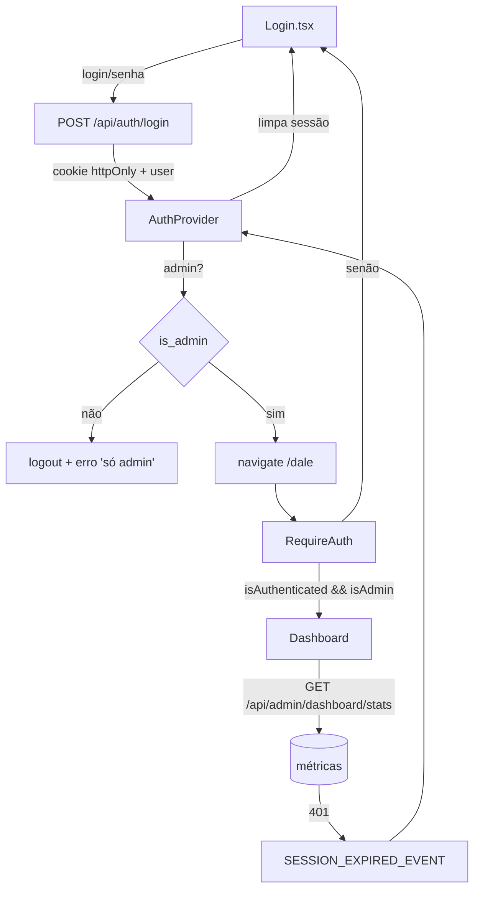

# Área Admin

Área protegida do front (`/dale`), separada da cena 3D. Login de administrador + dashboard. Base de UI (shadcn, tema, sidebar, roteamento) em [[componentes-html]].

> [!info] Backend
> Auth e métricas vêm do backend **cidoa-back** (mesmo backend do base_vite). Login seta cookie JWT httpOnly; rotas `/admin/*` exigem JWT + admin. Criar o primeiro admin = script `create-admin.ts` no backend (não há signup público de admin).

---

## Fluxo de autenticação

Token JWT vive em **cookie httpOnly** `token_access` — o JS nunca lê. O front guarda só um **espelho** da sessão (usuário + validade) no `localStorage`, pra UI sobreviver a reload. Autenticação real = sempre o cookie.



---

## AuthProvider

`src/components/AuthProvider.tsx` + `src/hooks/useAuth.ts`.

Expõe via Context: `user`, `isAuthenticated`, `isAdmin`, `login()`, `logout()`.

- `login(input)` → chama `POST /auth/login`, salva espelho (`cidoa.admin.session`) e seta `user`.
- `logout()` → `POST /auth/logout` + limpa espelho local (limpa mesmo se a request falhar — cookie expira sozinho).
- Escuta `SESSION_EXPIRED_EVENT` (do `http.ts`): 401 fora do login → cookie inválido/expirado → derruba sessão local.

> [!note] Sem signup
> AuthProvider expõe só `login`/`logout`. Não tem signup — admin nasce pelo script do backend.

---

## RequireAuth

`src/components/RequireAuth.tsx`. Rota-layout que protege `/dale`.

```tsx
if (!isAuthenticated || !isAdmin) {
  return <Navigate to="/dale/login" replace state={{ from: location }} />
}
return <Outlet />
```

> [!important] Defesa em profundidade
> Guard do front é só UX/navegação. O backend **também** exige JWT + admin em toda rota `/admin/*` (adminGuard). Bloquear no front não substitui o servidor.

### Anti-loop (admin vs. não-admin)

Cuidado sutil: se o `RequireAuth` exige admin e o `Login` redireciona todo autenticado, um **não-admin logado** entraria em loop (login → /dale → bounce → login…). Resolvido em dois pontos:

1. `Login` só redireciona quem é `isAuthenticated && isAdmin`.
2. Ao logar, se `!user.is_admin` → `logout()` + erro "Acesso restrito a administradores", **sem** navegar.

Resultado: não-admin nunca fica autenticado na área; sem loop.

---

## Login

`src/pages/admin/Login.tsx` — rota `/dale/login`.

- Card centralizado (`min-h-svh`, `bg-background`), `ThemeToggle` no canto.
- Campos `Username ou email` + `Senha` (input com label flutuante).
- Envia `{ login, password }` — backend resolve username **ou** email.
- Guarda a rota de origem (`location.state.from`) e volta pra ela após logar; default `/dale`.
- Erro de credencial vira `ApiError` → mensagem no formulário.

---

## Dashboard

`src/pages/admin/Dashboard.tsx` — rota `/dale` (dentro de `RequireAuth`).

Layout: `SidebarProvider` (`h-svh`) + `AppSidebar` + conteúdo rolável + `MobileNav`. Mostra:

1. **Sessão** — o admin logado (username, email, id, flag admin) — vem do `useAuth().user`, sem request.
2. **Métricas** — `GET /api/admin/dashboard/stats`: doações (contagem, total, ticket médio, maior), cidades, ONGs, usuários. Loading = `Skeleton`; erro = mensagem + botão "Tentar de novo".

> [!note] setState em effect
> O fetch das métricas só chama `setState` em callbacks assíncronos (`.then/.catch/.finally`), nunca no corpo do effect — a regra `react-hooks/set-state-in-effect` reclama de setState síncrono. Reload = função `retry()` reseta estado e bumpa uma `reloadKey`.

---

## Camada de API

`src/api/http.ts` — axios único, compartilhado com a cena. Ajustes pra auth:

- `withCredentials: true` → envia o cookie httpOnly.
- Interceptor de 401 (exceto `/auth/login`) → dispara `SESSION_EXPIRED_EVENT` no `window`.

| Módulo | Arquivo | Rotas |
| --- | --- | --- |
| Auth | `api/auth/auth.routes.ts` | `login`, `logout` |
| Admin | `api/admin/admin.routes.ts` | `getDashboardStats`, `createTestBuildings`, `deleteAllBuildings` (ver [[edificios-teste]]) |
| User | `api/user/user.types.ts` | tipo `User` (sem rotas no front admin) |

---

## Criar o primeiro admin

Sem signup público. No **backend** (cidoa-back):

```bash
bun run scripts/create-admin.ts <username> <password> [email]
```

Cria/promove usuário com `is_admin=true` + senha bcrypt. Depois é só logar em `/dale/login`.

---

## Onde mexer?

| Objetivo | Arquivo |
| --- | --- |
| Regras de acesso / redirect da área admin | `src/components/RequireAuth.tsx` |
| Sessão, login, logout | `src/components/AuthProvider.tsx` + `src/hooks/useAuth.ts` |
| Tela de login | `src/pages/admin/Login.tsx` |
| Tela de dashboard | `src/pages/admin/Dashboard.tsx` |
| Gerar/excluir edifícios de teste | [[edificios-teste]] |
| Itens da sidebar/nav | `src/lib/nav.ts` |
| Chamadas de API admin | `src/api/admin/admin.routes.ts` |
| Cookie / evento de sessão | `src/api/http.ts` |
| Novas rotas admin | `src/App.tsx` (dentro de `<RequireAuth>`) |

---

## Relacionado

- [[componentes-html]] — base de UI (shadcn, tema, sidebar, roteamento)
- [[edificios-teste]] — gerar/excluir edifícios fictícios em massa
- [[index]] — visão geral + cena 3D
- [[donation-api]] — cliente HTTP compartilhado
