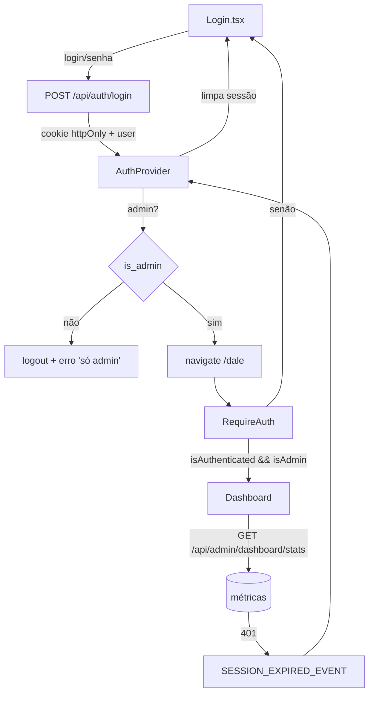
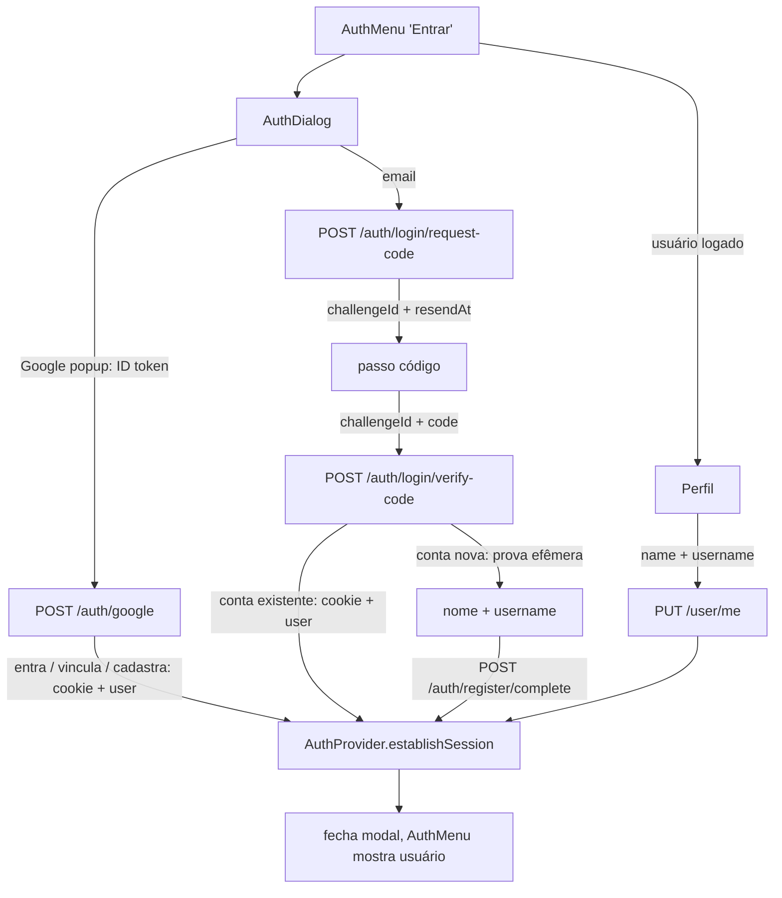

# Área Admin

Área protegida do front (`/dale`), separada da cena 3D. Login de administrador + dashboard. Base de UI (shadcn, tema, sidebar, roteamento) em [[componentes-html]].

> [!info] Backend
> Auth e métricas vêm do backend **cidoa-back** (mesmo backend do base_vite). Login seta cookie JWT httpOnly; rotas `/admin/*` exigem JWT + admin. Criar o primeiro admin = script `create-admin.ts` no backend (não há signup público de admin).

---

## Fluxo de autenticação

Token JWT vive em **cookie httpOnly** `token_access` — o JS nunca lê. O front guarda só um **espelho** da sessão (usuário + validade) no `localStorage`, pra UI sobreviver a reload. Autenticação real = sempre o cookie.



---

## AuthProvider

`src/components/AuthProvider.tsx` + `src/hooks/useAuth.ts`.

Expõe via Context: `user`, `isAuthenticated`, `isAdmin`, `login()`, `loginWithCode()`, `loginWithGoogle()`, `completeRegistration()`, `updateProfile()`, `logout()`.

- `login(input)` → login por **senha** (admin), `POST /auth/login`.
- `loginWithCode({ challengeId, code })` → passwordless, `POST /auth/login/verify-code`; autentica conta existente ou devolve prova efêmera para conta nova.
- `loginWithGoogle(credential)` → `POST /auth/google` com o ID token do GIS; entra, vincula ou cadastra automaticamente e abre a sessão.
- `completeRegistration({ registrationToken, name, username })` → `POST /auth/register/complete`; cria conta só após e-mail confirmado.
- `updateProfile({ name, username, profile_image? })` → `PUT /user/me`; atualiza backend + espelho local sem alterar validade da sessão.
- Login por senha, conta existente por código e cadastro concluído passam pelo mesmo `establishSession(user, expiresIn)`: salva o espelho (`cidoa.admin.session`) e seta `user`.
- `logout()` → `POST /auth/logout` + limpa espelho local (limpa mesmo se a request falhar — cookie expira sozinho).
- Escuta `SESSION_EXPIRED_EVENT` (do `http.ts`): 401 fora dos fluxos de auth → cookie inválido/expirado → derruba sessão local.

> [!note] Signup só passwordless
> Não há signup por senha. Admin nasce pelo script do backend (`create-admin.ts`); usuário comum se cadastra pelo modal passwordless na cena (ver [[#Login público na cena (passwordless)]]).

---

## RequireAuth

`src/components/RequireAuth.tsx`. Rota-layout que protege `/dale`.

```tsx
if (!isAuthenticated || !isAdmin) {
  return <Navigate to="/dale/login" replace state={{ from: location }} />
}
return <Outlet />
```

> [!important] Defesa em profundidade
> Guard do front é só UX/navegação. O backend **também** exige JWT + admin em toda rota `/admin/*` (adminGuard). Bloquear no front não substitui o servidor.

### Anti-loop (admin vs. não-admin)

Cuidado sutil: se o `RequireAuth` exige admin e o `Login` redireciona todo autenticado, um **não-admin logado** entraria em loop (login → /dale → bounce → login…). Resolvido em dois pontos:

1. `Login` só redireciona quem é `isAuthenticated && isAdmin`.
2. Ao logar, se `!user.is_admin` → `logout()` + erro "Acesso restrito a administradores", **sem** navegar.

Resultado: não-admin nunca fica autenticado na área; sem loop.

---

## Login

`src/pages/admin/Login.tsx` — rota `/dale/login`.

- Card centralizado (`min-h-svh`, `bg-background`), `ThemeToggle` no canto.
- Campos `Username ou email` + `Senha` (input com label flutuante).
- Envia `{ login, password }` — backend resolve username **ou** email.
- Guarda a rota de origem (`location.state.from`) e volta pra ela após logar; default `/dale`.
- Erro de credencial vira `ApiError` → mensagem no formulário.

---

## Dashboard

`src/pages/admin/Dashboard.tsx` — rota `/dale` (dentro de `RequireAuth`).

Layout: `SidebarProvider` (`h-svh`) + `AppSidebar` + conteúdo rolável + `MobileNav`. Mostra:

1. **Sessão** — o admin logado (username, email, id, flag admin) — vem do `useAuth().user`, sem request.
2. **Métricas** — `GET /api/admin/dashboard/stats`: doações (contagem, total, ticket médio, maior), cidades, ONGs, usuários. Loading = `Skeleton`; erro = mensagem + botão "Tentar de novo".

> [!note] setState em effect
> O fetch das métricas só chama `setState` em callbacks assíncronos (`.then/.catch/.finally`), nunca no corpo do effect — a regra `react-hooks/set-state-in-effect` reclama de setState síncrono. Reload = função `retry()` reseta estado e bumpa uma `reloadKey`.

---

## Login público na cena (passwordless)

Usuário comum entra/cadastra **na própria cena 3D** (`/`), sem sair para outra página. Fluxo **passwordless**: e-mail → código de 6 dígitos.

- **`src/components/AuthMenu.tsx`** — botão no canto superior direito da cena. Deslogado: "Entrar" abre o modal. Logado: botão somente com ícone de compartilhar indicação ao lado do usuário, `username` limitado a 18 caracteres + reticências e dropdown com "Perfil" + "Sair". Também coordena código vindo de `?ref=`, preview, resumo e confirmação. Ver [[referral]].
- **`src/components/ProfileDialog.tsx`** — perfil em modal com imagem ou iniciais, nome, username e e-mail confirmado. Mostra código/link próprio; indicador recebido só quando existe; total indicado só quando maior que zero. Um lápis sobre o avatar abre ações de adicionar/trocar e remover imagem. Aceita JPEG, PNG ou WebP de até 10 MB; `src/lib/image.ts` reduz proporcionalmente para no máximo 400×400.
- **`src/components/AuthDialog.tsx`** — modal único (shadcn `Dialog`): campo opcional de indicação sempre visível + botão **Continuar com Google** + divisor "ou" + e-mail → código. Código de indicação válido mostra nome/imagem; inválido bloqueia login/cadastro até correção ou remoção. Conta nova envia código no cadastro; conta existente confirma depois do login.
  - **Botão Google (GIS)**: o script `accounts.google.com/gsi/client` (carregado no `index.html`) renderiza o botão via `google.accounts.id`. O popup devolve o `credential` (ID token); o callback chama `loginWithGoogle(credential)` → `POST /auth/google` → mesma sessão do fluxo por código. Entrar e cadastrar são a **mesma ação** (o backend resolve). `GOOGLE_CLIENT_ID` vem de `VITE_GOOGLE_CLIENT_ID` (com default público embutido). Registre a **origem** do front em *Authorized JavaScript origins* no Google Console.
  - **Perfil depois da confirmação**: `POST /auth/register/complete` recebe `{ registrationToken, name, username }`. E-mail vem da prova assinada, nunca do body. Backend normaliza `username` para minúsculas, valida 3–45 caracteres e retorna `409` se já existir. `name` aceita 2–100 caracteres.
  - **Mesma sessão do modal**: `registrationToken` fica somente em estado React. Fechar modal, sair da página ou recarregar apaga a prova e exige novo código. Prova também expira no backend em 4 minutos.
  - **Reenvio**: botão com contagem regressiva do `resendAvailableAt` (cooldown do backend).
  - **Código em dev**: quando o backend devolve `debugCode` (só fora de produção, `AUTH_DEBUG_CODE=1`), o modal mostra e **já preenche** o campo. Em produção `debugCode` nunca vem — o código chega por e-mail.
  - Erros do backend (409 nome de usuário/e-mail em uso após confirmação, 429 rate limit, código/prova inválido ou expirado) viram `ApiError` → mensagem no formulário. E-mail sem cadastro não gera erro no envio.



> [!info] Backend passwordless
> Contrato completo (rate limit, e-mail descartável, HMAC do código, seam OAuth) em `cidoa-back` → `doc/modulos/auth/auth.md`.

---

## Camada de API

`src/api/http.ts` — axios único, compartilhado com a cena. Ajustes pra auth:

- `withCredentials: true` → envia o cookie httpOnly.
- Interceptor de 401 **fora** dos fluxos de auth (`/auth/login*`, `/auth/register*`) → dispara `SESSION_EXPIRED_EVENT` no `window`. Dentro do fluxo, 401 = credencial/código inválido (não sessão expirada).

| Módulo | Arquivo | Rotas |
| --- | --- | --- |
| Auth | `api/auth/auth.routes.ts` | `login`, `logout`, `requestLoginCode`, `verifyLoginCode`, `completeRegistration` |
| Referral | `api/referral/referral.routes.ts` | `getReferralPreview`, `getMyReferralSummary`, `applyMyReferral` — ver [[referral]] |
| Admin | `api/admin/admin.routes.ts` | `getDashboardStats`, `createTestBuildings`, `deleteAllBuildings` (ver [[edificios-teste]]), `getIbgeStatus`, `syncIbge` (ver [[ibge]]) |
| User | `api/user/user.routes.ts` + `user.types.ts` | `updateOwnProfile`; tipo `User`, incluindo `name: string \| null` para contas antigas |

---

## Criar o primeiro admin

Sem signup público. No **backend** (cidoa-back):

```bash
bun run scripts/create-admin.ts <username> <password> [email]
```

Cria/promove usuário com `is_admin=true` + senha bcrypt. Depois é só logar em `/dale/login`.

---

## Onde mexer?

| Objetivo | Arquivo |
| --- | --- |
| Regras de acesso / redirect da área admin | `src/components/RequireAuth.tsx` |
| Sessão, login, logout | `src/components/AuthProvider.tsx` + `src/hooks/useAuth.ts` |
| Botão de login na cena (público) | `src/components/AuthMenu.tsx` |
| Modal de login/cadastro passwordless | `src/components/AuthDialog.tsx` |
| Visualização e edição do perfil | `src/components/ProfileDialog.tsx` + `src/api/user/user.routes.ts` |
| Link, preview, confirmação e compartilhamento de indicação | `src/components/AuthMenu.tsx` + `src/components/referral/` + `src/api/referral/` |
| Tela de login do admin (senha) | `src/pages/admin/Login.tsx` |
| Tela de dashboard | `src/pages/admin/Dashboard.tsx` |
| Gerar/excluir edifícios de teste | [[edificios-teste]] |
| Vincular catálogo do IBGE | [[ibge]] |
| Itens da sidebar/nav | `src/lib/nav.ts` |
| Chamadas de API admin | `src/api/admin/admin.routes.ts` |
| Cookie / evento de sessão | `src/api/http.ts` |
| Novas rotas admin | `src/App.tsx` (dentro de `<RequireAuth>`) |

---

## Relacionado

- [[componentes-html]] — base de UI (shadcn, tema, sidebar, roteamento)
- [[edificios-teste]] — gerar/excluir edifícios fictícios em massa
- [[index]] — visão geral + cena 3D
- [[donation-api]] — cliente HTTP compartilhado
