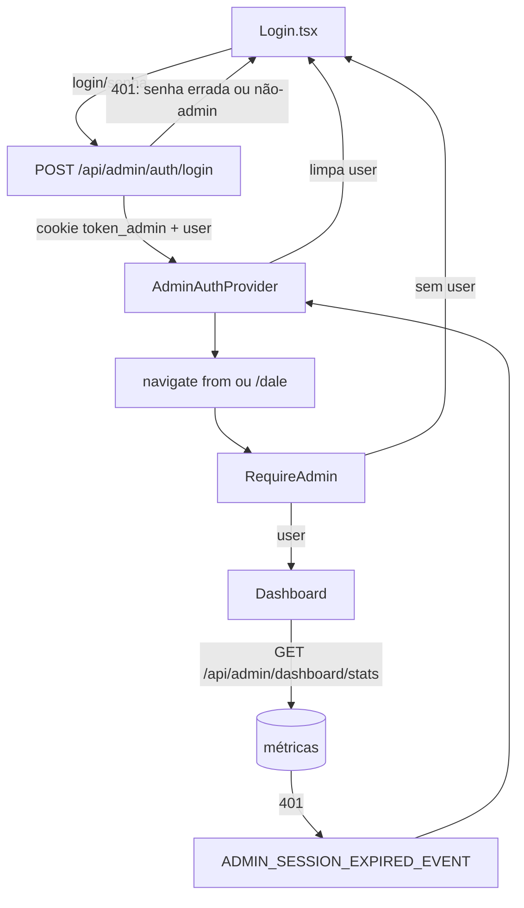
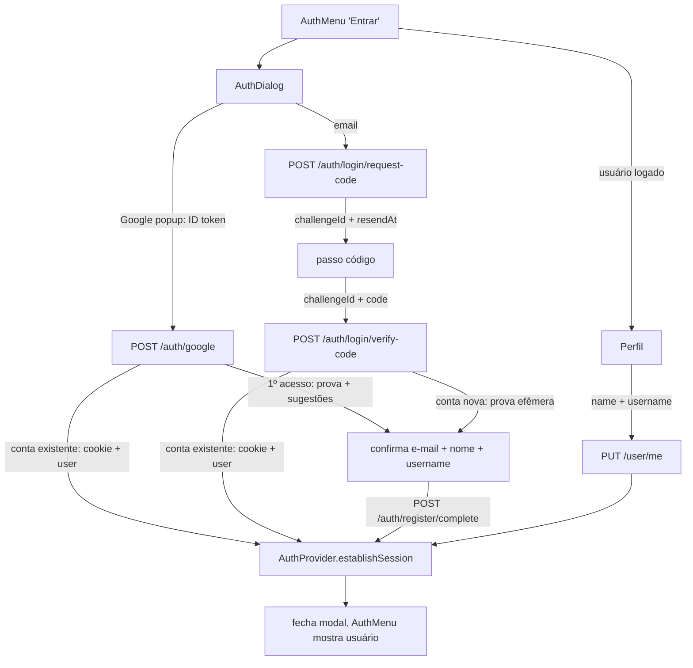

# Área Admin

Área protegida do front (`/dale`), separada da cena 3D. Login de administrador + dashboard. Base de UI (shadcn, tema, sidebar, roteamento) em [[componentes-html]].

> [!info] Backend
> Auth e métricas vêm do backend **cidoa-back** (mesmo backend do base_vite). Painel tem sessão própria: `POST /api/admin/auth/login` seta cookie JWT httpOnly `token_admin`; rotas `/admin/*` exigem essa sessão (`adminGuard`). Criar o primeiro admin = script `create-admin.ts` no backend (não há signup público de admin).

---

## Duas sessões (cena × painel)

Cena e painel = sessões **independentes**. Login numa nunca abre a outra; logout numa nunca derruba a outra. Cada área monta só o próprio provider ([[componentes-html#Roteamento]]).

| | Cena (`/`) | Painel (`/dale`) |
| --- | --- | --- |
| Cookie httpOnly | `token_access` (path `/`) | `token_admin` (path `/api/admin`, sameSite `strict`, TTL 8h) |
| JWT `type` | `user` | `admin` |
| Login | código por e-mail, Google, cadastro (`/auth/*`) | senha, `POST /admin/auth/login` — só conta admin |
| Confirma sessão | `GET /user/me` | `GET /admin/auth/me` |
| Logout | `POST /auth/logout` | `POST /admin/auth/logout` |
| Provider + hook | [[#AuthProvider]] + `useAuth` | [[#AdminAuthProvider]] + `useAdminAuth` |
| Guard | nenhum (cena pública) | [[#RequireAdmin]] + `adminGuard` no backend |
| Evento de 401 | `SESSION_EXPIRED_EVENT` | `ADMIN_SESSION_EXPIRED_EVENT` |
| Montado em | rota `/` | layout route de `/dale/login` + grupo `RequireAdmin` |

- `token_admin` com `path=/api/admin` → navegador nem envia pra rotas da app. `adminGuard` só lê `token_admin`; `token_access` nunca passa.
- Conta comum em `/admin/auth/login` → mesmo 401 "Credenciais inválidas" de senha errada.
- Conta admin logada **na cena** ganha só perks da cena (`isAdmin`, ver [[usuarios#O que admin ganha]]). Painel pede login próprio em `/dale/login`.
- JS nunca lê token. Usuário vive só em memória (nada em `localStorage`), confirmado pelo backend só no mount. `isLoading` impede redirect prematuro de `/dale`.
- Sem revogação no servidor: logout apaga cookie; token vale até `exp`. Permissão (conta ativa/admin) vem do banco a cada requisição.

> [!note] Por que separado
> Antes `/dale/login` setava o mesmo `token_access` da cena: logar no admin logava na cena, e conta admin logada na cena abria `/dale`.


```mermaid
flowchart TD
    L[Login.tsx] -->|login/senha| API[POST /api/admin/auth/login]
    API -->|401: senha errada ou não-admin| L
    API -->|cookie token_admin + user| AAP[AdminAuthProvider]
    AAP --> Nav[navigate from ou /dale]
    Nav --> RA[RequireAdmin]
    RA -->|user| Dash[Dashboard]
    RA -->|sem user| L
    Dash -->|GET /api/admin/dashboard/stats| Stats[(métricas)]
    Stats -->|401| Evt[ADMIN_SESSION_EXPIRED_EVENT]
    Evt --> AAP
    AAP -->|limpa user| L
```

---

## AuthProvider

`src/components/AuthProvider.tsx` + `src/hooks/useAuth.ts`. Sessão da **cena**. Montado só na rota `/`, em volta do `CitySceneEditor`.

Expõe via Context: `user`, `isAuthenticated`, `isLoading`, `isAdmin`, `loginWithCode()`, `loginWithGoogle()`, `completeRegistration()`, `updateProfile()`, `logout()`.

- Mount/foco → `GET /user/me`; confirma sessão e permissões atuais. Falha limpa usuário local. `isLoading` cobre consulta inicial; respostas antigas não sobrescrevem login/logout mais recente.
- `loginWithCode({ challengeId, code })` → passwordless, `POST /auth/login/verify-code`; autentica conta existente ou devolve prova efêmera para conta nova.
- `loginWithGoogle(credential)` → `POST /auth/google` com o ID token do GIS; entra ou vincula e abre a sessão. No 1º acesso devolve `registration_required` (e-mail + nome/username sugeridos) sem criar conta.
- `completeRegistration({ registrationToken, name, username })` → `POST /auth/register/complete`; cria conta só após e-mail confirmado.
- `updateProfile({ name, username, profile_image? })` → `PUT /user/me`; atualiza backend + `user` em memória.
- Conta existente por código, Google e cadastro concluído passam pelo mesmo `establishSession(user)`: seta `user`, encerra `isLoading`.
- `logout()` → `POST /auth/logout` + limpa `user` (limpa mesmo se a request falhar — cookie expira sozinho). Sessão do painel intacta.
- Escuta `SESSION_EXPIRED_EVENT` (do `http.ts`): 401 fora de `/admin/*` e fora dos fluxos de auth → derruba só sessão da cena.
- `isAdmin` = `user.is_admin`. Libera toda personalização na cena; **não** abre `/dale`.
- Sem login por senha (`login()` removido). Senha só no painel.
- Mount apaga chave antiga `cidoa.admin.session` do `localStorage` (espelho morto de perfil/e-mail, nunca lido).

> [!note] Signup só passwordless
> Não há signup por senha. Admin nasce pelo script do backend (`create-admin.ts`); usuário comum se cadastra pelo modal passwordless na cena (ver [[#Login público na cena (passwordless)]]).

---

## AdminAuthProvider

`src/components/AdminAuthProvider.tsx` + `src/hooks/useAdminAuth.ts`. Sessão do **painel**. Montado no layout route que envolve `/dale/login` e o grupo `RequireAdmin`.

Expõe via Context: `user`, `isLoading`, `login()`, `logout()`.

- Mount/foco → `GET /admin/auth/me` (`getAdminSession`). Falha → `user = null`.
- `login({ login, password })` → `POST /admin/auth/login` (`adminLogin`); seta `user`.
- `logout()` → `POST /admin/auth/logout` (`adminLogout`); limpa `user` mesmo se request falhar. Sessão da cena intacta.
- Escuta `ADMIN_SESSION_EXPIRED_EVENT`: 401 em `/admin/*` → cookie admin inválido/expirado → limpa `user` → `RequireAdmin` manda pro login.
- `sessionVersion` (ref): refresh mais velho que login/logout é descartado.
- `useAdminAuth()` fora do provider lança erro.

Consumidores: `Login`, `RequireAdmin`, `Dashboard`, `Users`, `AppSidebar`, `MobileNav`.

---

## RequireAdmin

`src/components/RequireAdmin.tsx` (antigo `RequireAuth.tsx`). Rota-layout que protege `/dale`. Lê `useAdminAuth` — sessão da cena, mesmo de conta admin, não conta.

```tsx
if (isLoading) return <p role="status">Carregando sessão…</p>
if (!user) {
  return <Navigate to="/dale/login" replace state={{ from: location }} />
}
return <Outlet />
```

> [!important] Defesa em profundidade
> Guard do front é só UX/navegação. O backend **também** exige sessão admin (`token_admin` + conta ativa/admin no banco) em toda rota `/admin/*` (`adminGuard`). Bloquear no front não substitui o servidor.

### Anti-loop

`Login` redireciona quem tem `user`; `RequireAdmin` deixa passar quem tem `user`. Mesma condição nos dois lados → sem loop. Não-admin nunca ganha sessão do painel (backend recusa no login), então front não checa `is_admin` nem faz logout de emergência.

---

## Login

`src/pages/admin/Login.tsx` — rota `/dale/login`.

- Card centralizado (`min-h-svh`, `bg-background`), `ThemeToggle` no canto.
- Campos `Username ou email` + `Senha` (input com label flutuante).
- Envia `{ login, password }` via `useAdminAuth().login` — backend resolve username **ou** email.
- Guarda a rota de origem (`location.state.from`) e volta pra ela após logar; default `/dale`. Já com sessão do painel → redirect direto.
- Senha errada **ou** conta não-admin → mesmo 401 "Credenciais inválidas" → `ApiError` → mensagem no formulário.
- Abre só a sessão do painel; cena continua deslogada.

---

## Dashboard

`src/pages/admin/Dashboard.tsx` — rota `/dale` (dentro de `RequireAdmin`).

Layout: `SidebarProvider` (`h-svh`) + `AppSidebar` + conteúdo rolável + `MobileNav`. Mostra:

1. **Sessão** — o admin logado (username, email, id, flag admin) — vem do `useAdminAuth().user`, sem request.
2. **Métricas** — `GET /api/admin/dashboard/stats`: doações (contagem, total, ticket médio, maior), cidades, ONGs, usuários. Loading = `Skeleton`; erro = mensagem + botão "Tentar de novo".

> [!note] setState em effect
> O fetch das métricas só chama `setState` em callbacks assíncronos (`.then/.catch/.finally`), nunca no corpo do effect — a regra `react-hooks/set-state-in-effect` reclama de setState síncrono. Reload = função `retry()` reseta estado e bumpa uma `reloadKey`.

---

## Modo noite (menu do usuário)

Cidade de dia ou de noite. Estado é `environmentSettings.night` no `CitySceneEditor` — mesma trilha dos outros settings da cena (`CitySceneCanvas` → [[scene-hooks]] → `runtime.updateEnvironmentSettings`).

- **Onde clica** — botão lua/sol no topo do [[html-components#GameMenu.tsx|GameMenu]]. Deslogado não tem menu: o mesmo toggle vira botão de ícone ao lado do "Entrar".
- **Props** — `AuthMenu` recebe `night` + `onNightChange`; não guarda estado próprio.
- **O que muda na cena** — céu tingido + estrelas ([[scene-builders#loadEnvironment.ts]]), luz/IBL/névoa ([[scene-runtime#Modo noite]]), valores em `NIGHT_PRESET` ([[scene-config#environmentConfig.ts]]).
- **Não persiste** — recarregar volta pro dia. Persistir = mesmo padrão de [[scene-config#uiVisibilityConfig.ts]].

Nada a ver com o `ThemeToggle`/`useTheme` do admin, que é o tema claro/escuro do HTML.

---

## Login público na cena (passwordless)

Usuário comum entra/cadastra **na própria cena 3D** (`/`), sem sair para outra página. Fluxo **passwordless**: e-mail → código de 6 dígitos.

- **`src/components/AuthMenu.tsx`** — botão no canto superior direito da cena. Deslogado: toggle de noite (lua/sol) + "Entrar" abre o modal. Logado: botão somente com ícone de compartilhar indicação ao lado do usuário, **primeiro nome** da conta (`name`; cai no `username` se vazio) limitado a 18 caracteres + reticências. Clique abre o [[html-components#GameMenu.tsx|GameMenu]] (perfil, doações, personalizações, indicações, dia/noite, sair). Também coordena código vindo de `?ref=`, preview, resumo e confirmação. Ver [[referral]].
- **`src/components/ProfilePanel.tsx`** — aba **Perfil** do `GameMenu`: imagem ou iniciais, nome, username e e-mail confirmado. Código/link próprio, indicador e total indicado ficam na aba **Indicações**. Um lápis sobre o avatar abre ações de adicionar/trocar e remover imagem. Aceita JPEG, PNG ou WebP de até 10 MB; `src/lib/image.ts` reduz proporcionalmente para no máximo 400×400. "Salvar alterações" só habilita com nome, username ou imagem diferente do perfil atual.
- **`src/components/AuthDialog.tsx`** — modal único (shadcn `Dialog`): campo opcional de indicação sempre visível + botão **Continuar com Google** + divisor "ou" + e-mail → código. Código de indicação válido mostra nome/imagem; inválido bloqueia login/cadastro até correção ou remoção. Conta nova envia código no cadastro; conta existente confirma depois do login.
  - **Botão Google (GIS)**: o script `accounts.google.com/gsi/client` (carregado no `index.html`) renderiza o botão via `google.accounts.id`. O popup devolve o `credential` (ID token); o callback chama `loginWithGoogle(credential)` → `POST /auth/google` → mesma sessão do fluxo por código. Entrar e cadastrar são a **mesma ação** (o backend resolve). No 1º acesso o modal vai para o passo de confirmação em vez de já entrar. `GOOGLE_CLIENT_ID` vem de `VITE_GOOGLE_CLIENT_ID` (com default público embutido). Registre a **origem** do front em *Authorized JavaScript origins* no Google Console.
  - **Confirmação de dados (passo `profile`)**: fecha os dois cadastros. E-mail aparece em campo **desabilitado** (só confere); nome e nome de usuário vêm preenchidos no 1º acesso por Google (sugestão do backend) e são editáveis. `POST /auth/register/complete` recebe `{ registrationToken, name, username, referralCode? }`. E-mail vem da prova assinada, nunca do body. Backend normaliza `username` para minúsculas, valida 3–45 caracteres e retorna `409` se já existir. `name` aceita 2–100 caracteres.
  - **Mesma sessão do modal**: `registrationToken` fica somente em estado React. Fechar modal, sair da página ou recarregar apaga a prova e exige novo código. Prova também expira no backend em 4 minutos.
  - **Reenvio**: botão com contagem regressiva do `resendAvailableAt` (cooldown do backend).
  - **Código em dev**: quando o backend devolve `debugCode` (só fora de produção, `AUTH_DEBUG_CODE=1`), o modal mostra e **já preenche** o campo. Em produção `debugCode` nunca vem — o código chega por e-mail.
  - Erros do backend (409 nome de usuário/e-mail em uso após confirmação, 429 rate limit, código/prova inválido ou expirado) viram `ApiError` → mensagem no formulário. E-mail sem cadastro não gera erro no envio.


```mermaid
flowchart TD
    Btn[AuthMenu 'Entrar'] --> Modal[AuthDialog]
    Modal -->|Google popup: ID token| GG[POST /auth/google]
    GG -->|conta existente: cookie + user| AP
    GG -->|1º acesso: prova + sugestões| Cadastro
    Modal -->|email| RC[POST /auth/login/request-code]
    RC -->|challengeId + resendAt| Code[passo código]
    Code -->|challengeId + code| VC[POST /auth/login/verify-code]
    VC -->|conta existente: cookie + user| AP[AuthProvider.establishSession]
    VC -->|conta nova: prova efêmera| Cadastro[confirma e-mail + nome + username]
    Cadastro -->|POST /auth/register/complete| AP
    AP --> Close[fecha modal, AuthMenu mostra usuário]
    Btn -->|usuário logado| Profile[Perfil]
    Profile -->|name + username| Update[PUT /user/me]
    Update --> AP
```

> [!info] Backend passwordless
> Contrato completo (rate limit, e-mail descartável, HMAC do código, seam OAuth) em `cidoa-back` → `doc/modulos/auth/auth.md`.

---

## Camada de API

`src/api/http.ts` — axios único, compartilhado com a cena. Ajustes pra auth:

- `withCredentials: true` → envia cookies httpOnly (`token_access`; `token_admin` só vai pra `/api/admin`).
- Interceptor de 401 **fora** dos fluxos de auth (regex `/auth/(login|register|google)` — cobre `/admin/auth/login`) escolhe evento pela URL: `/admin/*` → `ADMIN_SESSION_EXPIRED_EVENT` (derruba só painel); resto → `SESSION_EXPIRED_EVENT` (derruba só cena). Dentro do fluxo, 401 = credencial/código inválido (não sessão expirada).

| Módulo | Arquivo | Rotas |
| --- | --- | --- |
| Auth (cena) | `api/auth/auth.routes.ts` | `logout`, `loginWithGoogle`, `requestLoginCode`, `verifyLoginCode`, `completeRegistration` — sem login por senha |
| Referral | `api/referral/referral.routes.ts` | `getReferralPreview`, `getMyReferralSummary`, `applyMyReferral` — ver [[referral]] |
| Admin (painel) | `api/admin/admin.routes.ts` | sessão: `adminLogin`, `adminLogout`, `getAdminSession`; usuários: `listUsers`, `setUserAdmin`, `deleteUser` (ver [[usuarios]]); `getDashboardStats`, `createTestBuildings`, `deleteAllBuildings` (ver [[edificios-teste]]), `getIbgeStatus`, `syncIbge` (ver [[ibge]]) |
| User (cena) | `api/user/user.routes.ts` + `user.types.ts` | `getOwnSession`, `updateOwnProfile`; tipo `User`, incluindo `name: string \| null` para contas antigas |

---

## Criar o primeiro admin

Sem signup público. No **backend** (cidoa-back):

```bash
bun run scripts/create-admin.ts <username> <password> [email]
```

Cria/promove usuário com `is_admin=true` + senha bcrypt. Depois é só logar em `/dale/login` (abre só o painel; cena pede login próprio).

---

## Onde mexer?

| Objetivo | Arquivo |
| --- | --- |
| Regras de acesso / redirect da área admin | `src/components/RequireAdmin.tsx` |
| Sessão da cena (código, Google, logout) | `src/components/AuthProvider.tsx` + `src/hooks/useAuth.ts` |
| Sessão do painel (login por senha, logout) | `src/components/AdminAuthProvider.tsx` + `src/hooks/useAdminAuth.ts` |
| Qual provider cada rota monta | `src/App.tsx` |
| Botão de login na cena (público) | `src/components/AuthMenu.tsx` |
| Menu do usuário logado (abas, sair) | `src/components/GameMenu.tsx` · [[html-components#GameMenu.tsx]] |
| Modo noite (toggle no menu do usuário) | [[area-admin#Modo noite (menu do usuário)]] |
| Modal de login/cadastro passwordless | `src/components/AuthDialog.tsx` |
| Visualização e edição do perfil | `src/components/ProfilePanel.tsx` + `src/api/user/user.routes.ts` |
| Link, preview, confirmação e compartilhamento de indicação | `src/components/AuthMenu.tsx` + `src/components/referral/` + `src/api/referral/` |
| Tela de login do admin (senha) | `src/pages/admin/Login.tsx` |
| Tela de dashboard | `src/pages/admin/Dashboard.tsx` |
| Gerar/excluir edifícios de teste | [[edificios-teste]] |
| Vincular catálogo do IBGE | [[ibge]] |
| Itens da sidebar/nav | `src/lib/nav.ts` |
| Chamadas de API admin | `src/api/admin/admin.routes.ts` |
| Cookies / eventos de sessão (401 → cena ou painel) | `src/api/http.ts` |
| Novas rotas admin | `src/App.tsx` (dentro de `<RequireAdmin>`) |

---

## Relacionado

- [[componentes-html]] — base de UI (shadcn, tema, sidebar, roteamento)
- [[edificios-teste]] — gerar/excluir edifícios fictícios em massa
- [[index]] — visão geral + cena 3D
- [[donation-api]] — cliente HTTP compartilhado

## Primeiros inscritos

Menu **Primeiros inscritos** → `/dale/primeiros-inscritos`. Configura combo e quantidade; libera aos primeiros cadastros, inclusive anteriores. Sessão admin em GET/PUT `/admin/early-signups`. Ver [[primeiros-inscritos]].
