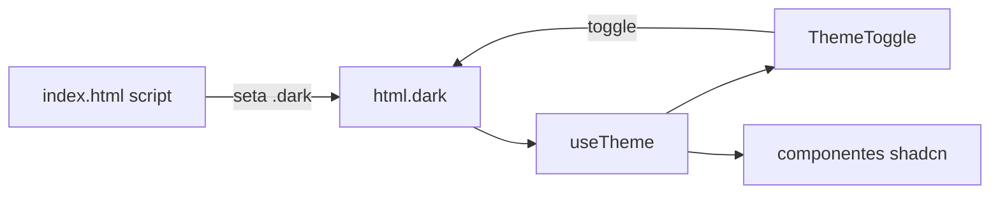

# Componentes & Renderização HTML

> [!abstract] Escopo
> Front do Cidoa = **dois mundos**. Cena 3D (Three.js, rota pública `/`) documentada em [[index]] e nas pastas `scene/`. Este doc cobre a **base de UI HTML da área admin** — componentes, tema, roteamento, shadcn/ui. Nada de Three.js aqui. Admin em si (login, dashboard, auth) fica em [[area-admin]].

Padrão copiado do repo **base_vite** (mesmo backend). Reutiliza componente antes de escrever novo.

---

## Stack HTML

| Camada | Tech |
| --- | --- |
| Roteamento | `react-router-dom` v7 (`BrowserRouter`, rotas lazy) |
| Componentes base | **shadcn/ui** — `radix-ui` + `class-variance-authority` + `tailwind-merge` + `clsx` |
| Ícones | `lucide-react` |
| Estilo | Tailwind v4 + tokens de tema (light/dark) |
| Tema | classe `.dark` no `<html>` + `useTheme` (sem provider) |

> [!note] Estado
> Auth = React Context ([[area-admin#AuthProvider]]). Não usa zustand — base_vite resolve com Context + hook, então segue igual. Não adiciona lib de estado sem necessidade.

---

## Estrutura de arquivos (fora da cena)

```text
src/
  App.tsx                      ← BrowserRouter + rotas (cena, admin)
  components/
    ui/                        ← primitivos shadcn (vendorizados, não editar à toa)
      button.tsx  input.tsx  card.tsx  sidebar.tsx  sheet.tsx
      dropdown-menu.tsx  avatar.tsx  tooltip.tsx  separator.tsx  skeleton.tsx
    AuthProvider.tsx           ← sessão global (login/logout)
    RequireAuth.tsx            ← guarda da área /dale (exige admin)
    AppSidebar.tsx             ← sidebar desktop (nav + conta/tema no rodapé)
    MobileNav.tsx              ← nav mobile (bottom bar + drawer, < md)
    ThemeToggle.tsx            ← switch claro/escuro
  hooks/
    useAuth.ts                 ← AuthContext + hook useAuth
    useTheme.ts                ← tema via .dark no <html>
    use-mobile.ts              ← breakpoint < 768px
  lib/
    utils.ts                   ← cn() (clsx + tailwind-merge)
    nav.ts                     ← fonte única dos itens de navegação
  pages/
    admin/
      Login.tsx                ← ver [[area-admin]]
      Dashboard.tsx            ← ver [[area-admin]]
  api/
    http.ts                    ← axios único (cookie + evento de sessão)
    auth/                      ← login/logout + tipos
    admin/                     ← métricas do dashboard
    user/                      ← tipo User
```

> [!important] Alias `@/`
> `@/*` aponta pra `src/*`. Configurado em `vite.config.ts` (`resolve.alias`) **e** `tsconfig.app.json` (`paths`). Os dois precisam bater. Imports shadcn usam `@/components/...`, `@/lib/utils`.

---

## Renderização HTML & tema

Tokens da marca ficam em `src/index.css`: blocos `:root` (light) e `.dark` (dark), expostos como utilitários Tailwind via `@theme inline` (`bg-background`, `text-foreground`, `border-border`, `bg-primary`…). Paleta = navy + creme + terracota.

Regras de layout que convivem com a cena:

- `body` fica com `overflow: hidden` (a **cena** ocupa a viewport inteira). Telas de `/dale` rolam **internamente** — o `Dashboard` usa `SidebarProvider` com altura `h-svh` e uma área de conteúdo `overflow-y-auto`.
- `body` mantém fundo escuro (load da cena). As páginas admin pintam `bg-background` por cima, então respondem ao tema.

### Anti-FOUC

`index.html` tem script inline que aplica `.dark` **antes** do paint (lê `localStorage.theme` ou `prefers-color-scheme`). Evita flash de tema errado. `useTheme` é a fonte da verdade em runtime: lê/escreve a classe `.dark` e usa `useSyncExternalStore` — N componentes sincronizam sem provider.



---

## shadcn/ui — primitivos

Ficam em `src/components/ui/`. **Vendorizados**: código do shadcn colado no repo, não vem de `node_modules`. Editar só com motivo. `cn()` (`@/lib/utils`) junta classes condicionais (clsx) e resolve conflito Tailwind (tailwind-merge).

> [!warning] Lint dos primitivos
> Arquivos `ui/**` exportam componente + `xxxVariants` (cva). A regra `react-refresh/only-export-components` é **desligada** só pra essa pasta no `eslint.config.js` (igual base_vite). Não replicar esse export duplo fora de `ui/`.

Adicionar primitivo novo: `npx shadcn@latest add <nome>` (config em `components.json`) ou copiar do base_vite.

---

## Componentes reutilizáveis

| Componente | Papel |
| --- | --- |
| [[area-admin#AuthProvider]] | provider global de sessão (login/logout, isAdmin) |
| [[area-admin#RequireAuth]] | guarda de rota — só admin logado entra em `/dale` |
| `AppSidebar` | sidebar desktop `collapsible=icon`; nav (`lib/nav`) + rodapé com usuário, tema e sair |
| `MobileNav` | bottom bar fixa (< md) + drawer "Menu" com nav completa e conta |
| `ThemeToggle` | switch claro/escuro (usa `useTheme`) |

`AppSidebar` e `MobileNav` leem os itens de `src/lib/nav.ts` — **fonte única** de navegação. Adicionar item = editar `nav.ts` (título, ícone lucide, `to`); os dois consumidores atualizam juntos.

---

## Roteamento

`src/App.tsx` = `BrowserRouter` + `AuthProvider` + `Suspense`. Cada página é `lazy()` → chunk próprio (cena Three.js pesada fica separada do admin).

```text
/                      → CitySceneEditor   (pública, cena 3D)
/dale/login            → Login             (pública)
/dale                  → Dashboard         (dentro de <RequireAuth> — exige admin)
/dale/edificios-teste  → TestBuildings     (dentro de <RequireAuth> — ver [[edificios-teste]])
*                      → redireciona pra /
```

Detalhe de guarda, login e dashboard → [[area-admin]].

---

## Regra de ouro (onde mora o código)

| Serve a… | Vai pra… | Documenta em… |
| --- | --- | --- |
| 1 página só | `src/pages/<Pagina>/` | doc da página |
| 2+ páginas | `src/components` · `src/hooks` · `src/lib` | aqui |
| Primitivo visual | `src/components/ui/` | aqui (seção shadcn) |

Antes de escrever: **procure**. Duplicar componente é o erro mais comum.

---

## Relacionado

- [[area-admin]] — login, dashboard, fluxo de auth e API admin
- [[index]] — visão geral + cena 3D
- [[donation-api]] — cliente HTTP da cena (mesmo `http.ts`)
