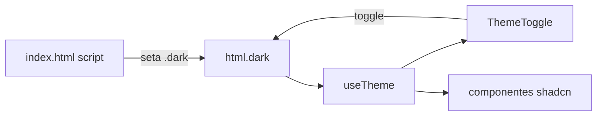

# Componentes & Renderização HTML

> [!abstract] Escopo
> Front do Cidoa = **dois mundos**. Cena 3D (Three.js, rota pública `/`) documentada em [[index]] e nas pastas `scene/`. Este doc cobre a **base de UI HTML da área admin** — componentes, tema, roteamento, shadcn/ui. Nada de Three.js aqui. Admin em si (login, dashboard, auth) fica em [[area-admin]].

Padrão copiado do repo **base_vite** (mesmo backend). Reutiliza componente antes de escrever novo.

---

## Stack HTML

| Camada | Tech |
| --- | --- |
| Roteamento | `react-router-dom` v7 (`BrowserRouter`, rotas lazy) |
| Componentes base | **shadcn/ui** — `radix-ui` + `class-variance-authority` + `tailwind-merge` + `clsx` |
| Ícones | `lucide-react` |
| Estilo | Tailwind v4 + tokens de tema (light/dark) |
| Tema | classe `.dark` no `<html>` + `useTheme` (sem provider) |

> [!note] Estado
> Auth = React Context, um por sessão: cena ([[area-admin#AuthProvider]]) e painel ([[area-admin#AdminAuthProvider]]). Não usa zustand — base_vite resolve com Context + hook, então segue igual. Não adiciona lib de estado sem necessidade.

---

## Estrutura de arquivos (fora da cena)

```text
src/
  App.tsx                      ← BrowserRouter + rotas (cena, admin)
  components/
    ui/                        ← primitivos shadcn (vendorizados, não editar à toa)
      button.tsx  input.tsx  card.tsx  sidebar.tsx  sheet.tsx  switch.tsx
      dropdown-menu.tsx  avatar.tsx  tooltip.tsx  separator.tsx  skeleton.tsx
      pagination.tsx
    AuthProvider.tsx           ← sessão da cena (código/Google, logout)
    AdminAuthProvider.tsx      ← sessão do painel /dale (senha, logout)
    RequireAdmin.tsx           ← guarda da área /dale (exige sessão do painel)
    AppSidebar.tsx             ← sidebar desktop (nav + conta/tema no rodapé)
    MobileNav.tsx              ← nav mobile (bottom bar + drawer, < md)
    ThemeToggle.tsx            ← switch claro/escuro
  hooks/
    useAuth.ts                 ← AuthContext + hook useAuth (cena)
    useAdminAuth.ts            ← AdminAuthContext + hook useAdminAuth (painel)
    useTheme.ts                ← tema via .dark no <html>
    use-mobile.ts              ← breakpoint < 768px
  lib/
    utils.ts                   ← cn() (clsx + tailwind-merge)
    nav.ts                     ← fonte única dos itens de navegação
  pages/
    admin/
      Login.tsx                ← ver [[area-admin]]
      Dashboard.tsx            ← ver [[area-admin]]
      Pass.tsx                 ← /dale/passe; trilha e configuração, ver [[passe-admin-ui]]
  api/
    http.ts                    ← axios único (cookie + evento de sessão)
    auth/                      ← login da cena (código/Google) + tipos
    admin/                     ← sessão do painel, usuários, métricas do dashboard
    user/                      ← perfil próprio (cena) + tipo User
```

> [!important] Alias `@/` — em **três** lugares
> `@/*` aponta pra `src/*`. Configurado em `vite.config.ts` (`resolve.alias`), `tsconfig.app.json` (`paths`) e `tsconfig.json` da **raiz** (`paths`, espelhado). Os três precisam bater. Imports shadcn usam `@/components/...`, `@/lib/utils`.
>
> O da raiz parece redundante — o build nem o lê (`files: []`). Mas é o **único** tsconfig que o CLI do shadcn abre: ele não segue `references`. Sem `paths` ali, o CLI não resolve o alias e grava os componentes numa pasta literal chamada `@/` na raiz do repo. Não remova.

---

## Adicionar primitivo shadcn

```bash
bun run ui:add badge          # um ou vários: bun run ui:add badge table
```

Wrapper em `scripts/ui-add.sh`. Chama `bunx --bun shadcn@latest add` e conserta o que o CLI erra sozinho — ver abaixo. Rodar o CLI cru funciona, mas aí a limpeza é manual.

> [!bug] Dois defeitos conhecidos do `shadcn add`
> **1. Alias não resolvido** → componentes caem numa pasta literal `@/`. Causa: `tsconfig.json` da raiz sem `paths`. **Já corrigido** no repo (ver callout acima); só volta se alguém tirar o `paths` de lá.
>
> **2. Import do `cn` quebrado** → o registry publica `import { cn } from "cn"` e declara `cn` como dependência npm, instalando um pacote de terceiro que não tem nada a ver. Confirmado no payload cru (`curl https://ui.shadcn.com/r/styles/new-york-v4/pagination.json` → `"dependencies": ["cn"]`) e em **todo** item `registry:ui`, no CLI 3 e no 4. É bug do upstream, não tem flag. O wrapper troca o import por `@/lib/utils` e roda `bun remove cn`. Quando o shadcn arrumar, o wrapper pode sumir.

Depois de rodar, confira `git status` de qualquer jeito: o arquivo tem que estar em `src/components/ui/` e `package.json` não pode ganhar dependência nova. O `bun.lock` pode aparecer modificado sem ser dependência nova — o `bun remove cn` do wrapper ressincroniza o lockfile se ele estiver defasado. Confira o diff antes de commitar.

---

## Renderização HTML & tema

Tokens ficam em `src/index.css`: blocos `:root` (light) e `.dark` (dark), expostos como utilitários Tailwind via `@theme inline` (`bg-background`, `text-foreground`, `border-border`, `bg-primary`…). Light mantém paleta da marca; dark usa escala neutra padrão do shadcn. Azul-marinho e terracota não entram no dark; vermelho fica restrito ao token semântico `destructive`.

Regras de layout que convivem com a cena:

- `body` fica com `overflow: hidden` (a **cena** ocupa a viewport inteira). Telas de `/dale` rolam **internamente** — o `Dashboard` usa `SidebarProvider` com altura `h-svh` e uma área de conteúdo `overflow-y-auto`.
- `body` mantém fundo escuro (load da cena). As páginas admin pintam `bg-background` por cima, então respondem ao tema.

### Anti-FOUC

`index.html` tem script inline que aplica `.dark` **antes** do paint (lê `localStorage.theme` ou `prefers-color-scheme`). Evita flash de tema errado. `useTheme` é a fonte da verdade em runtime: lê/escreve a classe `.dark` e usa `useSyncExternalStore` — N componentes sincronizam sem provider.


```mermaid
flowchart LR
    HTML[index.html script] -->|seta .dark| Root[html.dark]
    Root --> UT[useTheme]
    UT --> TT[ThemeToggle]
    UT --> Comp[componentes shadcn]
    TT -->|toggle| Root
```

---

## shadcn/ui — primitivos

Ficam em `src/components/ui/`. **Vendorizados**: código do shadcn colado no repo, não vem de `node_modules`. Editar só com motivo. `cn()` (`@/lib/utils`) junta classes condicionais (clsx) e resolve conflito Tailwind (tailwind-merge).

> [!warning] Lint dos primitivos
> Arquivos `ui/**` exportam componente + `xxxVariants` (cva). A regra `react-refresh/only-export-components` é **desligada** só pra essa pasta no `eslint.config.js` (igual base_vite). Não replicar esse export duplo fora de `ui/`.

Adicionar primitivo novo: `bun run ui:add <nome>` — ver [[#Adicionar primitivo shadcn]]. Config em `components.json`.

### Notificações (toast)

`src/components/ui/toast.tsx` — `toast.*` + `<Toaster />`. Base: **Radix Toast** (já vem no `radix-ui`, zero dependência nova). `<Toaster />` montado 1× em `App.tsx`, fora do `Suspense` — vale pra cena e admin. Store fora do React: `toast.*` chama de qualquer lugar (callback de promise, handler de API), sem hook.

```ts
import { toast } from "@/components/ui/toast"

toast.success("Salvo.")
toast.error("Falhou.", { id: "save-42", action: { label: "Tentar de novo", onClick: retry } })
toast.dismiss("save-42")
```

| Recurso | Como |
| --- | --- |
| Variantes | `success` · `error` · `warning` · `info` (ícone + cor) |
| Fecha sozinho | success/info 4s · warning 6s · error 7s; `duration` sobrescreve, `Infinity` = só no "x" |
| Fechar manual | botão "x", `Esc`, arrastar pra direita |
| Pausa | hover ou foco na pilha (Radix); janela sem foco também pausa |
| Sem duplicar | mesmo `id` substitui o toast e reinicia o timer |
| Teto | 3 visíveis; 4º derruba o mais antigo |
| Ação | `action` = botão extra; clicar também fecha |
| Acessibilidade | `aria-live` do Radix anuncia; `F8` foca a pilha |

Posição: rodapé central (`bottom-20` no mobile livra a `MobileNav`). Topo e cantos da cena já têm menu, filtros, painéis e engrenagem. Visual escuro fixo (vidro da cena), legível no admin claro e escuro.

Quando usar: resultado **transitório** de ação (salvou, copiou, falhou em segundo plano). Erro de campo/formulário e erro de carga com botão de retry continuam **inline** — somem quando o contexto some.

> [!bug] Dois contornos do Radix — não remover
> **Pausa presa** → último toast fecha com o mouse em cima: viewport remove os listeners com a pausa ainda ligada; próximo toast nasce pausado e nunca sai sozinho. `batch` agrupa toasts abertos juntos; nova leva remonta o `Provider` (`key`) e zera a pausa.
> **Foco no viewport** → clique de mouse no "x" focava o botão; ao fechar, Radix move o foco pro viewport e os restantes ficam pausados até clicar fora. `onMouseDown` com `preventDefault` nos botões impede. Teclado segue com foco gerenciado pelo Radix.

Desvio consciente em `pagination.tsx`: `PaginationLink` renderiza `<button type="button">` no lugar do `<a href>` do upstream. A página aqui vive em estado React, não na URL — `<a>` sem `href` perde foco e teclado. Rótulos em português. Uso em [[usuarios#Paginação]].

---

## Componentes reutilizáveis

| Componente | Papel |
| --- | --- |
| [[area-admin#AuthProvider]] | sessão da cena (código/Google, logout, isAdmin) — só na rota `/` |
| [[area-admin#AdminAuthProvider]] | sessão do painel (senha, logout) — só em `/dale/*` |
| [[area-admin#RequireAdmin]] | guarda de rota — só sessão do painel entra em `/dale` |
| `AppSidebar` | sidebar desktop `collapsible=icon`; nav (`lib/nav`) + rodapé com usuário, tema e sair |
| `MobileNav` | bottom bar fixa (< md) + drawer "Menu" com nav completa e conta |
| `ThemeToggle` | switch claro/escuro (usa `useTheme`) |

`AppSidebar` e `MobileNav` leem os itens de `src/lib/nav.ts` — **fonte única** de navegação. Adicionar item = editar `nav.ts` (título, ícone lucide, `to`); os dois consumidores atualizam juntos.

---

## Roteamento

`src/App.tsx` = `BrowserRouter` + `Suspense` + `<Toaster />` ([[#Notificações (toast)]]). Cada página é `lazy()` → chunk próprio (cena Three.js pesada fica separada do admin).

Cada área monta só a própria sessão ([[area-admin#Duas sessões (cena × painel)]]):

- `/` → `<AuthProvider><CitySceneEditor /></AuthProvider>`.
- Layout route sem path → `<AdminAuthProvider><Suspense><Outlet /></Suspense></AdminAuthProvider>` envolve `/dale/login` + grupo `<RequireAdmin>`.

```text
/                      → CitySceneEditor   (pública, cena 3D)
/dale/login            → Login             (pública)
/dale                  → Dashboard         (dentro de <RequireAdmin> — exige sessão do painel)
/dale/edificios-teste  → TestBuildings     (dentro de <RequireAdmin> — ver [[edificios-teste]])
*                      → redireciona pra /
```

Detalhe de guarda, login e dashboard → [[area-admin]].

---

## Regra de ouro (onde mora o código)

| Serve a… | Vai pra… | Documenta em… |
| --- | --- | --- |
| 1 página só | `src/pages/<Pagina>/` | doc da página |
| 2+ páginas | `src/components` · `src/hooks` · `src/lib` | aqui |
| Primitivo visual | `src/components/ui/` | aqui (seção shadcn) |

Antes de escrever: **procure**. Duplicar componente é o erro mais comum.

---

## Relacionado

- [[area-admin]] — login, dashboard, fluxo de auth e API admin
- [[index]] — visão geral + cena 3D
- [[donation-api]] — cliente HTTP da cena (mesmo `http.ts`)


## Navegação do Passe

`navItems` inclui **Passe** (`/dale/passe`, ícone Trophy), rota lazy protegida por `RequireAdmin`. Sidebar e mobile compartilham entrada. Passe ocupa quarto atalho mobile; IBGE continua no drawer Menu.
