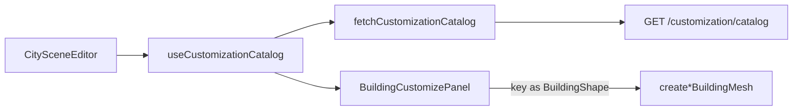

# Catálogo de Personalizações

Camada que traz do backend **quais** personalizações existem. Código (builders, shaders, layout) fica no front; catálogo (opções ativas, cores, labels) vem do backend. Ver decisão em [[personalizacoes]] (backend).

**Arquivos:** [`src/api/customizationApi.ts`](../../src/api/customizationApi.ts) · [`src/components/hooks/useCustomizationCatalog.ts`](../../src/components/hooks/useCustomizationCatalog.ts)

## `fetchCustomizationCatalog()`

`GET /customization/catalog` → normaliza árvore de categorias num objeto por-categoria pronto pro painel:

```ts
type CustomizationCatalog = {
  shapes: CatalogOption[];      // categoria 'shape'
  rooftops: CatalogOption[];    // 'rooftop'
  edgeLights: CatalogOption[];  // 'edge_light'
  colors: CatalogOption[];      // 'color' (value = hex)
  textures: CatalogOption[];    // 'texture' (value = caminho/URL)
  features: { sign: boolean; hologram: boolean }; // categorias-feature ativas
};
type CatalogOption = { id: number; key: string; label: string; value: string | null; sortOrder: number };
```

`features.*` = presença da categoria no payload. Backend só manda categoria **ativa**, então presença = habilitado. Admin desliga Letreiro/Holograma → some do painel.

`option.key` = contrato com builder (`twisted`, `helipad`, `led`…). Painel faz cast `key as BuildingShape` etc. Novo formato exige builder no front — admin não cria.

## `useCustomizationCatalog()`

Hook: carrega catálogo 1× no mount, retorna `CustomizationCatalog | null`. `null` = carregando (ou falha logada). Consumido em [[html-components#CitySceneEditor|CitySceneEditor]] e passado ao [[html-components#BuildingCustomizePanel.tsx|BuildingCustomizePanel]] via prop `catalog`.

Endpoint cacheado no backend (staleness ≤60s). Mudança do admin aparece na cena em ≤60s.

## Fluxo


