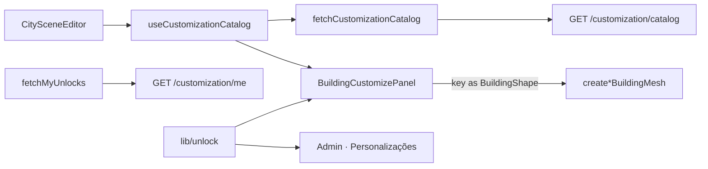

# Catálogo de Personalizações

Camada que traz do backend **quais** personalizações existem e **o que o usuário precisa fazer** pra usar cada uma. Código (builders, shaders, layout) fica no front; catálogo e regra de liberação vêm do backend.

Gamificação em volta desses dados = [[passe-front|módulo Passe]].

**Arquivos:** [`src/api/customizationApi.ts`](../../src/api/customizationApi.ts) · [`src/components/hooks/useCustomizationCatalog.ts`](../../src/components/hooks/useCustomizationCatalog.ts)

## `fetchCustomizationCatalog()`

`GET /customization/catalog` → normaliza árvore de categorias num objeto por-categoria pronto pro painel:

```ts
type CustomizationCatalog = {
  shapes: CatalogOption[];      // categoria 'shape'
  rooftops: CatalogOption[];    // 'rooftop'
  edgeLights: CatalogOption[];  // 'edge_light'
  colors: CatalogOption[];      // 'color' (value = hex)
  textures: CatalogOption[];    // 'texture' (value = caminho/URL)
  features: { sign: CatalogFeature | null; hologram: CatalogFeature | null };
};
type CatalogOption = { id: number; key: string; label: string; value: string | null; sortOrder: number; unlock: UnlockRule };
type CatalogFeature = { unlock: UnlockRule };
```

`features.*` = presença da categoria no payload. Backend só manda categoria **ativa**, então não-null = habilitado. Admin desliga Letreiro/Holograma → some do painel. Feature carrega regra própria (não tem lista de opções onde guardar).

`option.key` = contrato com builder (`twisted`, `helipad`, `led`…). Painel faz cast `key as BuildingShape` etc. Formato novo exige builder no front — admin não cria.

Requisito viaja no catálogo público porque é **igual pra todo visitante**. É isso que preserva o cache do backend e deixa quem está deslogado ver o passe inteiro com cadeado.

## `fetchMyUnlocks()`

`GET /customization/me` (exige sessão) → progresso e conquistas do usuário:

```ts
type MyUnlocks = {
  progress: { donated: number; referrals: number };
  unlockedOptionIds: number[];      // opção grátis NÃO aparece — não é conquista
  unlockedCategoryKeys: string[];   // 'sign', 'hologram'
};
```

Separado do catálogo de propósito: catálogo é igual pra todos e fica em cache; isto é por-usuário e nunca cacheável. Front junta os dois.

Conquista é **permanente**: admin subir o limiar não tira nada daqui.

## Formatação do requisito

`UnlockRule` = `{ donationMin: number | null; referralMin: number | null } | null`. `null` no topo = grátis. Eixo `null` = não exige. **Zero não existe** — backend recusa, então nenhuma tela precisa tratar.

Tipo e todas as funções de exibição vivem em [`src/lib/unlock.ts`](../../src/lib/unlock.ts) — fonte única. Ver [[passe-formatacao]].

## `useCustomizationCatalog()`

Hook: carrega catálogo 1× no mount, retorna `CustomizationCatalog | null`. `null` = carregando (ou falha logada). Consumido em [[html-components#CitySceneEditor|CitySceneEditor]], passado ao [[html-components#BuildingCustomizePanel.tsx|BuildingCustomizePanel]] via prop `catalog`.

Endpoint cacheado no backend (staleness ≤60s), mas o cache é **invalidado a cada escrita do admin** — mudança de regra aparece na cena na hora.

> [!todo] Fase seguinte — cena
> Hook ainda não busca `/customization/me`. Contrato e decisões já fechados em [[passe-cena]].

## Fluxo


```mermaid
flowchart LR
  Editor[CitySceneEditor] --> Hook[useCustomizationCatalog]
  Hook --> API[fetchCustomizationCatalog]
  API --> BE[GET /customization/catalog]
  Hook --> Panel[BuildingCustomizePanel]
  Panel --> |key as BuildingShape| Builders[create*BuildingMesh]
  Me[fetchMyUnlocks] --> BEME[GET /customization/me]
  Fmt[lib/unlock] --> Panel
  Fmt --> Admin[Admin · Personalizações]
```
