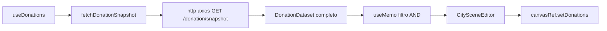

# Camada de API — Doações

Camada **só de dados**. Zero Three.js, zero React fora do hook. Busca doações do backend, aplica filtro client-side, entrega pro editor. Vive em `src/api/` (dados puros) + `src/components/hooks/useDonations.ts` (ponte React).

> [!important] Estilo de escrita
> Modo homem das cavernas. Corta artigo, enchimento, hedge. Fragmento OK.

## Por que existe

Antes: prédios nasciam no front (`INITIAL_TEST_DONATIONS`, 10 valores hardcoded). Agora: vêm do backend, snapshot cacheado, escala 100k+. IDs do backend preservados.

## Arquivos

| Arquivo | Papel |
| --- | --- |
| `src/api/http.ts` | Instância axios. `baseURL = VITE_API_URL ?? "/api"`. Normaliza erro → `ApiError {status, message}`. |
| `src/api/donationApi.ts` | `fetchDonationSnapshot()` — 1 GET, mapeia tuplas → objetos. Tipos `DonationRecord`/`City`/`Ong`/`DonationDataset`. |
| `src/api/regions.ts` | `UF_REGION` (27 UFs → 5 regiões) + `REGIONS`. Região é função fixa da UF — não vem do backend. |
| `src/components/hooks/useDonations.ts` | Hook. Carrega snapshot, guarda dataset, aplica filtro (`useMemo`), expõe `loadState`/`donations`/`cities`/`ongs`/`filter`/`setFilter`/`retry`. |

## Contrato do snapshot

`GET /donation/snapshot` (proxy Vite `/api` → back). Formato compacto por tuplas:

```json
{ "v": 2, "total": 100000,
  "cities": [[2800308, "Aracaju", "SE"]],
  "ongs": [[1, "Instituto X"]],
  "data": [[1, 42.5, 3550308, 7]] }
```

`data`: `[id, value, cityId, ongId]`. `fetchDonationSnapshot` desdobra em objetos `DonationRecord`.

## Gotcha: barra de progresso com gzip

Resposta vem `Content-Encoding: gzip`. Browser zera `ProgressEvent.total` e conta `loaded` em bytes **descomprimidos**. Logo `Content-Length` (tamanho gzip) não serve de denominador.

Solução: back manda header `X-Snapshot-Bytes` = tamanho do JSON raw. `donationApi` lê ele via `event.event?.target.getResponseHeader(...)` (headers chegam antes do body). Sem o header → `totalBytes: null` → overlay mostra só MB carregados, sem %.

## Filtro client-side

Dataset inteiro já é **público** (id, valor, cidade, ONG — sem dado de doador). Filtrar no front NÃO delega segurança ao cliente — só escolhe o que renderizar. ~5ms p/ 100k.

Predicado AND no `useMemo`:
- `ongId` combina com qualquer nível de local.
- Local usa o mais específico presente: `cityId` > `uf` > `region`.
- Região deriva da UF via `UF_REGION[cidade.uf]`.
- `cityById` (Map) montado 1× pra lookup O(1).

Sem filtro → retorna array original (mesma referência, evita rebuild à toa).

## Fluxo



Editor chama `setDonations(donations)` a cada mudança de `donations` (load inicial + troca de filtro). Replace-all na cena — doação manual local é descartada ao trocar filtro. Ver [[scene-managers#setDonations]].

## Estados de carga

`DonationsLoadState`: `loading` (bytes) → `ready` (count) | `error` (message). `retry()` reseta pra `loading` e refaz o fetch (dep `reloadKey`). `AbortController` cancela no unmount (StrictMode roda 2× em dev — abort ignora).

## Segurança

- Endpoint aceita **zero input** (sem body/params/query) — superfície de injeção nula.
- Proxy Vite = DX de dev (mata CORS local), **não** é segurança. Produção: reverse proxy same-origin ou `VITE_API_URL` + `CORS_ORIGINS` estrito no back.
- Nunca confiar no front pra esconder dado: se algo deixar de ser público, sai do snapshot no backend — não se filtra pra esconder.

## Relacionado

- [[html-components#DonationLoadOverlay.tsx]] — overlay de carregamento
- [[html-components#DonationFilterBar.tsx]] — barra de filtros
- [[scene-managers#setDonations]] — replace-all na cena
- [[three-components]] — handle `setDonations`
