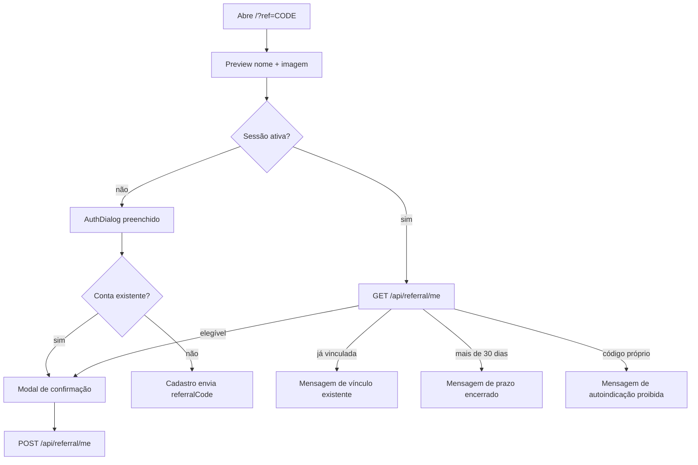

# Indicações no Frontend

Fluxo público de captura, validação, confirmação e compartilhamento de indicação. Backend e regras definitivas ficam em `cidoa-back/doc/modulos/indicacoes/indicacoes.md`.

## Arquivos

| Arquivo | Papel |
| --- | --- |
| `src/api/referral/referral.routes.ts` | Preview público, resumo autenticado e confirmação. |
| `src/api/referral/referral.types.ts` | Contratos de preview, resumo e confirmação. |
| `src/api/referral/referral.logic.ts` | Normalização e estado `confirm`, `linked`, `expired` ou `self`. |
| `src/components/referral/ReferralPerson.tsx` | Nome e imagem do indicador. |
| `src/components/referral/ReferralDialog.tsx` | Confirmação e mensagens finais. |
| `src/components/AuthMenu.tsx` | Orquestra URL, auth, resumo, modal e compartilhamento. |

## Captura e validação

- Link esperado: `/?ref=A1B2C3D4E5F60718`.
- Código normalizado com `trim()` + uppercase.
- Campo opcional fica sempre visível no `AuthDialog`.
- Código informado precisa ter 16 caracteres hexadecimais e passar por `GET /api/referral/preview/:code`.
- Preview usa debounce de 350 ms e request cancelável. Código inválido bloqueia e-mail, Google e conclusão do cadastro até correção ou remoção.
- Cancelar descarta código pendente e remove somente `ref` da URL, preservando outros parâmetros e hash.

## Cenários



- Cadastro novo por e-mail envia `referralCode` em `POST /api/auth/register/complete`.
- Google envia `referralCode` em `POST /api/auth/google`; backend aplica somente se criar conta nova.
- Conta existente, por e-mail ou Google, recebe modal após login e confirma via `POST /api/referral/me`.
- Prazo e vínculo vêm do resumo backend; front não recalcula elegibilidade pelo relógio local.
- Autoindicação é detectada pelo código próprio e continua protegida pelo backend.
- Conta já vinculada mostra indicador atual; vínculo não pode ser trocado.
- Admin recebe mensagem de que não participa.

## Home e perfil

- Usuário comum logado recebe botão somente com ícone de compartilhar ao lado do `AuthMenu`.
- Compartilhamento usa `navigator.share`; sem suporte, copia link com `navigator.clipboard`.
- Perfil mostra código e botão com a ação "Compartilhar".
- Bloco “Você foi indicado por” só aparece quando `referrer` existe.
- Total só aparece quando `referral_count > 0`.

## Verificação

```bash
bun test tests/referral-flow.test.ts
npm run lint
npm run build
```

Teste cobre normalização e decisões de confirmação, vínculo, expiração e autoindicação.

## Relacionado

- [[area-admin#Login público na cena (passwordless)]]
- [[donation-api|API de Doações]]
- [[index|Documentação principal]]
