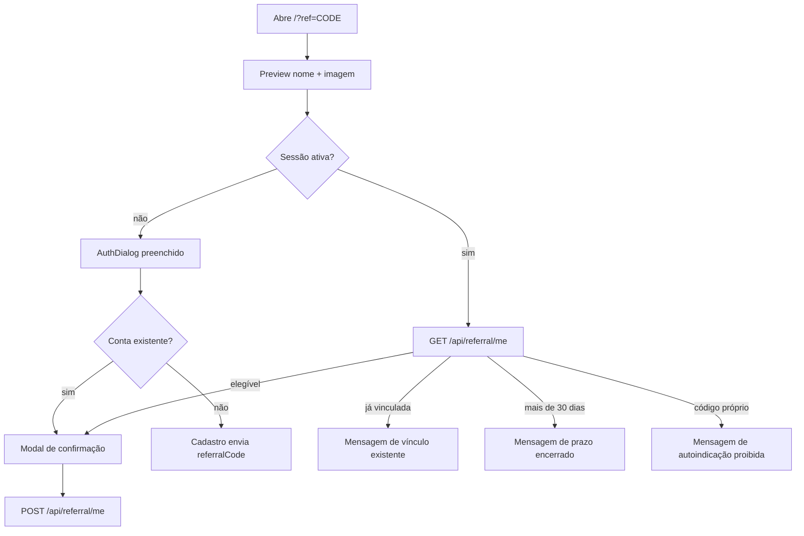

# Indicações no Frontend

Fluxo público de captura, validação, confirmação e compartilhamento de indicação. Backend e regras definitivas ficam em `cidoa-back/doc/modulos/indicacoes/indicacoes.md`.

## Arquivos

| Arquivo | Papel |
| --- | --- |
| `src/api/referral/referral.routes.ts` | Preview público, resumo autenticado e confirmação. |
| `src/api/referral/referral.types.ts` | Contratos de preview, resumo e confirmação. |
| `src/api/referral/referral.logic.ts` | Normalização e estado `confirm`, `linked`, `expired` ou `self`. |
| `src/components/referral/ReferralPerson.tsx` | Nome e imagem do indicador. |
| `src/components/referral/ReferralDialog.tsx` | Confirmação e mensagens finais. |
| `src/components/referral/ShareDialog.tsx` | Modal de compartilhamento: redes sociais + link com botão copiar. |
| `src/components/AuthMenu.tsx` | Orquestra URL, auth, resumo, modal e compartilhamento. |

## Captura e validação

- Link esperado: `/?ref=A1B2C3D4E5F60718`.
- Código normalizado com `trim()` + uppercase.
- Campo no `AuthDialog` fica escondido: aparece só com `?ref=` na URL ou clique em
  "Tenho um código de indicação" (botão com ícone `Gift` e borda tracejada, último componente do modal).
- Aberto, vira bloco destacado: borda tracejada `border-primary/40`, fundo `bg-primary/5`, ícone `Gift`,
  título "Alguém te indicou o Cidoa?" + descrição curta. Label do input só "Código de indicação".
  Input com fundo sólido (`bg-background`) — label flutuante corta a borda e precisa da mesma cor atrás.
  `mt-3` no bloco (aberto ou fechado) separa do botão de login; `p-4` + `space-y-4` dão respiro ao input.
- Código informado precisa ter 16 caracteres hexadecimais e passar por `GET /api/referral/preview/:code`.
- Preview usa debounce de 350 ms e request cancelável. Código inválido bloqueia e-mail, Google e conclusão do cadastro até correção ou remoção.
- Erro do código (`"Código inválido."`) só aparece na tentativa de entrar, nunca ao digitar: botões seguem clicáveis,
  o envio é abortado e o erro revelado. Digitar de novo esconde o erro.
- Cancelar descarta código pendente e remove somente `ref` da URL, preservando outros parâmetros e hash.

## Cenários


```mermaid
flowchart TD
    Link[Abre /?ref=CODE] --> Preview[Preview nome + imagem]
    Preview --> Session{Sessão ativa?}
    Session -->|não| Auth[AuthDialog preenchido]
    Auth --> Existing{Conta existente?}
    Existing -->|sim| Confirm[Modal de confirmação]
    Existing -->|não| Create[Cadastro envia referralCode]
    Session -->|sim| Summary[GET /api/referral/me]
    Summary -->|elegível| Confirm
    Summary -->|já vinculada| Linked[Mensagem de vínculo existente]
    Summary -->|mais de 30 dias| Expired[Mensagem de prazo encerrado]
    Summary -->|código próprio| Self[Mensagem de autoindicação proibida]
    Confirm --> Apply[POST /api/referral/me]
```

- Cadastro novo por e-mail envia `referralCode` em `POST /api/auth/register/complete`.
- Cadastro novo por Google envia `referralCode` no mesmo `POST /api/auth/register/complete` (a rota `/auth/google` não recebe mais código).
- Conta existente, por e-mail ou Google, recebe modal após login e confirma via `POST /api/referral/me`.
- Prazo e vínculo vêm do resumo backend; front não recalcula elegibilidade pelo relógio local.
- Autoindicação é detectada pelo código próprio e continua protegida pelo backend.
- Conta já vinculada mostra indicador atual; vínculo não pode ser trocado.
- Admin recebe mensagem de que não participa.

## Home e perfil

- Usuário comum logado recebe botão somente com ícone de compartilhar ao lado do `AuthMenu`.
- Botão abre `ShareDialog` (estilo YouTube), modal centralizado: WhatsApp, Facebook, LinkedIn e X em círculos com cor da marca + campo só leitura com link e botão "Copiar" (vira "Copiado" por 2 s).
- Redes abrem em nova aba via URL de share (`wa.me/?text=`, `facebook.com/sharer`, `linkedin.com/sharing/share-offsite`, `x.com/intent/post`). Só link, sem texto extra.
- Sem `navigator.share`: evita menu nativo do SO. Cópia usa `navigator.clipboard`; falha → toast de erro.
- Ícones de marca são SVG inline (lucide 1.x não tem marcas).
- Perfil mostra código e botão "Compartilhar", abre mesmo modal por cima do perfil.
- Bloco “Você foi indicado por” só aparece quando `referrer` existe.
- Total só aparece quando `referral_count > 0`.

## Verificação

```bash
bun test tests/referral-flow.test.ts
npm run lint
npm run build
```

Teste cobre normalização e decisões de confirmação, vínculo, expiração e autoindicação.

## Relacionado

- [[area-admin#Login público na cena (passwordless)]]
- [[donation-api|API de Doações]]
- [[index|Documentação principal]]
