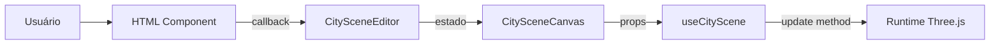

# HTML Components

Componentes React DOM do painel lateral do Cidoa.

> [!info] O que é "HTML" aqui
> Componentes que renderizam tags como `div`, `section`, `input`, `select` e `label`. Não são arquivos HTML estáticos — são componentes React puros de interface.

## Objetivo da Camada

A pasta `src/components/html` organiza todo o painel lateral sem misturar interface com lógica Three.js.

Esses componentes:
- mostram controles para o usuário
- recebem dados via `props`
- chamam callbacks quando o usuário altera valores
- **não** criam objetos Three.js
- **não** conhecem `scene`, `camera` ou `renderer`

## Componentes Principais

### `BuildingHeightInput.tsx`

Overlay fixo no centro superior da página — é o input de doação. Monta 3 sub-painéis empilhados, cada um liga/desliga independente via `visibility` (ver aba **tela** em [[#CityControlPanel.tsx]]):

1. **Doação individual** — `visibility.donationInput`
2. **Geração em lote** (mín/máx/qtd) — `visibility.bulkInput`
3. **Configuração de quadras** (bloco/rua/t·quadra/torres%/base%) — `visibility.blockLayoutInput`

**Responsabilidades:**
- Exibir input numérico para o valor da doação
- Ao clicar em "Doar" (ou pressionar Enter), chamar `onSubmit(value)`
- Suporte a `onBulkSubmit(values[])` para envio de múltiplas doações em lote
- Exibir inputs de layout de quadra: `bloco` (blockSize) e `rua` (streetWidth)
- Limpar o campo após cada envio bem-sucedido
- Esconder cada sub-painel conforme `visibility`
- Não conhece Three.js nem estado global

**Props:**
| Prop | Tipo | Descrição |
|---|---|---|
| `onSubmit` | `(value: number) => void` | Doação individual |
| `onBulkSubmit` | `(values: number[]) => void` | Lote de doações |
| `blockLayoutSettings` | `BlockLayoutSettings` | Tamanho de quadra e largura de rua |
| `onBlockLayoutChange` | `(s: BlockLayoutSettings) => void` | Atualiza layout em tempo real |
| `visibility` | `UIVisibilitySettings` | Quais sub-painéis mostrar (ver [[scene-types#UIVisibilitySettings]]) |

> [!note] Fluxo de doação
> Cada envio chama `canvasRef.addDonation(value)` em `CitySceneEditor`. O prédio de maior valor sempre ocupa o centro da quadra central.

---

### `DonationLoadOverlay.tsx`

Overlay de carregamento do snapshot de doações do backend ([[donation-api]]). Card central sobre o canvas enquanto o dataset carrega.

**Responsabilidades:**
- Card central: spinner + barra de progresso `%` por bytes (`X-Snapshot-Bytes`) ou só MB carregados quando o header não vem (gzip zera `total` — ver [[donation-api#Gotcha: barra de progresso com gzip]])
- Estado de erro: mensagem + botão **"Tentar novamente"** (chama `retry` do `useDonations`)
- Fundo `pointer-events-none` — não bloqueia interação com a cena embaixo
- Mascara o **freeze do rebuild**: só some depois de `setDonations` aplicar (o `rebuildInstances` trava o frame; overlay cobre o congelamento). Vale pro load inicial **e pra troca de filtro** — o editor derruba `donationsApplied`, espera duplo `requestAnimationFrame` (garante 1 paint do overlay; rAF simples dispara antes do paint) e só então chama `setDonations`

**Props:**
| Prop | Tipo | Descrição |
|---|---|---|
| `state` | `DonationsLoadState` | `loading` (bytes) / `ready` (count) / `error` (message) — ver [[donation-api#Estados de carga]] |
| `onRetry` | `() => void` | Refaz o fetch (estado de erro) |

---

### `DonationFilterBar.tsx`

Barra de filtros das doações. Presentacional — recebe listas e filtro, emite mudança. Filtragem real acontece no `useDonations` ([[donation-api#Filtro client-side]]).

**Responsabilidades:**
- Selects em **cascata**: Região → UF → Cidade (região deriva da UF via `UF_REGION`, não vem do backend)
- Select de **ONG**
- Botão **Limpar** — reseta o filtro
- Sem estado próprio nem Three.js — só dispara `onChange`

**Props:**
| Prop | Tipo | Descrição |
|---|---|---|
| `cities` | `City[]` | Cidades presentes no dataset (para o select) |
| `ongs` | `Ong[]` | ONGs presentes no dataset |
| `filter` | `DonationFilter` | Filtro atual (`region`/`uf`/`cityId`/`ongId`) |
| `onChange` | `(filter: DonationFilter) => void` | `setFilter` do `useDonations` |

---

### `BuildingCustomizePanel.tsx`

Painel de personalização de um edifício individual, exibido ao clicar em um prédio na cena. Posicionado no canto superior direito com scroll interno para caber em telas menores.

**Responsabilidades:**
- Exibir campos de personalização para o edifício selecionado
- Atualizar cor, formato, letreiro, acessório de topo e LED de arestas em tempo real
- Botão de fechar (X) para desselecionar o edifício

> [!important] Opções vêm do backend (catálogo)
> Nada de lista hardcoded. Opções (Formato/Topo/LED/Cor/Textura) vêm do catálogo do backend via [[customization-api]] (prop `catalog`). Cada seção só aparece se a categoria estiver **ativa** e tiver opção. Cor = **paleta cadastrada pelo admin** (não hex livre). `catalog = null` → mostra "Carregando personalizações…". Keys (`twisted`, `helipad`…) = contrato com builders do front; admin não cria formato novo sem deploy. Gestão em [[personalizacoes]].

**Props:**

| Prop | Tipo | Descrição |
|---|---|---|
| `donationId` | `number` | ID da doação selecionada |
| `catalog` | `CustomizationCatalog \| null` | Catálogo de opções do backend (ver [[customization-api]]). `null` = carregando |
| `initialColor` | `string` | Cor atual do edifício (customizada ou global) |
| `initialBuildingShape` | `BuildingShape` | Formato atual (`"default"`, `"twisted"`, `"octagonal"`, `"setback"`, `"tapered"`, `"chrysler"`, `"hearst"`, `"empire"`, `"taipei"` ou `"one-trade"`) |
| `initialTilingScale` | `number` | Multiplicador de tiling da textura (1.0 = sem alteração) |
| `initialTextureTransform` | `BuildingTextureTransform` | Ajuste manual de escala/offset da textura |
| `initialRooftopType` | `RooftopType` | Estado atual do acessório de topo |
| `initialSignText` | `string` | Texto atual do letreiro na fachada |
| `initialSignSides` | `number` | Quantidade de lados com letreiro (1–4) |
| `initialEdgeLightType` | `EdgeLightType` | Estado atual do LED nas arestas (`"none"` ou `"led"`) |
| `onColorChange` | `(id: number, color: string) => void` | Callback de troca de cor |
| `onBuildingShapeChange` | `(id: number, shape: BuildingShape) => void` | Callback de troca de formato |
| `onTilingScaleChange` | `(id: number, tilingScale: number) => void` | Callback de troca de tiling |
| `onTextureTransformChange` | `(id: number, textureTransform: BuildingTextureTransform) => void` | Callback de ajuste manual da textura |
| `onRooftopChange` | `(id: number, type: RooftopType) => void` | Callback de troca do acessório de topo |
| `onSignTextChange` | `(id: number, text: string) => void` | Callback de troca de texto do letreiro |
| `onSignSidesChange` | `(id: number, sides: number) => void` | Callback de troca de lados do letreiro |
| `onEdgeLightTypeChange` | `(id: number, type: EdgeLightType) => void` | Callback de toggle do LED |
| `onClose` | `() => void` | Fecha o painel e limpa o foco |

**Seções do painel:**

Cada seção renderiza a partir de `catalog` (só se categoria ativa + tem opção):

| Seção | Controles | Fonte |
|---|---|---|
| **Cor** | Grid de swatches | `catalog.colors` — paleta cadastrada pelo admin (value = hex). Não é hex livre |
| **Formato** | Botões | `catalog.shapes` — key casa com builder (`twisted`, `chrysler`…) |
| **Letreiro** | Input texto + seletor de lados | Feature `catalog.features.sign`. Marca/empresa (máx 30). Lados (1–4) quando há texto |
| **Topo** | Botões | `catalog.rooftops` — nenhum, holofotes, heliponto, jardim, helicóptero |
| **LED de arestas** | Botões | `catalog.edgeLights` — liga/desliga LED |
| **Holograma** | Upload + cor + opacidade | Feature `catalog.features.hologram`. Cor do holograma segue hex livre (tint cyberpunk, não é cor do prédio) |

> [!note] Fluxo de personalização
> Clique no edifício → `onBuildingClick(donationId)` → `CitySceneEditor` chama `focusOnDonation` (destaque visual) e abre `BuildingCustomizePanel` → cada mudança chama `updateCustomization` que monta o `BuildingCustomization` completo e envia ao runtime via `canvasRef.updateDonationCustomization(id, {...})`.

> [!tip] Onde cada personalização é aplicada
> - **Cor** → `InstancedBufferAttribute` (instanceColor) quando o prédio fica no `InstancedMesh`; clone de material quando o prédio vira mesh próprio
> - **Formato** → `Mesh` próprio via builders dedicados em [[scene-builders]] (pula alocação no `InstancedMesh`)
> - **Texturas (Tiling)** → uniform `uTilingMultiplier` por material clonado; valores ≠ 1.0 movem o prédio para `customShapeMeshes` (ver [[scene-managers#Customizações que exigem Mesh próprio (`needsCustomMesh`)|needsCustomMesh]])
> - **Letreiro** → `CanvasTexture` + `PlaneGeometry` via [[scene-builders#createSignMesh.ts|createSignMesh]]
> - **Topo** → `THREE.Group` via [[scene-builders#createRooftopMesh.ts|createRooftopMesh]]
> - **LED de arestas** → `THREE.Group` (core emissivo + halo aditivo) via [[scene-builders#createEdgeLightMesh.ts|createEdgeLightMesh]]

> [!warning] Limitação: acessórios em formatos customizados
> Letreiros e LEDs possuem tratamento específico para formatos customizados, mas acessórios de topo como holofotes, heliponto, jardim e helicóptero ainda usam a **caixa lógica** (`width/depth/height` da bounding box). Em formatos com topo não retangular, acessórios de topo podem ocupar a área da bounding box, não exatamente a silhueta da cobertura.

---

### `CityControlPanel.tsx`

Componente que monta o painel completo de configuração da cena. **Escondido por padrão** — aberto via ícone de engrenagem no canto inferior direito. O ícone **desaparece** enquanto o painel está aberto; o fechamento é feito pelo **"X"** na barra de abas, que chama `onClose`.

**Responsabilidades:**
- Receber todos os estados do editor
- Organizar as seções em abas
- Repassar callbacks para cada seção
- Fechar o painel via `onClose` (botão "X" na barra de abas)

**Abas:**

| Aba | Seções |
|---|---|
| **Geral** | Intro, prédios, chão, **quadras** (cor dos lotes vazios → [[scene-types#BlockLayoutSettings]]), calçada, ambiente |
| **Texturas** | Configurações PBR das fachadas |
| **Luz** | Ambient, hemisphere, directional |
| **Horizonte** | Configurações de HDRI e skybox |
| **Terreno** | Relevo procedural ao redor da cidade — ver [[#TerrainControls.tsx]] |
| **Tela** | Checkbox por componente HTML sobreposto (log de câmera + 3 inputs de geração/posição). Liga/desliga visibilidade; preferência persistida em `localStorage` via [[scene-config#uiVisibilityConfig.ts]] |

Tipo da aba ativa: `"geral" | "texturas" | "luz" | "horizonte" | "terreno" | "tela"`.

Props extras da aba **Tela**: `uiVisibility: UIVisibilitySettings` + `onUIVisibilityChange`. Ver [[scene-types#UIVisibilitySettings]].

Props extras da aba **Geral** (`blockLayoutSettings: BlockLayoutSettings` + `onBlockLayoutSettingsChange`):
- seção **Quadras**: `ColorField` edita `lotColor` (cor dos lotes vazios).
- seção **Calçada**: `ColorField` edita `sidewalkColor` (topo) + `ColorField` edita `sidewalkSideColor` (laterais, sombra) + `RangeField` edita `sidewalkHeight` (0.02–0.4) — altura do meio-fio.

Ver [[scene-types#BlockLayoutSettings]].

> [!tip] Atalho
> `Ctrl + M` abre/fecha painel. Ver [[#Atalhos de teclado]].

---

### Atalhos de teclado

Dois arquivos. Hook `useKeyboardShortcuts` escuta teclado global; `KeyboardShortcutsHelp.tsx` mostra overlay com lista. Ambos registrados em `CitySceneEditor`.

#### `hooks/useKeyboardShortcuts.ts`

Hook genérico. Recebe array `KeyboardShortcut[]`, liga 1 listener `keydown` em `window`, dispara primeiro atalho que casa.

- Match modificador **exato** — `{ key: "m", ctrl: true }` dispara em Ctrl+M, não Ctrl+Shift+M.
- Ignora digitação em `input`/`textarea`/`select`/`contentEditable`, exceto se `allowInInput: true`.
- `preventDefault` padrão `true`.
- Lê array via `ref` atualizado por efeito → caller passa array inline novo a cada render sem re-ligar listener.
- Export `formatShortcut(s)` → string legível (`"Ctrl + M"`, `"?"`). Tecla símbolo já implica Shift, omite rótulo.

Tipo `KeyboardShortcut`: `key`, `ctrl?`, `shift?`, `alt?`, `meta?`, `description`, `handler`, `allowInInput?`, `preventDefault?`.

#### `KeyboardShortcutsHelp.tsx`

Overlay modal central. Renderiza lista a partir do **mesmo** array de atalhos (fonte única). Cada linha: `description` + `<kbd>` via `formatShortcut`. Fecha por clique no fundo, "X", ou Esc.

**Props:** `shortcuts: KeyboardShortcut[]`, `onClose: () => void`.

#### Atalhos registrados (em `CitySceneEditor`)

| Combo | Ação |
|---|---|
| `Ctrl + M` | Abrir/fechar painel de controle |
| `Ctrl + B` | Mostrar/esconder input de doação |
| `Ctrl + J` | Mostrar/esconder log da câmera |
| `?` | Mostrar/esconder ajuda de atalhos |
| `Esc` | Fechar painel aberto (ajuda → customizar → controle) |

> [!note] Adicionar atalho novo
> Acrescentar entrada no array `shortcuts` em `CitySceneEditor`. Overlay de ajuda atualiza sozinho.

---

### `PanelIntro.tsx`

Cabeçalho do painel com métricas em tempo real:

- Título do projeto
- Quantidade de prédios ativos
- Intensidade solar atual

---

### `BuildingControls.tsx`

Configurações visuais dos prédios:

- Cor
- Roughness
- Metalness

> [!tip] Ponto de entrada
> Se quiser alterar a interface de personalização dos prédios, comece aqui.

---

### `TextureControls.tsx`

Configurações de textura PBR das fachadas:

| Controle | Descrição |
|---|---|
| `enabled` | Ativa/desativa texturas |
| `clayRender` | Espelhamento nas superfícies (roughness baixo + metalness alto) |
| `normalScale` | Intensidade do mapa de normais |
| `displacementScale` | Relevo visual via displacement map (0–5) |
| `tilingScale` | Repetição da textura (UV repeat) |
| `roughnessIntensity` | Multiplicador do mapa de roughness (0–2) |
| `metalnessIntensity` | Multiplicador do mapa de metalness (0–3, padrão 2) |
| `emissiveIntensity` | Brilho/glow nas fachadas usando o colorMap como emissiveMap |

Texturas carregadas de: `src/assets/texture/Facade006_1K-mirrored-PNG/`
Mapas disponíveis: color, normal, roughness, metalness, displacement.

---

### `GroundControls.tsx`

Configurações do chão:

- Cor
- Tipo de material (`standard`, `matte`, `soft-metal`, `polished`)

---

### `TerrainControls.tsx`

Controles do relevo procedural ao redor da cidade na aba **terreno** (ver [[scene-types#TerrainSettings]]). Dois `PanelSection`: **"Relevo"** (forma) e **"Aparência do relevo"** (seed + cores + wireframe).

**Relevo (forma):**

| Controle | Tipo | Descrição |
|---|---|---|
| `enabled` | `CheckboxField` | "Mostrar relevo" — liga/desliga |
| `segments` | `select` | Resolução da malha (opções `TERRAIN_SEGMENT_OPTIONS`) |
| `size` | `RangeField` | Tamanho (largura do plano) |
| `height` | `RangeField` | Altura (amplitude do relevo) |
| `frequency` | `RangeField` | Frequência (escala do ruído) |
| `octaves` | `RangeField` | Octaves (camadas do fbm) |
| `persistence` | `RangeField` | Persistência (queda de amplitude por oitava) |
| `lacunarity` | `RangeField` | Lacunarity (ganho de frequência por oitava) |
| `ridge` | `RangeField` | Ridge (peso das cristas) |
| `faults` | `RangeField` | Falhas (quantidade de falhas tectônicas) |
| `faultStrength` | `RangeField` | Força da falha |
| `smooth` | `RangeField` | Suavização (iterações) |
| `terrace` | `RangeField` | Terraços (patamares) |
| `edge` | `RangeField` | Borda baixa (rebaixamento da borda externa) |

**Aparência do relevo:**

| Controle | Tipo | Descrição |
|---|---|---|
| `seed` | `RangeField` + botão | Semente do ruído + **"Nova seed"** (gera seed aleatória) |
| `lowColor` | `ColorField` | Cor baixa (vales) |
| `highColor` | `ColorField` | Cor alta (picos) |
| `wireframe` | `CheckboxField` | Malha em arame |

> [!note] Aba própria
> Antes ficava na aba **geral** (logo após [[#GroundControls.tsx]]). Agora tem aba **terreno** dedicada — ver [[#CityControlPanel.tsx]].

---

### `SceneLightControls.tsx`

Luzes gerais da cena:

- Ambient light
- Directional light (posição por ângulos esféricos, alvo)
- Métricas derivadas como intensidade solar

---

### `EnvironmentControls.tsx`

Configurações do ambiente HDRI:

- `offsetX` — rotação horizontal do skybox
- `offsetY` — deslocamento vertical do horizonte (UV offset)
- `offsetZ` — roll (inclinação diagonal)

---

### `HorizonControls.tsx`

Controles da aba **Horizonte**. Dividido em duas seções:

**Silhueta do Horizonte:**
- `color` — cor dos prédios da silhueta
- `distance` — distância da fileira + alcance de renderização dos prédios (camera.far + cull) (100–600)
- `backDistance` — alcance de renderização atrás da câmera (cull direcional) (10–600)
- prop `culledCount` (de `sceneStats.culled`) — mostra readout embaixo do slider

> [!note] `backDistance` só corta geometria invisível
> Câmera olha pra frente → prédio atrás dela nunca aparece na tela. Reduzir `backDistance` corta esses prédios (ganho de perf + menos reflexo no envMap), mas **não muda o render principal**. O efeito é observável no número `culledCount`, não na imagem. Contraste: `distance` (frontal) mexe no `camera.far`, então tem efeito visível.

**Névoa:**
- `fogDensity` — densidade da névoa exponencial (`FogExp2`). Controla quão rápido os objetos distantes somem (0–0.05, padrão 0.01)
- `fogColor` — cor da névoa. Deve combinar com o céu para o efeito de fusão

> [!note]
> A névoa é global — afeta toda a cena, não só o horizonte. Aumentar `fogDensity` também dissolve os prédios da cidade em distâncias maiores.

---

## Componentes Reutilizáveis (`controls/`)

Componentes pequenos e reaproveitáveis de formulário.

### `PanelSection.tsx`

Bloco visual padrão de cada seção. Use ao criar novas seções para manter o visual consistente.

### `ColorField.tsx`

Campo de cor com `input type="color"` + `input type="text"`. Bom quando o usuário quer seletor visual ou digitar hex manualmente.

### `RangeField.tsx`

Slider numérico. Use quando o valor fizer sentido arrastar.

### `NumberField.tsx`

Input numérico direto. Use quando o valor precisa ser digitado.

### `CheckboxField.tsx`

Campo booleano simples.

### `PointLightCard.tsx`

Card para configuração de point lights individuais.

## Fluxo de Comunicação

1. Usuário mexe em um input
2. Componente HTML chama callback
3. `CitySceneEditor` atualiza estado React
4. `CitySceneCanvas` recebe novo estado
5. [[scene-hooks|useCityScene]] sincroniza com o runtime Three.js

## Regra Prática

- Problema **visual ou de formulário** → procure em `src/components/html`
- Cena **não reagiu ao novo valor** → veja [[scene-hooks|useCityScene.ts]] ou [[scene-runtime|createCitySceneRuntime.ts]]
