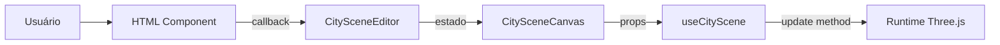

# HTML Components

Componentes React DOM do painel lateral do Cidoa.

> [!info] O que é "HTML" aqui
> Componentes que renderizam tags como `div`, `section`, `input`, `select` e `label`. Não são arquivos HTML estáticos — são componentes React puros de interface.

## Objetivo da Camada

A pasta `src/components/html` organiza todo o painel lateral sem misturar interface com lógica Three.js.

Esses componentes:
- mostram controles para o usuário
- recebem dados via `props`
- chamam callbacks quando o usuário altera valores
- **não** criam objetos Three.js
- **não** conhecem `scene`, `camera` ou `renderer`

## Componentes Principais

### `BuildingHeightInput.tsx`

Overlay fixo no centro superior da página — é o input de doação. Monta 3 sub-painéis empilhados, cada um liga/desliga independente via `visibility` (ver aba **tela** em [[#CityControlPanel.tsx]]):

1. **Doação individual** — `visibility.donationInput`
2. **Geração em lote** (mín/máx/qtd) — `visibility.bulkInput`
3. **Configuração de quadras** (bloco/rua/t·quadra/torres%/base%) — `visibility.blockLayoutInput`

**Responsabilidades:**
- Exibir input numérico para o valor da doação
- Ao clicar em "Doar" (ou pressionar Enter), chamar `onSubmit(value)`
- Suporte a `onBulkSubmit(values[])` para envio de múltiplas doações em lote
- Exibir inputs de layout de quadra: `bloco` (blockSize) e `rua` (streetWidth)
- Limpar o campo após cada envio bem-sucedido
- Esconder cada sub-painel conforme `visibility`
- Não conhece Three.js nem estado global

**Props:**
| Prop | Tipo | Descrição |
|---|---|---|
| `onSubmit` | `(value: number) => void` | Doação individual |
| `onBulkSubmit` | `(values: number[]) => void` | Lote de doações |
| `blockLayoutSettings` | `BlockLayoutSettings` | Tamanho de quadra e largura de rua |
| `onBlockLayoutChange` | `(s: BlockLayoutSettings) => void` | Atualiza layout em tempo real |
| `visibility` | `UIVisibilitySettings` | Quais sub-painéis mostrar (ver [[scene-types#UIVisibilitySettings]]) |

> [!note] Fluxo de doação
> Cada envio chama `canvasRef.addDonation(value)` em `CitySceneEditor`. O prédio de maior valor sempre ocupa o centro da quadra central.

> [!note] Lote gera fachadas variadas
> Prédio sem customização usa fachada sorteada pelo id (`randomFacadeStyle`), então o lote não sai todo igual. Desempenho preservado por bucket: 1 `InstancedMesh` por estilo em uso, não 1 mesh por prédio (ver [[scene-managers#Buckets de fachada (1 InstancedMesh por estilo)]]). Primeira geração grande baixa os ~10 conjuntos PBR do pool — texturas entram assíncronas.

---

### `DonationInfoSection.tsx`

Seção full-width **abaixo da cena**. Mostra info do projeto, totais arrecadados e ONGs parceiras (causa animal). Presentational puro — recebe números, renderiza. Não toca Three.js.

Conteúdo:
1. **Projeto** — overline + headline + parágrafo + foto (cão e gato, `public/cat_dog.jpeg` via `/cat_dog.jpeg`) lado a lado. 100% repassado a ONGs de proteção animal.
2. **Totais** — `totalRaised` (BRL grande, cor de apoio), `donationCount`, nº de ONGs, repasse 100%.
3. **ONGs parceiras** — lista `PARTNER_NGOS`. Cada ONG: nome, foco, cidade, valor recebido (= `totalRaised * share`), % do total. `share` soma 1.

**Props:**
| Prop | Tipo | Descrição |
|---|---|---|
| `totalRaised` | `number` | Total arrecadado (soma das doações) |
| `donationCount` | `number` | Quantidade de doações |

Tema **branco** (combina com doação). Paleta 3 cores — fundo `#ffffff`, texto `#14161c`, apoio dourado `#a8814a`. Sem gradiente, sem efeito especial; hairlines = preto baixa opacidade. Foto tem fundo branco → funde com a seção.

> [!note] Navegação cena ↔ info
> `CitySceneEditor` envolve cena + seção num container `overflow-y-auto`. Botão **"Para onde vai o seu investimento"** (canto inferior direito da cena) rola pra baixo. Na info, botão **"Voltar para a cena"** (fixo) sobe. Roda do mouse: na cena, scroll-down bloqueado (só botão — evita sair sem querer); na info, scroll-up no topo volta pra cena automático e suave.

> [!warning] Dados fictícios
> ONGs em `PARTNER_NGOS` são ilustrativas — parcerias reais ainda não firmadas. Trocar a lista quando houver parceiros.

---

### `PaymentSimulation.tsx`

Overlay no lado direito, parte superior (perto do topo). Roda depois da confirmação do [[#`DonationFormModal.tsx`|formulário de doação]], com o valor escolhido lá. Usa a lib **`motion`** (`motion/react`) para animações sequenciadas com spring + saída.

Fluxo de fases (um cartão por vez), na ordem da simulação de pagamento:
1. **typing** (`TYPING_MS`) — valor surge com **efeito de digitação** caractere por caractere (`useMotionValue` conta letras + `useTransform` fatia a string) com cursor piscante.
2. **qr** (`QR_MS`) — valor preenchido → exibe o **QR Code do Pix** (`public/qr_code.png` via `QR_SRC`) sobre fundo branco + "escaneie para pagar".
3. **loading** (`LOADING_MS`) — QR colapsa → barra de progresso preenche (brilho deslizante) processando a transação.
4. **confirmed** (`CONFIRMED_HOLD_MS`) — checkmark desenhado (`pathLength` 0→1) com pulso de anel, faixa de acento muda azul→verde. Dispara `onConfirmed(amount)` **nesse instante** → o edifício aparece em sincronia.
5. **saída** — `payment` vira `null` no pai, `AnimatePresence` anima o cartão saindo; `onExitComplete` → `onExited` libera a próxima seta.

Cada fase é um bloco com `AnimatePresence` animando `height` (auto↔0), então o cartão cresce/encolhe suavemente a cada transição.

**Responsabilidades:**
- Animar o ciclo de pagamento sem tocar Three.js
- Sinalizar o momento de criar o edifício (`onConfirmed`)
- Sinalizar fim da saída para destravar novo pagamento (`onExited`)

**Props:**
| Prop | Tipo | Descrição |
|---|---|---|
| `payment` | `Payment \| null` | Pagamento ativo (`{ id, amount }`); `null` = sem cartão |
| `onConfirmed` | `(amount: number) => void` | Chamado na confirmação → adiciona o edifício (ligado a `handleDonation(amount, pendingInfoRef.current)`: persiste no storage e entra com fachada `"default"`) |
| `onDone` | `() => void` | Pede o fechamento (pai limpa `payment` → inicia saída) |
| `onExited` | `() => void` | Após o cartão sair de tela → libera próxima seta |

> [!note] Fachada do prédio do pagamento
> `handleDonation(value, info?)` chama `canvasRef.addDonation(value, Boolean(info))` — prédio nascido do formulário usa a textura `default`, sem sorteio ([[scene-managers#Buckets de fachada (1 InstancedMesh por estilo)]]), e o editor grava `facadeStyle: "default"` na personalização dele para o reload não sortear outra. Doação digitada no input (sem `info`) continua sorteando.

> [!note] Trava de um-por-vez
> `CitySceneEditor` guarda `paymentBusyRef`: `startPayment(amount)` ignora novas chamadas enquanto um cartão está na tela (inclusive durante a saída), e `openDonationForm` nem abre o formulário nesse intervalo. Valor **sempre** vem do formulário — não há mais sorteio nem teto (`DONATION_MAX_VALUE`/`maxDonationRef` foram removidos). Altura é normalizada por `targetMaxHeight` ([[scene-config#buildingConfig.ts]]), então quem doa mais vira o mais alto e assume o centro da espiral.

> [!info] Dependência `motion`
> Único componente que importa `motion`. Demais animações de UI continuam em CSS/Tailwind.

---

### `DonationFormModal.tsx`

Modal **centralizado** de simulação de doação. Duas entradas, mesma função `openDonationForm`:
- **Clique direito na cena** — `onSceneRightClick` do [[three-components|CitySceneCanvas]] → [[scene-runtime#3. Atualizações do React|runtime]].
- **Seta direita (`→`)** — atalho de teclado (ver [[#Atalhos de teclado]]).

Doador monta a doação; ao confirmar, a [[#`PaymentSimulation.tsx`|simulação de pagamento]] roda e o edifício nasce na confirmação. Usa `motion` (overlay fade + card com spring).

**Campos:**

| Campo | Controle | Obrigatório |
|---|---|---|
| Valor | Chips `AMOUNT_PRESETS` (50/100/250/500) + input numérico livre | sim (> 0) |
| ONG | `<select>` nativo com `PARTNER_NGOS` importado de [[#`DonationInfoSection.tsx`]] (mostra `focus` da ONG escolhida abaixo) | sim (default = primeira) |
| Imagem | Upload → `createImageBitmap` + `<canvas>` reduz para `MAX_IMAGE_SIDE` (512 px no maior lado) e vira data URL JPEG (q 0.82). Preview + remover. Arquivo acima de `IMAGE_MAX_BYTES` (8 MB) é recusado antes de decodificar | não |
| Título | Input de texto | **sim** — botão confirmar fica desabilitado sem ele |
| Descrição | Textarea (3 linhas) | não |
| Link | Input de texto (protocolo opcional) | não |

**Props:**

| Prop | Tipo | Descrição |
|---|---|---|
| `open` | `boolean` | Controla `AnimatePresence` (entrada/saída animada) |
| `onConfirm` | `(amount: number, info: DonationInfo) => void` | Confirmação → pai fecha o modal, guarda `info` e dispara o pagamento |
| `onClose` | `() => void` | X, botão Cancelar, clique no fundo escuro ou `Esc` |

**`DonationInfo`** (mora em [[scene-types#DonationInfo]] — dado só de UI, não chega no Three.js, mas persiste junto da cena):

```typescript
type DonationInfo = {
  title: string;
  description: string;
  link: string;
  image: string | null; // data URL
  ngo: string;
};
```

> [!note] Ligação no `CitySceneEditor`
> `openDonationForm` ignora a chamada enquanto `paymentBusyRef` está travado (cartão de pagamento na tela) ou o formulário já está aberto, e incrementa `donationFormKey` — `key` novo remonta o modal **em branco** a cada abertura. `handleDonationFormConfirm` fecha o modal, guarda `info` em `pendingInfoRef` e chama `startPayment(amount)`. Quando o cartão confirma, `handleDonation(amount, pendingInfoRef.current)` cria o edifício e grava `info` em `donationInfos: Map<donationId, DonationInfo>`.

> [!note] Persistência
> Prédio do formulário entra no `localStorage` como qualquer outro: valor em `PersistedScene.donations`, `info` em `PersistedScene.infos` (alinhado por índice) — vale tanto para o autosave (`cidoa:scene`) quanto para **salvar um estado nomeado da cidade**. A foto é reduzida a 512 px antes de virar data URL; se ainda assim estourar a cota, o storage cai para o fallback sem imagens ([[scene-config#scenePersistence.ts]]).

---

### `BuildingCustomizePanel.tsx`

Painel de personalização de um edifício individual, exibido ao clicar em um prédio na cena. Posicionado no canto superior direito com scroll interno para caber em telas menores.

**Responsabilidades:**
- Exibir campos de personalização para o edifício selecionado
- Atualizar cor, fachada, formato, letreiro, acessório de topo e LED de arestas em tempo real
- Botão de fechar (X) para desselecionar o edifício

**Props:**

| Prop | Tipo | Descrição |
|---|---|---|
| `donationId` | `number` | ID da doação selecionada |
| `initialColor` | `string` | Cor atual do edifício (customizada ou global) |
| `initialFacadeStyle` | `FacadeStyle` | Fachada atual — 10 conjuntos PBR (`"default"`, `"facade001"`, `"facade002"`, `"facade005"`, `"facade007"`, `"facade014"`, `"facade016"`, `"facade018a"`, `"facade019a"`, `"facade020a"`); ver [[scene-types#FacadeStyle]]. Sem customização, `CitySceneEditor` preenche com `randomFacadeStyle(donationId)` — o painel abre na fachada sorteada que o prédio já mostra, então mexer só na cor não troca a textura ([[scene-utils#`facadeStyle.ts`]]) |
| `initialBuildingShape` | `BuildingShape` | Formato atual (`"default"`, `"twisted"`, `"octagonal"`, `"setback"`, `"tapered"`, `"chrysler"`, `"hearst"`, `"empire"`, `"taipei"` ou `"one-trade"`) |
| `initialTilingScale` | `number` | Multiplicador de tiling da textura (1.0 = sem alteração) |
| `initialRooftopType` | `RooftopType` | Estado atual do acessório de topo |
| `initialSignText` | `string` | Texto atual do letreiro na fachada |
| `initialSignSides` | `number` | Quantidade de lados com letreiro (1–4) |
| `initialEdgeLightType` | `EdgeLightType` | Estado atual do LED nas arestas (`"none"` ou `"led"`) |
| `onColorChange` | `(id: number, color: string) => void` | Callback de troca de cor |
| `onFacadeStyleChange` | `(id: number, facadeStyle: FacadeStyle) => void` | Callback de troca de fachada |
| `onBuildingShapeChange` | `(id: number, shape: BuildingShape) => void` | Callback de troca de formato |
| `onTilingScaleChange` | `(id: number, tilingScale: number) => void` | Callback de troca de tiling |
| `onRooftopChange` | `(id: number, type: RooftopType) => void` | Callback de troca do acessório de topo |
| `onSignTextChange` | `(id: number, text: string) => void` | Callback de troca de texto do letreiro |
| `onSignSidesChange` | `(id: number, sides: number) => void` | Callback de troca de lados do letreiro |
| `onEdgeLightTypeChange` | `(id: number, type: EdgeLightType) => void` | Callback de toggle do LED |
| `onClose` | `() => void` | Fecha o painel e limpa o foco |

**Seções do painel:**

| Seção | Controles | Descrição |
|---|---|---|
| **Aparência** | `ColorField` | Cor individual do edifício (hex) |
| **Fachada** | Botões | 10 opções: padrão (Facade006), vidro azul (001), vidro noturno (002), vidro espelhado (005), escritório aceso (007), torre noturna (014), janelas âmbar (016), tijolo (018A), concreto cinza (019A), tijolo e vidro (020A). Prédio continua instanciado — muda de bucket de fachada (ver [[scene-managers#Buckets de fachada (1 InstancedMesh por estilo)]]) |
| **Formato** | Botões | Opções: padrão (caixa), torre torcida, torre octogonal, torre setback, torre afunilada, Chrysler, Hearst Tower, Empire State, Taipei 101 ou One Trade |
| **Texturas** | `RangeField` | Tiling Scale por edifício (0.2–4, passo 0.05) — multiplicador do tiling global, cada textura de fachada tem escala própria adequada. ≠ 1.0 tira o prédio do `InstancedMesh`; volta pra 1.00 devolve pro instanced. `textureTransform` (escala/offset X/Y) existe no tipo e no runtime, mas **ainda não tem UI** |
| **Letreiro** | Input de texto + seletor de lados | Marca/empresa na fachada (máx 30 chars). Seletor de lados (1–4) aparece quando há texto |
| **Topo** | Botões | Opções: nenhum, holofotes, heliponto, jardim suspenso ou helicóptero |
| **LED de arestas** | Botões | Liga/desliga o LED nas arestas verticais e topo |

> [!note] Fluxo de personalização
> Clique no edifício → `onBuildingClick(donationId)` → `CitySceneEditor` chama `focusOnDonation` (zoom + destaque) e abre o [[#`BuildingInfoModal.tsx`|BuildingInfoModal]] (dono + valor). Botão **Personalizar** do modal abre `BuildingCustomizePanel` (mantém o foco) → cada mudança chama `updateCustomization` que monta o `BuildingCustomization` completo e envia ao runtime via `canvasRef.updateDonationCustomization(id, {...})`.

> [!tip] Onde cada personalização é aplicada
> - **Cor** → `InstancedBufferAttribute` (instanceColor) quando o prédio fica no `InstancedMesh`; clone de material quando o prédio vira mesh próprio
> - **Fachada** → conjunto PBR carregado sob demanda + bucket (`InstancedMesh` por estilo) com material próprio marcado por `userData.facadeStyle` (ver [[scene-managers#Buckets de fachada (1 InstancedMesh por estilo)|buckets de fachada]])
> - **Formato** → `Mesh` próprio via builders dedicados em [[scene-builders]] (pula alocação no `InstancedMesh`)
> - **Texturas (Tiling)** → uniform `uTilingMultiplier` por material clonado; valores ≠ 1.0 movem o prédio para `customShapeMeshes` (ver [[scene-managers#Customizações que exigem Mesh próprio (`needsCustomMesh`)|needsCustomMesh]])
> - **Letreiro** → `CanvasTexture` + `PlaneGeometry` via [[scene-builders#createSignMesh.ts|createSignMesh]]
> - **Topo** → `THREE.Group` via [[scene-builders#createRooftopMesh.ts|createRooftopMesh]]
> - **LED de arestas** → `THREE.Group` (core emissivo + halo aditivo) via [[scene-builders#createEdgeLightMesh.ts|createEdgeLightMesh]]

> [!warning] Limitação: acessórios em formatos customizados
> Letreiros e LEDs possuem tratamento específico para formatos customizados, mas acessórios de topo como holofotes, heliponto, jardim e helicóptero ainda usam a **caixa lógica** (`width/depth/height` da bounding box). Em formatos com topo não retangular, acessórios de topo podem ocupar a área da bounding box, não exatamente a silhueta da cobertura.

---

### `BuildingInfoModal.tsx`

Modal central que abre ao clicar num edifício. Mostra as informações do prédio + valor doado. Duas fontes:

- **Com `info`** — prédio criado pelo [[#`DonationFormModal.tsx`|formulário de doação]]: imagem, título, descrição, link e ONG vêm do que o doador preencheu (`donationInfos.get(id)` no editor).
- **Sem `info`** — prédio do lote inicial ou do input de doação: cai no dono estático `BUILDING_OWNER` (mock). Vale também para prédio salvo antes de `infos` existir no storage.

**Dado estático (`BUILDING_OWNER`, fallback):**

| Campo | Valor |
|---|---|
| `image` | `/claudio.png` (em `public/`) |
| `name` | `Claudio` |
| `url` | `claudio.dev` |

**Props:**

| Prop | Tipo | Descrição |
|---|---|---|
| `value` | `number` | Valor doado do edifício clicado — formatado em BRL (`Intl` pt-BR) |
| `info` | `DonationInfo \| undefined` | Informações do formulário. Ausente = dono estático |
| `onCustomize` | `() => void` | Abre `BuildingCustomizePanel` mantendo o zoom |
| `onClose` | `() => void` | Fecha o modal e limpa o foco (`clearFocus`) |

**Render com `info`:** imagem enviada (sem imagem → faixa com a inicial do título), título, link (`https://` posto na mão quando falta protocolo; some se vazio), descrição e pílula dourada com a ONG.

**Comportamento:**
- Sem dim/blur — overlay `pointer-events-none`, cena fica **visível e interativa** atrás. Card à direita (desktop) ou bottom-sheet (mobile). Imagem ocupa o topo do card (sem gradiente); infos embaixo
- Nome + URL (ícone de link, estilo de link) abaixo da imagem; valor grande, **sem label**
- "X" de fechar sobre a imagem aparece só no **hover** do card (desktop, `group-hover`); sempre visível no mobile (`max-sm`, sem mouse). Também fecha por `Esc`. **Não** fecha por clique no fundo (backdrop pass-through)
- Personalizar = **ícone de lápis** → `onCustomize` (fecha modal, abre painel de personalização, foco mantido)
- `Esc` fecha o modal antes de fechar painel de customização/controle (ver [[#Atalhos de teclado]])

> [!note] Estado no `CitySceneEditor`
> `infoBuilding: { id, value } | null` controla o modal. Clique seta `infoBuilding` e zera `selectedBuildingId` (modal e painel de customização são mutuamente exclusivos). `Personalizar` faz o caminho inverso: zera `infoBuilding`, seta `selectedBuildingId`.

---

### `CityControlPanel.tsx`

Componente que monta o painel completo de configuração da cena. **Escondido por padrão** — aberto via ícone de engrenagem no canto inferior direito. O ícone **desaparece** enquanto o painel está aberto; o fechamento é feito pelo **"X"** na barra de abas, que chama `onClose`.

**Responsabilidades:**
- Receber todos os estados do editor
- Organizar as seções em abas
- Repassar callbacks para cada seção
- Fechar o painel via `onClose` (botão "X" na barra de abas)

**Abas:**

| Aba | Seções |
|---|---|
| **Geral** | Intro, prédios, sombras, direção de renderização, chão, **quadras** (cor dos lotes vazios → [[scene-types#BlockLayoutSettings]]), ambiente |
| **Texturas** | Configurações PBR das fachadas |
| **Luz** | Ambient, hemisphere, directional |
| **Horizonte** | Configurações de HDRI e skybox |
| **Terreno** | Relevo procedural ao redor da cidade — ver [[#TerrainControls.tsx]] |
| **Tela** | Checkbox por componente HTML sobreposto (log de câmera + 3 inputs de geração/posição). Liga/desliga visibilidade; preferência persistida em `localStorage` via [[scene-config#uiVisibilityConfig.ts]]. Seção **Estados da cidade**: select de troca rápida + salvar/abrir/excluir estado nomeado. Seção **Dados salvos**: botão "Limpar dados salvos" |

Tipo da aba ativa: `"geral" | "texturas" | "luz" | "horizonte" | "terreno" | "tela"`.

Props extras da aba **Tela**: `uiVisibility: UIVisibilitySettings` + `onUIVisibilityChange` (ver [[scene-types#UIVisibilitySettings]]), `sceneSlots: string[]` + `activeSceneSlot: string | null` + `onSaveSceneSlot`/`onLoadSceneSlot`/`onDeleteSceneSlot` e `onClearStorage: () => void`.

Seção **Estados da cidade** — save nomeado da cena inteira (edifícios, personalizações, texturas e settings):

| Controle | Ação |
|---|---|
| `<select>` de troca rápida | `onLoadSceneSlot(value)`. Só aparece com `sceneSlots.length > 0`; `value = activeSceneSlot ?? ""` e a opção extra "Cena atual (não salva)" existe só enquanto `activeSceneSlot` é `null` |
| Input de nome + botão "Salvar" (ou `Enter`) | `onSaveSceneSlot(name)`. Nome vazio desabilita o botão; nome já existente pede confirmação de sobrescrita |
| Nome na lista | `onLoadSceneSlot(name)` — editor grava o progresso no estado ativo, copia o escolhido para `cidoa:scene` e recarrega a página |
| "X" vermelho | `onDeleteSceneSlot(name)` — editor confirma e remove do storage |

Painel é presentacional: só valida nome e confirma sobrescrita. Storage fica em [[scene-config#scenePersistence.ts]]; lista de nomes vem do estado `sceneSlots` do editor.

Seção **Dados salvos** — botão vermelho que dispara `onClearStorage`. O editor confirma via `window.confirm`, apaga as chaves `cidoa:scene` + `cidoa:ui-visibility` e recarrega a página (reconstruir o runtime em memória custaria bem mais que um reload). Estados nomeados (`cidoa:scene-slots`) **sobrevivem** a esse botão. Ver [[scene-config#scenePersistence.ts]].

Props extras da aba **Geral** (`blockLayoutSettings: BlockLayoutSettings` + `onBlockLayoutSettingsChange`):
- seção **Quadras**: `ColorField` edita `lotColor` (cor dos lotes vazios).
- seção **Calçada**: `ColorField` edita `sidewalkColor` (topo) + `ColorField` edita `sidewalkSideColor` (laterais, sombra) + `RangeField` edita `sidewalkHeight` (0.02–0.4) — altura do meio-fio.

Ver [[scene-types#BlockLayoutSettings]].

> [!tip] Atalho
> `Ctrl + M` abre/fecha painel. Ver [[#Atalhos de teclado]].

---

### Atalhos de teclado

Dois arquivos. Hook `useKeyboardShortcuts` escuta teclado global; `KeyboardShortcutsHelp.tsx` mostra overlay com lista. Ambos registrados em `CitySceneEditor`.

#### `hooks/useKeyboardShortcuts.ts`

Hook genérico. Recebe array `KeyboardShortcut[]`, liga 1 listener `keydown` em `window`, dispara primeiro atalho que casa.

- Match modificador **exato** — `{ key: "m", ctrl: true }` dispara em Ctrl+M, não Ctrl+Shift+M.
- Ignora digitação em `input`/`textarea`/`select`/`contentEditable`, exceto se `allowInInput: true`.
- `preventDefault` padrão `true`.
- Lê array via `ref` atualizado por efeito → caller passa array inline novo a cada render sem re-ligar listener.
- Export `formatShortcut(s)` → string legível (`"Ctrl + M"`, `"?"`). Tecla símbolo já implica Shift, omite rótulo.

Tipo `KeyboardShortcut`: `key`, `ctrl?`, `shift?`, `alt?`, `meta?`, `description`, `handler`, `allowInInput?`, `preventDefault?`.

#### `KeyboardShortcutsHelp.tsx`

Overlay modal central. Renderiza lista a partir do **mesmo** array de atalhos (fonte única). Cada linha: `description` + `<kbd>` via `formatShortcut`. Fecha por clique no fundo, "X", ou Esc.

**Props:** `shortcuts: KeyboardShortcut[]`, `onClose: () => void`.

#### Atalhos registrados (em `CitySceneEditor`)

| Combo | Ação |
|---|---|
| `→` (seta direita) | Abrir formulário de doação — ver [[#`DonationFormModal.tsx`]] |
| `Ctrl + M` | Abrir/fechar painel de controle |
| `Ctrl + B` | Mostrar/esconder input de doação |
| `Ctrl + J` | Mostrar/esconder log da câmera |
| `?` | Mostrar/esconder ajuda de atalhos |
| `Esc` | Fechar painel aberto (ajuda → formulário de doação → info → customizar → controle) |

Mouse: **clique direito na cena** abre o [[#`DonationFormModal.tsx`|formulário de doação]] (não é atalho de teclado, não aparece no overlay de ajuda).

> [!note] Adicionar atalho novo
> Acrescentar entrada no array `shortcuts` em `CitySceneEditor`. Overlay de ajuda atualiza sozinho.

---

### `PanelIntro.tsx`

Cabeçalho do painel com métricas em tempo real:

- Título do projeto
- Quantidade de prédios ativos
- Chunks carregados
- Prédios gerando sombra
- Intensidade solar atual

---

### `BuildingControls.tsx`

Configurações visuais dos prédios:

- Cor
- Roughness
- Metalness

> [!tip] Ponto de entrada
> Se quiser alterar a interface de personalização dos prédios, comece aqui.

---

### `TextureControls.tsx`

Configurações de textura PBR das fachadas:

| Controle | Descrição |
|---|---|
| `enabled` | Ativa/desativa texturas |
| `clayRender` | Espelhamento nas superfícies (roughness baixo + metalness alto) |
| `normalScale` | Intensidade do mapa de normais |
| `displacementScale` | Relevo visual via displacement map (0–5) |
| `tilingScale` | Repetição da textura (UV repeat) |
| `roughnessIntensity` | Multiplicador do mapa de roughness (0–2) |
| `metalnessIntensity` | Multiplicador do mapa de metalness (0–3, padrão 2) |
| `emissiveIntensity` | Brilho/glow nas fachadas usando o colorMap como emissiveMap |

Texturas carregadas de: `src/assets/texture/Facade006_1K-mirrored-PNG/`
Mapas disponíveis: color, normal, roughness, metalness, displacement.

---

### `ShadowControls.tsx`

Configurações de sombra:

- Ligar/desligar sombras
- Quantidade de prédios que geram sombra
- Parâmetros da câmera de sombra

---

### `RenderDirectionControls.tsx`

Distâncias de renderização por direção da câmera:

- Frente
- Laterais
- Trás

> [!note]
> Esse componente não calcula nada. Apenas altera estado que o [[scene-managers|ChunkManager]] consome (mantido para referência arquitetural).

---

### `GroundControls.tsx`

Configurações do chão:

- Cor
- Tipo de material (`standard`, `matte`, `soft-metal`, `polished`)

---

### `TerrainControls.tsx`

Controles do relevo procedural ao redor da cidade na aba **terreno** (ver [[scene-types#TerrainSettings]]). Dois `PanelSection`: **"Relevo"** (forma) e **"Aparência do relevo"** (seed + cores + wireframe).

**Relevo (forma):**

| Controle | Tipo | Descrição |
|---|---|---|
| `enabled` | `CheckboxField` | "Mostrar relevo" — liga/desliga |
| `segments` | `select` | Resolução da malha (opções `TERRAIN_SEGMENT_OPTIONS`) |
| `size` | `RangeField` | Tamanho (largura do plano) |
| `height` | `RangeField` | Altura (amplitude do relevo) |
| `frequency` | `RangeField` | Frequência (escala do ruído) |
| `octaves` | `RangeField` | Octaves (camadas do fbm) |
| `persistence` | `RangeField` | Persistência (queda de amplitude por oitava) |
| `lacunarity` | `RangeField` | Lacunarity (ganho de frequência por oitava) |
| `ridge` | `RangeField` | Ridge (peso das cristas) |
| `faults` | `RangeField` | Falhas (quantidade de falhas tectônicas) |
| `faultStrength` | `RangeField` | Força da falha |
| `smooth` | `RangeField` | Suavização (iterações) |
| `terrace` | `RangeField` | Terraços (patamares) |
| `edge` | `RangeField` | Borda baixa (rebaixamento da borda externa) |

**Aparência do relevo:**

| Controle | Tipo | Descrição |
|---|---|---|
| `seed` | `RangeField` + botão | Semente do ruído + **"Nova seed"** (gera seed aleatória) |
| `lowColor` | `ColorField` | Cor baixa (vales) |
| `highColor` | `ColorField` | Cor alta (picos) |
| `wireframe` | `CheckboxField` | Malha em arame |

> [!note] Aba própria
> Antes ficava na aba **geral** (logo após [[#GroundControls.tsx]]). Agora tem aba **terreno** dedicada — ver [[#CityControlPanel.tsx]].

---

### `SceneLightControls.tsx`

Luzes gerais da cena:

- Ambient light
- Directional light (posição por ângulos esféricos, alvo)
- Métricas derivadas como intensidade solar

---

### `EnvironmentControls.tsx`

Configurações do ambiente HDRI:

- `offsetX` — rotação horizontal do skybox
- `offsetY` — deslocamento vertical do horizonte (UV offset)
- `offsetZ` — roll (inclinação diagonal)

---

### `HorizonControls.tsx`

Controles da aba **Horizonte**. Dividido em duas seções:

**Silhueta do Horizonte:**
- `color` — cor dos prédios da silhueta
- `distance` — distância da câmera até a fileira (100–600)

**Névoa:**
- `fogDensity` — densidade da névoa exponencial (`FogExp2`). Controla quão rápido os objetos distantes somem (0–0.05, padrão 0.01)
- `fogColor` — cor da névoa. Deve combinar com o céu para o efeito de fusão

> [!note]
> A névoa é global — afeta toda a cena, não só o horizonte. Aumentar `fogDensity` também dissolve os prédios da cidade em distâncias maiores.

---

## Componentes Reutilizáveis (`controls/`)

Componentes pequenos e reaproveitáveis de formulário.

### `PanelSection.tsx`

Bloco visual padrão de cada seção. Use ao criar novas seções para manter o visual consistente.

### `ColorField.tsx`

Campo de cor com `input type="color"` + `input type="text"`. Bom quando o usuário quer seletor visual ou digitar hex manualmente.

### `RangeField.tsx`

Slider numérico. Use quando o valor fizer sentido arrastar.

### `NumberField.tsx`

Input numérico direto. Use quando o valor precisa ser digitado.

### `CheckboxField.tsx`

Campo booleano simples.

### `PointLightCard.tsx`

Card para configuração de point lights individuais.

## Fluxo de Comunicação


```mermaid
flowchart LR
    U[Usuário] --> H[HTML Component]
    H --> |callback| E[CitySceneEditor]
    E --> |estado| C[CitySceneCanvas]
    C --> |props| K[useCityScene]
    K --> |update method| R[Runtime Three.js]
```

1. Usuário mexe em um input
2. Componente HTML chama callback
3. `CitySceneEditor` atualiza estado React
4. `CitySceneCanvas` recebe novo estado
5. [[scene-hooks|useCityScene]] sincroniza com o runtime Three.js
6. Efeito de persistência grava tudo em `localStorage` — ver abaixo

## Persistência (`localStorage`)

`CitySceneEditor` lê o estado salvo **uma vez no módulo** (`STORED_SCENE = loadPersistedScene()`) — precisa de referência estável, senão o efeito de semeadura do canvas reexecuta a cada render. Daí saem `INITIAL_DONATIONS`, `INITIAL_BUILDING_CUSTOMIZATIONS` (via `createInitialBuildingCustomizations`), o mapa inicial de `donationInfos` (via `createInitialDonationInfos`) e `INITIAL_SETTINGS`.

`currentScene` (`useMemo<PersistedScene>`) monta a cena serializável a partir de `persistedDonations`, `buildingCustomizations`, `donationInfos` e todos os settings. Um `useEffect` grava ela em `cidoa:scene` a cada mudança; os handlers de estado nomeado salvam a mesma referência. Ver [[scene-config#scenePersistence.ts]] para o formato.

**Estados nomeados** — `sceneSlots: string[]` (de `listSceneSlots()`) + `activeSceneSlot: string | null` (de `getActiveSceneSlot()`):

| Handler | O que faz |
|---|---|
| `handleSaveSceneSlot(name)` | `saveSceneSlot(name, currentScene)`; `false` → `alert` de cota; senão atualiza `sceneSlots` e `activeSceneSlot` |
| `handleDeleteSceneSlot(name)` | `window.confirm` → `deleteSceneSlot` → atualiza `sceneSlots` e `activeSceneSlot` |
| `handleLoadSceneSlot(name)` | Ignora se `name === activeSceneSlot`. Existe estado ativo → grava `currentScene` nele primeiro (trocar não perde progresso); não existe → `window.confirm`. Depois `applySceneSlot` → `window.location.reload()` |

Select de troca rápida mora dentro do painel (aba **Tela** → seção Estados da cidade) — ver [[#CityControlPanel.tsx]]. Editor só passa `sceneSlots` + `activeSceneSlot` e recebe `onLoadSceneSlot`.

**Estado que sustenta isso:**

| Estado | Papel |
|---|---|
| `persistedDonations: Array<{ id, value }>` | Todos os edifícios criados na sessão + os carregados do storage. Guarda o id de runtime para casar com `buildingCustomizations` e `donationInfos` na hora de salvar |
| `donationInfos: Map<id, DonationInfo>` | Dados do formulário de doação por edifício. Vira `PersistedScene.infos` alinhado por índice |
| `nextDonationIdRef` | Espelha o contador de ids do donation manager. Todo edifício nasce no editor e o manager numera na ordem de chegada, então os contadores não divergem |

> [!important] Seta direita não persiste
> `handleDonation(value, persist = true)`. A simulação de pagamento chama `handleDonation(amount, false)`: o edifício entra na cena e conta em `donationTotal`/`donationCount`, mas fica fora do storage. Ainda assim **consome um id** — por isso `customizations` casa por índice, não por id.

## Regra Prática

- Problema **visual ou de formulário** → procure em `src/components/html`
- Cena **não reagiu ao novo valor** → veja [[scene-hooks|useCityScene.ts]] ou [[scene-runtime|createCitySceneRuntime.ts]]
