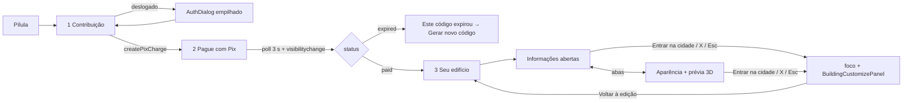
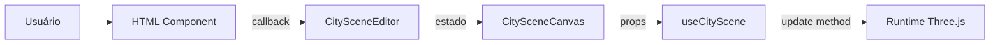

# HTML Components

Componentes React DOM do painel lateral do Cidoa.

> [!info] O que é "HTML" aqui
> Componentes que renderizam tags como `div`, `section`, `input`, `select` e `label`. Não são arquivos HTML estáticos — são componentes React puros de interface.

## Objetivo da Camada

A pasta `src/components/html` organiza todo o painel lateral sem misturar interface com lógica Three.js.

Esses componentes:
- mostram controles para o usuário
- recebem dados via `props`
- chamam callbacks quando o usuário altera valores
- **não** criam objetos Three.js
- **não** conhecem `scene`, `camera` ou `renderer`

## Componentes Principais

### `BuildingHeightInput.tsx`

Overlay fixo no centro superior da página — é o input de doação. Monta 3 sub-painéis empilhados, cada um liga/desliga independente via `visibility` (ver aba **tela** em [[#CityControlPanel.tsx]]):

1. **Doação individual** — `visibility.donationInput`
2. **Geração em lote** (mín/máx/qtd) — `visibility.bulkInput`
3. **Configuração de quadras** (bloco/rua/t·quadra/torres%/base%) — `visibility.blockLayoutInput`

**Responsabilidades:**
- Exibir input numérico para o valor da doação
- Ao clicar em "Doar" (ou pressionar Enter), chamar `onSubmit(value)`
- Suporte a `onBulkSubmit(values[])` para envio de múltiplas doações em lote
- Exibir inputs de layout de quadra: `bloco` (blockSize) e `rua` (streetWidth)
- Limpar o campo após cada envio bem-sucedido
- Esconder cada sub-painel conforme `visibility`
- Não conhece Three.js nem estado global

**Props:**
| Prop | Tipo | Descrição |
|---|---|---|
| `onSubmit` | `(value: number) => void` | Doação individual |
| `onBulkSubmit` | `(values: number[]) => void` | Lote de doações |
| `blockLayoutSettings` | `BlockLayoutSettings` | Tamanho de quadra e largura de rua |
| `onBlockLayoutChange` | `(s: BlockLayoutSettings) => void` | Atualiza layout em tempo real |
| `visibility` | `UIVisibilitySettings` | Quais sub-painéis mostrar (ver [[scene-types#UIVisibilitySettings]]) |

> [!note] Fluxo de doação
> Cada envio chama `canvasRef.addDonation(value)` em `CitySceneEditor`. O prédio de maior valor sempre ocupa o centro da quadra central.

---

### `BuildingLayoutCard.tsx`

Card flutuante no canto superior esquerdo. Tira do painel os dois controles que mais se mexe ao compor a cidade: **modo de layout** e **quantos edifícios entram na cena**. Botão `×` no cabeçalho remove o card da tela (escreve `buildingLayoutCard: false`); aba **Tela** do painel devolve.

**Responsabilidades:**
- Par de botões que alterna `centerTallest` — **Por quadra** (`false`, padrão) = torres agrupadas nos slots centrais de cada quadra, menores embaralhados no meio; **Mais alto no centro** (`true`) = gradiente global, maior doação no centro exato e altura caindo pra borda. Quadras/ruas idênticas nos dois — ver [[scene-managers#Layout dos Prédios — 2 Modos]]
- Teto de edifícios na cena: input numérico + **aplicar** (ou Enter) + **tudo** (volta a `null` = sem teto)
- Rodapé conta `N de TOTAL doações` — total já é o pós-filtro do [[#DonationFilterBar.tsx]]
- Commit só no aplicar/Enter, nunca por tecla: cada mudança dispara replace-all na cena (`rebuildInstances` trava o frame ~0,5s com 100k)
- Sem estado global nem Three.js

**Props:**
| Prop | Tipo | Descrição |
|---|---|---|
| `settings` | `BlockLayoutSettings` | Só lê/escreve `centerTallest` |
| `onChange` | `(s: BlockLayoutSettings) => void` | Troca de modo |
| `visibleLimit` | `number \| null` | Teto atual, `null` = todos |
| `onVisibleLimitChange` | `(limit: number \| null) => void` | Novo teto |
| `total` | `number` | Doações disponíveis após o filtro |
| `onClose` | `() => void` | Remove o card da tela |

> [!note] Corte é por valor, não por ordem do dataset
> `CitySceneEditor` ordena por valor desc antes de cortar (`visibleDonations`), então o teto mantém as **maiores** doações. Lista completa passa direto, sem cópia nem sort.

---

### `DonationLoadOverlay.tsx`

Overlay de carregamento do snapshot de doações do backend ([[donation-api]]). Card central sobre o canvas enquanto o dataset carrega.

**Responsabilidades:**
- Card central: spinner + barra de progresso `%` por bytes (`X-Snapshot-Bytes`) ou só MB carregados quando o header não vem (gzip zera `total` — ver [[donation-api#Gotcha: barra de progresso com gzip]])
- Estado de erro: mensagem + botão **"Tentar novamente"** (chama `retry` do `useDonations`)
- Fundo `pointer-events-none` — não bloqueia interação com a cena embaixo
- Mascara o **freeze do rebuild**: só some depois de `setDonations` aplicar (o `rebuildInstances` trava o frame; overlay cobre o congelamento). Vale pro load inicial **e pra troca de filtro** — o editor derruba `donationsApplied`, espera duplo `requestAnimationFrame` (garante 1 paint do overlay; rAF simples dispara antes do paint) e só então chama `setDonations`

**Props:**
| Prop | Tipo | Descrição |
|---|---|---|
| `state` | `DonationsLoadState` | `loading` (bytes) / `ready` (count) / `error` (message) — ver [[donation-api#Estados de carga]] |
| `onRetry` | `() => void` | Refaz o fetch (estado de erro) |

---

### `DonationFilterBar.tsx`

Barra de filtros das doações. Presentacional — recebe listas e filtro, emite mudança. Filtragem real acontece no `useDonations` ([[donation-api#Filtro client-side]]).

**Responsabilidades:**
- Selects em **cascata**: Região → UF → Cidade (região deriva da UF via `UF_REGION`, não vem do backend)
- Select de **ONG**
- Botão **Limpar** — reseta o filtro
- Sem estado próprio nem Three.js — só dispara `onChange`
- Montada só com dataset pronto **e** `uiVisibility.donationFilter` ligado (aba **Tela**)

**Props:**
| Prop | Tipo | Descrição |
|---|---|---|
| `cities` | `City[]` | Cidades presentes no dataset (para o select) |
| `ongs` | `Ong[]` | ONGs presentes no dataset |
| `filter` | `DonationFilter` | Filtro atual (`region`/`uf`/`cityId`/`ongId`) |
| `onChange` | `(filter: DonationFilter) => void` | `setFilter` do `useDonations` |

---

### `ContributeDialog.tsx`

`html/donate/`. Pílula **Contribuir** (creme, ícone `building-complex-plus`, rodapé central) + modal em **3 etapas**. Pagamento e perfil passam por [[contribution-api]] (mock hoje).

**Layout** — contribuição/Pix até **896 px** (`lg:max-w-4xl`); etapa do edifício até **1152 px** (`lg:max-w-6xl`), altura estável até **800 px**, limitada por `100dvh`. Cabeçalho, etapas, abas e **ações no rodapé ficam visíveis**; somente conteúdo central rola (`min-h-0` + `overflow-y-auto`). Modal usa flex, `overflow-hidden` e rodapé `shrink-0`, sem sobrepor campos. Margens/padding responsivos; celular empilha; tokens claro/escuro.

**Seu edifício** usa cabeçalho compacto (título de 20 px, ícone de 32 px, descrição de 12 px), etapas menores e conteúdo com padding vertical de 12 px. Rodapé tem padding vertical de 8 px; botões de 40 px no desktop e 44 px no celular, preservando a área de toque. A aba Aparência define `container-type: size` para limitar a prévia pela altura disponível.

```mermaid
flowchart LR
  P[Pílula] --> F[1 Contribuição]
  F -- deslogado --> L[AuthDialog empilhado] --> F
  F -- createPixCharge --> Pay[2 Pague com Pix]
  Pay -- poll 3 s + visibilitychange --> S{status}
  S -- expired --> X[Este código expirou → Gerar novo código]
  S -- paid --> D[3 Seu edifício]
  D --> Info[Informações abertas]
  Info <-- abas --> Editor[Aparência + prévia 3D]
  Info -- Entrar na cidade / X / Esc --> Fim[foco + BuildingCustomizePanel]
  Editor -- Entrar na cidade / X / Esc --> Fim
  Fim -- Voltar à edição --> D
```

**Etapa 1 — Contribuição**
- **Novo edifício · Aumentar edifício** — chips; só com edifício próprio. Máximo **3 por conta**: ao atingir limite, Novo desabilita e Aumentar fica ativo; backend valida e banco impede quarto edifício. Aumentar = select do edifício (pré-selecionado se só 1); com 2 ou 3, seleção explícita obrigatória. Rótulos numerados distinguem edifícios com mesmo valor/cidade.
- **ONG** — sempre visível e obrigatória, inclusive ao aumentar. Escolha independente das ONGs já apoiadas pelo edifício. `OngCombobox` local: digitar/buscar por nome, ignora acentos/caixa (`normalizeSearch` existente). Lista abre no foco; setas/Enter selecionam, Esc fecha só lista. Blur aceita resultado único/nome exato único; restante restaura seleção anterior. Pré-seleciona se só 1; catálogo vazio desabilita; busca vazia = todas, sem resultado = `Nenhuma ONG encontrada`
- **Cidade do edifício** — aparece só ao erguer; aumentar mantém cidade existente. `CityCombobox` de [[#ProfileDetailsFields.tsx]]. `city === undefined` = não tocado → mostra `user.city` (login no meio do fluxo já preenche)
- **Valor da contribuição** — input 96 px, prefixo R$, teclado numérico, **25,00 inicial**. `formatMoneyInput` em `src/lib/moneyInput.ts`: máscara a cada tecla, sempre vírgula + **2 casas**, milhar com ponto; dígitos entram como centavos (`1234` → `12,34`). Apagar tudo mantém `0,00`. Colagem passa por `normalizeMoneyInput`: `25` → `25,00`, `25.90` → `25,90`, `R$ 1.234,56` → `1.234,56`. Rejeita letras, sinal, expoente e valores fora da precisão segura; `parseMoney` converte para reais. Mínimo R$ 5 visível; blur só valida mínimo. Chips R$ 10/25/50/100; 2 colunas em telas menores que 380 px
- **Resumo** — ONG, cidade, Pix; aumentar também mostra valor acumulado após contribuição. IDs de ONG/edifício precisam existir no catálogo atual
- Pago: `CitySceneEditor` acrescenta `ongId` a `DonationRecord.ongIds` sem duplicar; filtro/card/menu reconhecem todas as ONGs apoiadas pelo edifício.
- Botão: **Ir para pagamento**. Deslogado: `Entrar para continuar` → `onRequestLogin` (form fica preenchido). Rodapé explica campo pendente ou próxima etapa; carregamento bloqueia envios repetidos

**Etapa 2 — Pague com Pix** (`PixPayment`, mesmo arquivo)
- Resumo valor/ONG/cidade separado das instruções; QR 224 px no desktop. Celular (`useIsMobile`) esconde atrás de `Mostrar QR code`; **Copiar código Pix** = ação primária em ambos
- `Pix Copia e Cola` (input só leitura) + 3 passos numerados + cartão **Recebedor no app do banco** (`receiverName`). Clipboard indisponível → seleciona código e orienta copiar manualmente
- Status `role="status"` **Aguardando confirmação do pagamento** + **`Válido até HH:MM`** (sem cronômetro). 3 falhas seguidas → **Sem conexão. Tentando novamente…**
- Grafia **Pix**, nunca "PIX" (manual da marca BCB)
- Expirado: cartão próprio, **Gerar novo código** mantém contribuição. **Alterar contribuição** retorna ao formulário sem descartar cobrança nem parar poll (`editingCharge`); banner **Voltar ao Pix**, novo código substitui anterior conforme contrato. **Continuar depois** fecha modal e mantém acompanhamento

**Etapa 3 — Seu edifício** — pagamento confirmado no cabeçalho; abas Radix **Informações** e **Aparência**, separadas do inventário de personalização. **Informações abre primeiro**, inclusive ao retornar à edição: [[#BuildingProfileForm.tsx]] mostra imagem, nome e descrição diretamente, sem `
` nem rolar pelo editor 3D. **Aparência** contém [[#BuildingCustomizer.tsx]], com prévia e inventário lado a lado no desktop.

- Perfil usa `forceMount` + aba inativa oculta: alternar não perde texto/imagem ainda não salvos. Aparência desmonta ao sair da aba; escolhas continuam no estado do editor, com salvamento automático existente
- Rodapé comum, fora dos painéis roláveis: **Agora não** / **Entrar na cidade**. Botão usa `form={profileFormId}` nativo para salvar perfil em qualquer aba; carregamento/processamento bloqueia concluir. Erro ao salvar aparece no rodapé, inclusive na aba Aparência
- Rodapé da cena: **Voltar à edição** reabre Informações do mesmo edifício. Clique fora bloqueado; saída com alterações pendentes abre `AlertDialog` **Sair sem salvar?**. Salvar/processar imagem ou ler holograma bloqueia abas, X/Esc e saída

**Carregamento** — `BuildingCustomizer` entra por `lazy`/`Suspense` e só monta com pagamento confirmado, **modal aberto e aba Aparência ativa**; seu `BuildingPreview` também tem import dinâmico. Fechar ou voltar a Informações desmonta menu/canvas. `useMemo` preserva referência da aparência entre atualizações das estatísticas da cidade, sem reconstruir prévia.

**Estado** — `Flow` (`form` | `pay` | `done`) vive **fora** do `DialogContent`: fechar o modal não perde o Pix nem a etapa do edifício pago. `finish` fecha e foca sem reiniciar o fluxo. Ao retornar, `BuildingProfileForm` recarrega o perfil salvo do mesmo `donationId`; as personalizações da cena continuam no estado do editor. Poll segue fechado; pílula vira **Pix pendente** (ícone relógio). Pago com modal fechado → toast "Pagamento confirmado." com **Continuar** (reabre na etapa 3). `Flow` guarda `userId`: troca de conta ignora a cobrança e oculta o retorno à edição anterior. `getPendingCharge` ao logar/remontar retoma Pix pendente. Troca de etapa foca o título.

**Verificação** — `node scripts/check-contribution.mjs`: máscara/centavos, colagem, precisão; retorno à etapa 3, bloqueio durante salvamento, descarte; render React da seção real: Informações inicial, campos abertos, perfil mantido na aba Aparência, envio externo, botão desabilitado e erro visível. Prévia 3D simulada; sem servidor/navegador.

| Prop | Tipo | Descrição |
|---|---|---|
| `open` / `onOpenChange` | `boolean` / `(open) => void` | Controlado pelo editor |
| `ongs` | `readonly Ong[]` | ONGs do snapshot (back sem rota de ONGs) |
| `buildings` | `readonly MyDonation[]` | `myDonations` do editor |
| `catalog` | `CustomizationCatalog \| null` | Catálogo com `isUnlocked` da sessão |
| `textureSettings` | `TextureSettings` | Textura global herdada pela prévia |
| `getCustomization` | `(id) => BuildingCustomization` | Aparência completa atual do edifício |
| `onCustomizationChange` | `(id, patch) => void` | Atualiza cena/estado e agenda o salvamento existente |
| `onRequestLogin` | `() => void` | Abre `AuthDialog` (estado `authOpen` no editor) |
| `onPaid` | `(c, donationId) => void` | Editor faz `upsertDonation` + `addOwned` → edifício entra/cresce na cena |
| `onFinish` | `(donationId) => void` | Editor foca + abre painel sem apagar a etapa 3; fora do filtro/teto → limpa ambos e foca no fim do rebuild (`pendingFocusRef`, rAF do `setDonations`) |

Copy sem "Doar"/"Construir"/"prédio". Decisões (login, R$ 25, validade, Pix pendente) vêm da pesquisa + supervisão — ver [[contribution-api]].

---

### `BuildingProfileForm.tsx`

`html/donate/`. **Imagem** (4:3, `resizeImage(file, 800)` → JPEG, descarta EXIF), **Nome do edifício** (≤ 40), **Descrição** (textarea ≤ 160 + contador). Tudo opcional, público para quem clicar no edifício.

- Imagem compacta no celular, até 256 px no desktop; formatos/limite de 10 MB visíveis. Campos 48 px, textarea 3 linhas. Fluxo de contribuição usa duas colunas no desktop: imagem + textos
- Carrega perfil atual antes de liberar campos — save substitui tudo, começar vazio apagaria o existente. Falha → "Não foi possível carregar." + Tentar de novo
- Só salva se mudou; trim, `""` → `null`
- `onSkip` opcional mostra **Agora não**; `onEditStateChange({ dirty, busy, ready, error })` informa diálogo sobre alterações, processamento e resultado. Loading/salvamento têm feedback; Enter não envia durante carregamento/processamento
- `BuildingProfileDialog` (mesmo arquivo): "Editar nome e imagem" aberto do [[#BuildingInfoModal.tsx]]; `donationId` null = fechado
- `id` associa formulário ao botão externo; `showActions={false}` deixa rodapé com o chamador. Campos sempre abertos. `disabled` bloqueia campos/conclusão enquanto holograma está sendo lido. `BuildingProfileDialog` também separa conteúdo rolável e botão Salvar fixo no rodapé

---

### `BuildingCustomizer.tsx`

`components/customization/`. Menu reutilizável de aparência: recebe `catalog`, `customization`, `textureSettings`, `onChange(patch)` e `onBusyChange` opcional. Não cria cobranças nem consulta/persiste dados por conta própria; o chamador mantém o estado.

- Prévia [[three-components#BuildingPreview.tsx|BuildingPreview]] à esquerda; inventário à direita, com intervalo de 16 px. Celular empilha e mantém a prévia compacta; desktop mantém a coluna da prévia no topo durante a rolagem e ocupa toda a altura disponível na aba (`100cqh`). Prévia e placeholder crescem com `flex-1`, deixando somente o espaço necessário para a indicação de salvamento automático e eliminando a sobra em branco abaixo.
- Abas Radix com teclado: **Formato, Cor, Fachada, Topo, LED, Letreiro, Holograma**. Categorias inativas/vazias somem; só a aba atual monta seus itens.
- Cartões em grade de 2–4 colunas, com `CustomizationImage` usado pelo [[passe-admin-ui|Passe do admin]], nome, **Disponível**, **Em uso** ou **Bloqueado**. Bloqueados ficam desabilitados e mostram `formatUnlockCta` inteiro no cartão, inclusive regras AND/OR.
- Fachada oferece **Padrão** para herdar a global. Letreiro mantém texto de até 30 caracteres e 1–4 lados. Holograma mantém upload PNG/JPG/WebP/GIF de até 700 KB, remover, cor e opacidade; valida tipo/tamanho e cancela a leitura no unmount.
- A aparência usa `CitySceneEditor.updateCustomization`: mesma atualização ao vivo e debounce de 500 ms do painel da cidade. Fechar/reabrir preserva as escolhas.
- `node scripts/check-building-customizer.mjs` verifica render React, categorias, requisitos, bloqueios, seleção e ciclo do canvas com GPU simulada; sem servidor/navegador.

---

### `BuildingInfoModal.tsx`

Card só-leitura do edifício clicado. Canto superior direito, sem dim: cena segue interativa. Visual herdado da branch `video-2`.

Mostra valor (BRL), `Cidade · UF`, chip da ONG — do snapshot público. Imagem 4:3, nome e descrição vêm do perfil ([[contribution-api]], `fetchBuildingProfile` no clique; aparece quando chega). Rótulo **Seu edifício** quando dono; senão **Edifício**. Quem pode editar vê link **Adicionar/Editar nome e imagem** → [[#BuildingProfileForm.tsx|BuildingProfileDialog]]. Dono do prédio (e admin) vê lápis **Personalizar** → abre [[#BuildingCustomizePanel.tsx|BuildingCustomizePanel]]. Prédio alheio ou sem login: sem lápis. Regra em [[donation-api#Quem pode editar]].

| Prop | Tipo | Descrição |
|---|---|---|
| `value` | `number` | Valor da doação |
| `ongName` | `string?` | Nome da ONG |
| `place` | `string?` | `"Cidade · UF"` |
| `isOwn` | `boolean` | Doação da sessão atual |
| `onCustomize` | `() => void` opcional | Ausente = só leitura (sem lápis) |
| `profile` | `BuildingProfile \| null` opcional | Imagem, nome, descrição |
| `onEditProfile` | `() => void` opcional | Ausente = sem link de edição |
| `onClose` | `() => void` | Fecha e limpa o foco |

---

### `GameMenu.tsx`

Menu do usuário logado, estilo menu de pausa do GTA V. Abre pelo botão avatar + nome do `AuthMenu` (canto superior direito). Deslogado não existe — `AuthMenu` mostra "Entrar". Substituiu dropdown antigo + `ProfileDialog`.

- **Fundo** — `DialogOverlay` com tinta `#04283d` + `backdrop-blur` + `backdrop-saturate-50`, fade 500 ms: cena muda de cor ao abrir.
- **Visual** — mesmo vocabulário da cena: vidro escuro (`bg-black/60` + `backdrop-blur-xl`, `border-white/10`), cantos `rounded-2xl`/`rounded-3xl`, dourado `#c9a86a` como destaque (anel do avatar, "Ver na cidade", código, barra de progresso).
- **Topo** — sem título visível (`DialogTitle` só `sr-only`); à direita switch sol/lua dia/noite (`NightToggle`, `onNightChange`) e, ao lado dele, pílula com nome, `@username` (some no celular) e avatar redondo.
- **Abas** — Radix `Tabs` (setas ←/→ navegam), pílulas com ícone dentro do cartão. Abre em Doações; Perfil por último. Ativa = branca. Celular: inativa mostra só ícone.
- **Conteúdo** — coluna centralizada com largura máxima (perfil `max-w-xl`, doações `max-w-2xl`, indicações `max-w-md`). Perfil e indicações centralizam também na vertical.
- **Rodapé** — só **Esc Voltar** à direita.
- **Tema** — Content leva classe `dark`: tokens shadcn escuros só dentro do menu.

| Aba | Conteúdo |
|---|---|
| Doações | Total doado + doações da sessão, maior valor 1º. **Ver na cidade** fecha menu e chama `handleBuildingClick` (foco + [[#BuildingInfoModal.tsx\|card]]). Fora do filtro/teto atual → "Fora do filtro", sem botão. |
| Personalizações | Catálogo agrupado (formato, topo, LED, cor, textura, letreiro/holograma) com `isUnlocked`. Travado mostra requisito via `formatUnlockRequirement` ([[passe-formatacao]]). |
| Indicações | Topo: "Faltam apenas N indicações para desbloquear sua recompensa" + barra. Meta fixa `REFERRAL_GOAL = 2` (recompensas do banco ajustadas depois); N = meta − `referral_count`; barra começa com 1 segmento bônus (`(count+1)/(meta+1)`). Meta batida → total indicado. Depois: código (quebra linha se não cabe) + `SharePanel` inline (redes + copiar link, sem modal), quem indicou ([[referral]]). Some p/ admin. |
| Perfil | `ProfilePanel.tsx`: avatar + nome + e-mail no topo; nome e username lado a lado (sm+); abaixo [[#ProfileDetailsFields.tsx\|Cidade + Como conheceu]], mesmo formulário e mesmo Salvar (`PUT /user/me`). `hasChanges` conta cidade, origem e texto de "Outro" (só com "Outro" escolhido). Salvar → toast. Canto inferior direito: **Sair** discreto (texto cinza, hover vermelho; fecha + `logout()`). |

| Prop | Tipo | Descrição |
|---|---|---|
| `open` / `onOpenChange` | `boolean` / `(open) => void` | Controlado pelo `AuthMenu` |
| `night` / `onNightChange` | `boolean` / `(night) => void` | Toggle dia/noite do topo |
| `donations` | `MyDonation[]` | `{ id, value, ongName?, place?, inScene }` |
| `catalog` | `CustomizationCatalog \| null` | Mesmo do `useCustomizationCatalog`; `null` = carregando |
| `onOpenDonation` | `(id) => void` | Foca edifício + abre card |
| `referralSummary` / `referralError` | | Vêm do `AuthMenu` |

`myDonations` montado no `CitySceneEditor`: `allDonations` (dataset sem filtro, do `useDonations`) ∩ `ownedDonationIds`; `inScene` = está em `visibleDonations`.

---

### `OnboardingDialog.tsx`

Perfil progressivo do 1º login: **Cidade** + **Como conheceu o Cidoa?**. Tudo opcional. Montado no `AuthMenu` (ramo logado).

- **Quando abre** — `user.onboarding_completed_at === null` e `blocked` falso. `AuthMenu` passa `blocked` = indicação pendente (`?ref=`) || `GameMenu` aberto || `ShareDialog` aberto || `onboardingBlocked` do editor (modal Contribuir ou painel de personalização abertos). `AuthDialog` nem existe no ramo logado. Não empilha modal.
- **Uma vez por conta** — estado do servidor (`onboarding_completed_at`), não `localStorage`. Conta antiga também vê uma vez (sem backfill no back).
- **Copy** — título "Complete seu perfil"; frase de valor "Com sua cidade, sugerimos ONGs perto de você."; botões **Pular** (ghost) e **Salvar**.
- **Salvar** — desabilitado até ter cidade ou origem. `completeOnboarding({ city_id, discovery_source, discovery_source_other })` → `POST /user/me/onboarding`. Sucesso preenche `onboarding_completed_at` → fecha sozinho. Erro → `role="alert"`, continua aberto.
- **Pular** — botão, Esc, X ou clique fora. Fecha na hora (estado local `skipped`) e manda `completeOnboarding({})` sem esperar. Falha de rede: fica fechado nesta sessão; servidor pergunta de novo no próximo login. Durante o Salvar, dismiss ignorado.
- **Tema** — `Dialog` padrão (tema do `<html>`: claro creme ou escuro). `text-foreground` no Content: body da cena pinta texto branco, sumiria no claro.
- **Foco inicial** — 1º campo (busca de cidade), padrão Radix.
- **Botões** — `size="lg"` (40 px). Celular: `DialogFooter` empilha Salvar em cima, largura cheia.

| Prop | Tipo | Descrição |
|---|---|---|
| `blocked` | `boolean` | Outro diálogo da cena aberto → espera |

`AuthProvider.completeOnboarding` segue padrão `sessionVersion` do `updateProfile`: resposta de sessão antiga (logout no meio) não sobrescreve usuário.

---

### `ProfileDetailsFields.tsx`

Campos compartilhados entre [[#OnboardingDialog.tsx|OnboardingDialog]] e aba Perfil ([[#GameMenu.tsx|ProfilePanel]]). Valor = `ProfileDetails` (`Pick<User, "city" | "discovery_source" | "discovery_source_other">`); conversão p/ API (`city_id`) fica em quem salva.

- **Cidade** — combobox de busca único ("Campinas, SP"): estado + cidade numa interação, sem cascata UF → cidade.
  - Lista: `getCities()` (`src/api/location/location.routes.ts`) — `GET /location/cities`, promise memoizada no módulo; onboarding e Perfil dividem a mesma requisição. Falha limpa cache → "Tentar de novo".
  - Busca: `src/lib/citySearch.ts` (pura) — sem acento, sem maiúsculas, pontuação vira espaço, prefixo antes de substring, máx 6. Check: `node scripts/check-city-search.mjs`.
  - Teclado: ↑ ↓ navegam (abrem a lista fechada), Enter escolhe, Esc fecha só a lista. Esc via captura na `window`: roda antes do Esc do Dialog Radix (captura no `document`, respeita `defaultPrevented`) — senão Esc fecharia o modal junto (no onboarding = pular).
  - ARIA: `role="combobox"`, `aria-expanded`, `aria-controls`, `aria-autocomplete="list"`, `aria-activedescendant`; lista `role="listbox"` / `role="option"` + `aria-selected`. Foco nunca sai do input (`mousedown` com `preventDefault` em opção e no X).
  - Blur sem clicar: texto que aponta pra 1 cidade só (resultado único ou nome exato único, `pickTypedCity`) escolhe; ambíguo ("Bom Jesus") volta pra cidade atual; texto apagado = sem cidade. Botão X (44 px) limpa.
  - Lista inline (`absolute`, sem portal): herda tema do contexto (`.dark` do GameMenu). Na aba Perfil o painel rola: `scrollIntoView({ block: "nearest" })` mostra a lista inteira. Hover ativa por `mousemove` (rolar sob mouse parado não troca opção).
- **Como conheceu o Cidoa?** — chips Radix `RadioGroup` (`role="radiogroup"`/`radio`, setas navegam e marcam). Rótulos em `DISCOVERY_LABELS` (lugar único): Instagram, TikTok, YouTube, Facebook, WhatsApp, Google, Amigo ou familiar, Uma ONG, Outro. "Outro" revela input (máx 100). Marcado = `bg-primary` (navy no claro, quase branco no escuro, igual aba ativa do menu). Chip `h-10`.
- **Tema** — só tokens shadcn (`foreground`, `input`, `popover`, `muted`, `primary`): claro no diálogo, escuro no GameMenu. `fieldClassName` aplica o vidro da aba Perfil nos inputs de texto.

| Prop | Tipo | Descrição |
|---|---|---|
| `value` / `onChange` | `ProfileDetails` / `(value) => void` | Controlado |
| `fieldClassName` | `string?` | Classe extra dos inputs (vidro escuro do Perfil) |

---

### `BuildingCustomizePanel.tsx`

Painel de personalização de um edifício individual, aberto pelo lápis do [[#BuildingInfoModal.tsx|BuildingInfoModal]] — só para dono ou admin. Posicionado no canto superior direito com scroll interno para caber em telas menores.

**Responsabilidades:**
- Exibir campos de personalização para o edifício selecionado
- Atualizar cor, formato, letreiro, acessório de topo e LED de arestas em tempo real
- Botão de fechar (X) para desselecionar o edifício

> [!important] Opções vêm do backend (catálogo)
> Nada de lista hardcoded. Opções (Formato/Topo/LED/Cor/Textura) vêm do catálogo do backend via [[customization-api]] (prop `catalog`). Cada seção só aparece se a categoria estiver **ativa** e tiver opção. Cor = **paleta cadastrada pelo admin** (não hex livre). `catalog = null` → mostra "Carregando personalizações…". Keys (`twisted`, `helipad`…) = contrato com builders do front; admin não cria formato novo sem deploy. Gestão em [[personalizacoes]].

**Props:**

| Prop | Tipo | Descrição |
|---|---|---|
| `donationId` | `number` | ID da doação selecionada |
| `catalog` | `CustomizationCatalog \| null` | Catálogo de opções do backend (ver [[customization-api]]). `null` = carregando |
| `initialColor` | `string` | Cor atual do edifício (customizada ou global) |
| `initialBuildingShape` | `BuildingShape` | Formato atual (`"default"`, `"twisted"`, `"octagonal"`, `"setback"`, `"tapered"`, `"chrysler"`, `"hearst"`, `"empire"`, `"taipei"`, `"one-trade"`, `"yachthouse"` ou `"residential"`) |
| `initialTextureKey` | `string \| null` | Textura de fachada do edifício. `null` = "Padrão" (herda a global). Seção **Textura** lista `catalog.textures` + botão "Padrão". Ver [[scene-textures]] |
| `initialTilingScale` | `number` | Multiplicador de tiling da textura (1.0 = sem alteração) |
| `initialTextureTransform` | `BuildingTextureTransform` | Ajuste manual de escala/offset da textura |
| `initialRooftopType` | `RooftopType` | Estado atual do acessório de topo |
| `initialSignText` | `string` | Texto atual do letreiro na fachada |
| `initialSignSides` | `number` | Quantidade de lados com letreiro (1–4) |
| `initialEdgeLightType` | `EdgeLightType` | Estado atual do LED nas arestas (`"none"` ou `"led"`) |
| `onColorChange` | `(id: number, color: string) => void` | Callback de troca de cor |
| `onBuildingShapeChange` | `(id: number, shape: BuildingShape) => void` | Callback de troca de formato |
| `onTextureKeyChange` | `(id: number, textureKey: string \| null) => void` | Callback de troca de textura do edifício |
| `onTilingScaleChange` | `(id: number, tilingScale: number) => void` | Callback de troca de tiling |
| `onTextureTransformChange` | `(id: number, textureTransform: BuildingTextureTransform) => void` | Callback de ajuste manual da textura |
| `onRooftopChange` | `(id: number, type: RooftopType) => void` | Callback de troca do acessório de topo |
| `onSignTextChange` | `(id: number, text: string) => void` | Callback de troca de texto do letreiro |
| `onSignSidesChange` | `(id: number, sides: number) => void` | Callback de troca de lados do letreiro |
| `onEdgeLightTypeChange` | `(id: number, type: EdgeLightType) => void` | Callback de toggle do LED |
| `onClose` | `() => void` | Fecha o painel e limpa o foco |

**Seções do painel:**

Cada seção renderiza a partir de `catalog` (só se categoria ativa + tem opção):

| Seção | Controles | Fonte |
|---|---|---|
| **Cor** | Grid de swatches | `catalog.colors` — paleta cadastrada pelo admin (value = hex). Não é hex livre |
| **Formato** | Botões | `catalog.shapes` — key casa com builder (`twisted`, `chrysler`…) |
| **Letreiro** | Input texto + seletor de lados | Feature `catalog.features.sign`. Marca/empresa (máx 30). Lados (1–4) quando há texto |
| **Topo** | Botões | `catalog.rooftops` — nenhum, holofotes, heliponto, jardim, helicóptero |
| **LED de arestas** | Botões | `catalog.edgeLights` — liga/desliga LED |
| **Holograma** | Upload + cor + opacidade | Feature `catalog.features.hologram`. Arquivo máx. **700 KB** (~956 KB em base64, cabe no body limit de 1 MB do back). Cor do holograma segue hex livre (tint cyberpunk, não é cor do prédio) |

> [!note] Fluxo de personalização
> Clique no edifício → `onBuildingClick(donationId)` → `CitySceneEditor` chama `focusOnDonation` (destaque visual) e abre `BuildingInfoModal` → lápis (só `canEdit`) abre `BuildingCustomizePanel` → cada mudança chama `updateCustomization` que monta o `BuildingCustomization` completo, envia ao runtime via `canvasRef.updateDonationCustomization(id, {...})` **e agenda a gravação no banco** (debounce 500ms por edifício).

> [!important] Personalização é permanente
> O painel não mexe só no state: `updateCustomization` grava em `donation.customization` via `PUT /donation/:id/customization`. Recarregou a página, o prédio volta personalizado — o snapshot traz as personalizações salvas e o editor as reaplica na cena. Debounce, flush no unmount, toast de erro e limites de autorização em [[donation-api#Personalização persistida]].
>
> Valores iniciais do painel vêm do state do editor, que nasce do banco. Salvar exige login **e** ser dono do edifício; opção travada é recusada pelo servidor, não só escondida pelo botão desabilitado.

> [!tip] Onde cada personalização é aplicada
> - **Cor** → `InstancedBufferAttribute` (instanceColor) quando o prédio fica no `InstancedMesh`; clone de material quando o prédio vira mesh próprio
> - **Formato** → `Mesh` próprio via builders dedicados em [[scene-builders]] (pula alocação no `InstancedMesh`)
> - **Texturas (Tiling)** → uniform `uTilingMultiplier` por material clonado; valores ≠ 1.0 movem o prédio para `customShapeMeshes` (ver [[scene-managers#Customizações que exigem Mesh próprio (`needsCustomMesh`)|needsCustomMesh]])
> - **Letreiro** → `CanvasTexture` + `PlaneGeometry` via [[scene-builders#createSignMesh.ts|createSignMesh]]
> - **Topo** → `THREE.Group` via [[scene-builders#createRooftopMesh.ts|createRooftopMesh]]
> - **LED de arestas** → `THREE.Group` (core emissivo + halo aditivo) via [[scene-builders#createEdgeLightMesh.ts|createEdgeLightMesh]]

> [!warning] Limitação: acessórios em formatos customizados
> Letreiros e LEDs possuem tratamento específico para formatos customizados, mas acessórios de topo como holofotes, heliponto, jardim e helicóptero ainda usam a **caixa lógica** (`width/depth/height` da bounding box). Em formatos com topo não retangular, acessórios de topo podem ocupar a área da bounding box, não exatamente a silhueta da cobertura.

---

### `CityControlPanel.tsx`

Componente que monta o painel completo de configuração da cena. **Escondido por padrão** — aberto via ícone de engrenagem no canto inferior direito. O ícone **desaparece** enquanto o painel está aberto; o fechamento é feito pelo **"X"** na barra de abas, que chama `onClose`.

**Responsabilidades:**
- Receber todos os estados do editor
- Organizar as seções em abas
- Repassar callbacks para cada seção
- Fechar o painel via `onClose` (botão "X" na barra de abas)

**Abas:**

| Aba | Seções |
|---|---|
| **Geral** | Intro, prédios, **organização dos edifícios** (por quadra ↔ mais alto no centro), **quadras** (cor dos lotes vazios → [[scene-types#BlockLayoutSettings]]), calçada, ambiente |
| **Texturas** | Configurações PBR das fachadas |
| **Reflexo** | Probe do envMap: on/off, intensidade, resolução, posição, céu na captura, o que entra na captura, cadência — ver [[#ReflectionControls.tsx]] |
| **Luz** | Ambient, hemisphere, directional |
| **Horizonte** | Modo do final do chão (reta/circular/quadrado), alcance do horizonte/chão/edifícios, névoa e material do chão ([[#GroundControls.tsx]]). Ver [[#HorizonControls.tsx]]. |
| **Terreno** | Relevo procedural ao redor da cidade — ver [[#TerrainControls.tsx]] |
| **Tela** | Checkbox por componente HTML sobreposto (log de câmera + 3 inputs de geração/posição + filtros + card de organização). Liga/desliga visibilidade; preferência persistida em `localStorage` via [[scene-config#uiVisibilityConfig.ts]] |

Tipo da aba ativa: `"geral" | "texturas" | "reflexo" | "luz" | "horizonte" | "terreno" | "tela"`. Sete abas → rótulo em `text-xs` pra caber nos 360px do painel.

Props extras da aba **Tela**: `uiVisibility: UIVisibilitySettings` + `onUIVisibilityChange` (ver [[scene-types#UIVisibilitySettings]]) e `grain: number` + `onGrainChange`.

Aba **Tela** tem duas seções inline (não componentizadas):

| Seção | Controla |
|---|---|
| Componentes da tela | Checkboxes de `uiVisibility`, persistidos em localStorage |
| Granulado | `RangeField` 0–1 (passo 0.05) do granulado de renderização. **Padrão `0`** = resolução nativa travada, rótulo "desligado". Acima disso o runtime troca nitidez por FPS sob carga — ver `setGrain` em [[scene-runtime]] |

`CitySceneEditor` só encaminha `onCameraDebugChange` ao canvas quando `cameraLog` está visível. Com o log desligado, as amostras de câmera a cada 200ms não atualizam estado React. Estatísticas iguais também são ignoradas pelo runtime.

Props extras da aba **Geral** (`blockLayoutSettings: BlockLayoutSettings` + `onBlockLayoutSettingsChange`):
- seção **Quadras**: `ColorField` edita `lotColor` (cor dos lotes vazios).
- `centerTallest` **não** fica mais aqui: migrou pro card flutuante [[#BuildingLayoutCard.tsx]].
- seção **Calçada**: `ColorField` edita `sidewalkColor` (topo) + `ColorField` edita `sidewalkSideColor` (laterais, sombra) + `RangeField` edita `sidewalkHeight` (0.02–0.4) — altura do meio-fio.

Ver [[scene-types#BlockLayoutSettings]].

> [!tip] Atalho
> `Ctrl + M` abre/fecha painel. Ver [[#Atalhos de teclado]].

---

### Atalhos de teclado

Dois arquivos. Hook `useKeyboardShortcuts` escuta teclado global; `KeyboardShortcutsHelp.tsx` mostra overlay com lista. Ambos registrados em `CitySceneEditor`.

#### `hooks/useKeyboardShortcuts.ts`

Hook genérico. Recebe array `KeyboardShortcut[]`, liga 1 listener `keydown` em `window`, dispara primeiro atalho que casa.

- Match modificador **exato** — `{ key: "m", ctrl: true }` dispara em Ctrl+M, não Ctrl+Shift+M.
- Ignora digitação em `input`/`textarea`/`select`/`contentEditable`, exceto se `allowInInput: true`.
- `preventDefault` padrão `true`.
- Evento já com `defaultPrevented` → ignorado. Esc que fecha Dialog Radix (ex.: [[#GameMenu.tsx|GameMenu]]) não fecha card/painel da cena junto.
- Lê array via `ref` atualizado por efeito → caller passa array inline novo a cada render sem re-ligar listener.
- Export `formatShortcut(s)` → string legível (`"Ctrl + M"`, `"?"`). Tecla símbolo já implica Shift, omite rótulo.

Tipo `KeyboardShortcut`: `key`, `ctrl?`, `shift?`, `alt?`, `meta?`, `description`, `handler`, `allowInInput?`, `preventDefault?`.

#### `KeyboardShortcutsHelp.tsx`

Overlay modal central. Renderiza lista a partir do **mesmo** array de atalhos (fonte única). Cada linha: `description` + `<kbd>` via `formatShortcut`. Fecha por clique no fundo, "X", ou Esc.

**Props:** `shortcuts: KeyboardShortcut[]`, `onClose: () => void`.

#### Atalhos registrados (em `CitySceneEditor`)

| Combo | Ação |
|---|---|
| `Ctrl + M` | Abrir/fechar painel de controle |
| `Ctrl + B` | Mostrar/esconder input de doação |
| `Ctrl + J` | Mostrar/esconder log da câmera |
| `?` | Mostrar/esconder ajuda de atalhos |
| `Esc` | Fechar painel aberto (ajuda → customizar → controle) |

> [!note] Adicionar atalho novo
> Acrescentar entrada no array `shortcuts` em `CitySceneEditor`. Overlay de ajuda atualiza sozinho.

---

### `PanelIntro.tsx`

Cabeçalho do painel com métricas em tempo real:

- Título do projeto
- Quantidade de prédios ativos
- Intensidade solar atual

---

### `BuildingControls.tsx`

Configurações visuais dos prédios:

- Cor
- Roughness
- Metalness

> [!tip] Ponto de entrada
> Se quiser alterar a interface de personalização dos prédios, comece aqui.

---

### `TextureControls.tsx`

Configurações de textura PBR das fachadas:

| Controle | Descrição |
|---|---|
| `enabled` | Ativa/desativa texturas |
| `randomPerBuilding` | Sorteia a textura de cada prédio entre as ativas do catálogo (padrão ligado). Desligado = cidade inteira com a textura selecionada. Ver [[scene-textures#Sorteio por edifício]] |
| `clayRender` | Espelhamento nas superfícies (roughness baixo + metalness alto) |
| `normalScale` | Intensidade do mapa de normais |
| `displacementScale` | Relevo visual via displacement map (0–5) |
| `tilingScale` | Repetição da textura (UV repeat) |
| `roughnessIntensity` | Multiplicador do mapa de roughness (0–2) |
| `metalnessIntensity` | Multiplicador do mapa de metalness (0–3, padrão 2) |
| `emissiveIntensity` | Brilho/glow nas fachadas usando o colorMap como emissiveMap |

**Seletor "Textura da fachada"** (topo da seção): prop `facadeTextures` = `catalog.textures` ativas do backend. Clicar seta `textureSettings.textureKey` = `value` da opção → troca a fachada de **toda a cena**. Por edifício: seção **Textura** do [[html-components#BuildingCustomizePanel.tsx|BuildingCustomizePanel]]. Só aparece se houver textura ativa no catálogo.

Assets no front (`src/assets/texture/`), em **KTX2** (comprimido na GPU), carregados **lazy + assíncrono + cache** pelo loader — ver [[scene-textures]]. Cadastro/controle das texturas em [[personalizacoes]]. Mapas por pasta: color, normal, roughness, metalness, displacement.

---

### `ReflectionControls.tsx`

Aba **reflexo**: tudo do probe de envMap dos prédios. Props: `value: ReflectionSettings` + `onChange`, mais `textureSettings: TextureSettings` + `onTextureSettingsChange` (seção Intensidade).

| Seção | Controles |
|---|---|
| **Reflexo** | `enabled` |
| **Intensidade** | `envMapIntensity` (fachada e topo), `roughnessIntensity` (nitidez), `metalnessIntensity` (espelhamento) — campos de `TextureSettings` |
| **Qualidade** | `resolution` (slider anda no **expoente**: 6–10 → 64–1024px, rótulo em px) |
| **Posição do probe** | `followCamera`, `probeY` (0–120), `probeX`/`probeZ` (−200–200) |
| **Céu no reflexo** | `skyDrop` (−0.5–0.5) |
| **Direção do reflexo** | `envHorizon` (0–0.95, puxa o reflexo pro horizonte), `envRotY` (−180–180°) — corrige a amostragem no material, sem recaptura |
| **Suavização por altura** | `heightFadeStart`, `heightFadeEnd` (altura sobre o chão), `heightBlur` (0–1) |
| **Reflexo por proximidade** | `reflectionDistanceStart` (reflexo completo), `reflectionDistanceEnd` (sem reflexo) |
| **Conteúdo da captura** | `includeGround`, `includeCityFloor` |
| **Atualização** | `updateInterval` (1–60 frames), `continuous` |

> [!warning] Intensidade é do material, não do probe
> Os sliders da seção Intensidade escrevem em `TextureSettings` — mesmos campos da aba **texturas**, sem estado duplicado. Ranges idênticos aos de lá (envMap 0–5, roughness 0–100, metalness 0–10) pra não clampar valor existente.

> [!note] Resolução em potência de 2
> Mipmap do cube exige potência de 2. O `RangeField` guarda `log2(resolution)` e devolve `2 ** exp` — evita criar um componente de select só pra isso.

Ver [[scene-types#ReflectionSettings]], [[scene-config#reflectionConfig.ts]] e [[scene-runtime#Probe de reflexo (envMap dos prédios)]].

---

### `GroundControls.tsx`

Configurações do chão. Fica na aba **Horizonte** (logo depois de [[#HorizonControls.tsx]]) — saiu da **Geral** porque o alcance do horizonte decide se a borda do plano aparece:

- **alcance não fica aqui**: slider "Distância do chão" vive em [[#HorizonControls.tsx]] (`HorizonSettings.groundDistance`), acima nesta mesma aba
- Cor
- Tipo de material (`standard`, `matte`, `soft-metal`, `polished`)

---

### `TerrainControls.tsx`

Controles do relevo procedural ao redor da cidade na aba **terreno** (ver [[scene-types#TerrainSettings]]). Dois `PanelSection`: **"Relevo"** (forma) e **"Aparência do relevo"** (seed + cores + wireframe).

**Relevo (forma):**

| Controle | Tipo | Descrição |
|---|---|---|
| `enabled` | `CheckboxField` | "Mostrar relevo" — liga/desliga |
| `segments` | `select` | Resolução da malha (opções `TERRAIN_SEGMENT_OPTIONS`) |
| `size` | `RangeField` | Tamanho (largura do plano) |
| `height` | `RangeField` | Altura (amplitude do relevo) |
| `frequency` | `RangeField` | Frequência (escala do ruído) |
| `octaves` | `RangeField` | Octaves (camadas do fbm) |
| `persistence` | `RangeField` | Persistência (queda de amplitude por oitava) |
| `lacunarity` | `RangeField` | Lacunarity (ganho de frequência por oitava) |
| `ridge` | `RangeField` | Ridge (peso das cristas) |
| `faults` | `RangeField` | Falhas (quantidade de falhas tectônicas) |
| `faultStrength` | `RangeField` | Força da falha |
| `smooth` | `RangeField` | Suavização (iterações) |
| `terrace` | `RangeField` | Terraços (patamares) |
| `edge` | `RangeField` | Borda baixa (rebaixamento da borda externa) |

**Aparência do relevo:**

| Controle | Tipo | Descrição |
|---|---|---|
| `seed` | `RangeField` + botão | Semente do ruído + **"Nova seed"** (gera seed aleatória) |
| `lowColor` | `ColorField` | Cor baixa (vales) |
| `highColor` | `ColorField` | Cor alta (picos) |
| `wireframe` | `CheckboxField` | Malha em arame |

> [!note] Aba própria
> Antes ficava na aba **geral** (logo após [[#GroundControls.tsx]]). Agora tem aba **terreno** dedicada — ver [[#CityControlPanel.tsx]].

---

### `SceneLightControls.tsx`

Luzes gerais da cena:

- Ambient light
- Directional light (posição por ângulos esféricos, alvo)
- Métricas derivadas como intensidade solar

---

### `EnvironmentControls.tsx`

Configurações do ambiente HDRI:

- `offsetX` — rotação horizontal do skybox
- `offsetY` — deslocamento vertical do horizonte (UV offset)
- `offsetZ` — roll (inclinação diagonal)
- `windowIntensity` — "Brilho das janelas (noite)", 0–6 · padrão `NIGHT_PRESET.windowIntensity` (1.7). 0 apaga todas. Só surte efeito com `night` ligado — o toggle dia/noite fica no [[area-admin#Modo noite (menu do usuário)|menu do usuário]], não aqui. Ver [[scene-managers#Janelas acesas de noite]]

---

### `HorizonControls.tsx`

Controles da aba **Horizonte**. Três seções:

**Renderização do horizonte:**
- `renderDistance` — limite do horizonte (60–2000, passo 5, padrão 600). Escreve `camera.far` e o raio da esfera do céu; não mexe no cull dos edifícios nem no alcance do chão. Baixar aproxima o céu → some o vazio entre a cidade e o horizonte
- `groundEdgeMode` — seletor **Final do chão**: Linha reta (padrão), Circular, Quadrado (original). Descrição contextual explica curva/quinas. Controles renderizados pelo `CityControlPanel.tsx` na aba Horizonte.
- `groundDistance` — 20–2200, passo 5, padrão 660. Distância à frente no reto; raio no disco; meio lado no quadrado. Reduzir ajuda a comparar modos. Só chão muda; montanhas podem cobrir sua borda. Névoa existente suaviza transição.

**Renderização dos edifícios:**
- `distance` — alcance dos edifícios à frente (100–600)
- `backDistance` — alcance dos edifícios atrás da câmera (10–600)
- prop `culledCount` (de `sceneStats.culled`) — mostra readout embaixo do slider

> [!note] Distância só dos edifícios
> Sliders usam cull do manager: compactam buffer, reduzem `mesh.count` e ocultam formatos customizados/acessórios. Não alteram `camera.far`, chão ou montanhas. Probe fixo recompõe cidade durante captura; culling da câmera principal não muda conteúdo compartilhado do reflexo.

**Névoa:**
- `fogDensity` — densidade da névoa exponencial (`FogExp2`). Controla quão rápido os objetos distantes somem (0–0.05, padrão 0.01)
- `fogColor` — cor da névoa. Deve combinar com o céu para o efeito de fusão

> [!note]
> A névoa é global — afeta toda a cena, não só o horizonte. Aumentar `fogDensity` também dissolve os prédios da cidade em distâncias maiores.

---

## Componentes Reutilizáveis (`controls/`)

Componentes pequenos e reaproveitáveis de formulário.

### `PanelSection.tsx`

Bloco visual padrão de cada seção. Use ao criar novas seções para manter o visual consistente.

### `ColorField.tsx`

Campo de cor com `input type="color"` + `input type="text"`. Bom quando o usuário quer seletor visual ou digitar hex manualmente.

### `RangeField.tsx`

Slider numérico. Use quando o valor fizer sentido arrastar.

### `NumberField.tsx`

Input numérico direto. Use quando o valor precisa ser digitado.

### `CheckboxField.tsx`

Campo booleano simples.

### `PointLightCard.tsx`

Card para configuração de point lights individuais.

## Fluxo de Comunicação

```mermaid
flowchart LR
    U[Usuário] --> H[HTML Component]
    H --> |callback| E[CitySceneEditor]
    E --> |estado| C[CitySceneCanvas]
    C --> |props| K[useCityScene]
    K --> |update method| R[Runtime Three.js]
```

1. Usuário mexe em um input
2. Componente HTML chama callback
3. `CitySceneEditor` atualiza estado React
4. `CitySceneCanvas` recebe novo estado
5. [[scene-hooks|useCityScene]] sincroniza com o runtime Three.js

## Regra Prática

- Problema **visual ou de formulário** → procure em `src/components/html`
- Cena **não reagiu ao novo valor** → veja [[scene-hooks|useCityScene.ts]] ou [[scene-runtime|createCitySceneRuntime.ts]]

## PassTrack.tsx

`src/components/pass/PassTrack.tsx`: visualização de passe reutilizável, sem API/admin/auth. Recebe `rewards: readonly PassReward[]`, `layout` (`track` ou `grid`) e `onConfigure` opcional; ausência do callback deixa somente leitura. Renderiza tudo que chega — filtro de ativo/inativo é do consumidor.

Uma personalização por cartão: posição, miniatura, categoria, nome, doação acumulada e indicações exigidas. Itens grátis mostram somente um indicador verde de desbloqueado; nenhum cartão usa badge no topo. Grátis primeiro; depois esforço estimado dos requisitos (AND soma, OR usa alternativa mais fácil). Ver [[passe-balanceamento]]. Mesma exigência não agrupa cartões. `track` usa scroll nativo + botões + teclado e respeita movimento reduzido; `grid` organiza quatro cartões por linha no desktop e reduz colunas responsivamente.

Cada cartão abre, por clique, Enter ou Espaço, um `Dialog` amplo com preview completo ampliado (`object-contain` para texturas). Metas aparecem em linhas verticais sem fundo ou borda, com `HandCoins` para doação, `Users` para indicação e divisor **e/ou** quando necessário. A ação **Configurar** fica fora da área interativa dos detalhes e mantém o fluxo próprio do admin.

`src/components/customization/CustomizationImage.tsx`: imagem compartilhada com catálogo admin. Formato/topo/LED via PNG do preview 3D lazy; cor como amostra; textura usa preview da pasta; features usam ícones.

Consumidor atual: `/dale/passe` ([[passe-admin-ui]]), com configuração e prévia do usuário. `UnlockDialog` compartilhado entre Passe e Personalizações; detalhes em [[passe-admin-ui#Dialog de liberação]].

## Benefícios de cadastro e cadeados

`EarlySignups.tsx` administra combo e primeiros N inscritos; detalhes em [[primeiros-inscritos]]. `BuildingCustomizePanel` recebe `isUnlocked` resolvido pelo hook: opções bloqueadas continuam visíveis, botões desabilitados, cadeado e requisito (`formatUnlockCta`). Letreiro/holograma usam `fieldset disabled`. Grátis disponível sem login; conquistas permanentes dispensam requisitos. Ver [[passe-cena]].

Passe: `UnlockDialog` permite doação, indicação, doação + indicação e doação ou indicação. Com ambos os eixos ligados, radios selecionam `all`/`any`; cartão mostra `+`/`ou`. Ver [[passe-admin-ui]].
