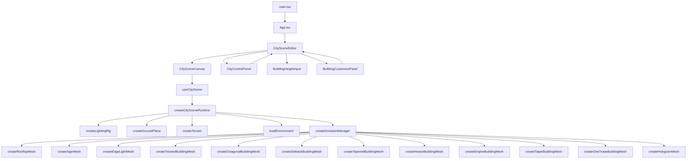
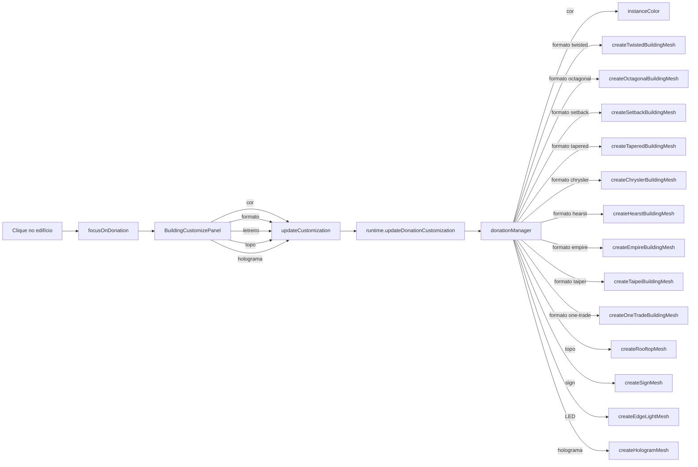

# Cidoa — Documentação

Cidoa é uma cena 3D de cidade procedural feita com `React 19`, `Three.js`, `TypeScript` e `Vite`. Gera prédios baseados em doações, com texturas PBR, iluminação configurável e sistema de sombras — tudo controlável via painel em tempo real.

> [!abstract] Para quem é essa documentação?
> O objetivo é ajudar um dev júnior a entender por onde a aplicação começa, onde cada responsabilidade fica, em qual arquivo mexer e como os dados saem do React e chegam na cena 3D.

> [!important] Estilo de escrita
> Toda escrita aqui = modo homem das cavernas. Corta artigo, enchimento, hedge. Fragmento OK. Termo técnico exato. Code block, wikilink, Mermaid ficam intactos.

## Como a Documentação Está Organizada

As páginas ficam em pastas que **espelham as pastas do código** — assim você acha o doc pelo mesmo caminho do arquivo.

| Pasta da doc       | Espelha          | O que documenta                                            |
| ------------------ | ---------------- | ---------------------------------------------------------- |
| `components/`      | `src/components` | Interface React: painel de controle e canvas               |
| `scene/engine/`    | `src/scene`      | Maquinaria que monta e roda a cena (runtime, hooks, managers, builders) |
| `scene/foundation/`| `src/scene`      | Base que o engine consome: config, tipos e utils           |

> [!tip] Adicionando uma página nova
> 1. Crie o `.md` dentro da pasta cujo **tema** combina (componente novo → `components/`; peça nova da cena → `scene/engine/`; tipo/config novo → `scene/foundation/`).
> 2. Linke com wikilink pelo **nome do arquivo**, ex.: `[[scene-runtime]]` — funciona de qualquer pasta, não use o caminho.
> 3. Registre a página aqui no `index.md` (árvore de arquivos + tabela "Onde Mexer?").

## Visão Geral Rápida

O projeto é dividido em 3 grandes partes:

| Pasta            | Responsabilidade                                                       |
| ---------------- | ---------------------------------------------------------------------- |
| `src/components` | Interface React — editor, painel lateral e canvas                      |
| `src/scene`      | Lógica 3D — tipos, configs, utils, builders, managers, hooks e runtime |
| `doc`    | Documentação da estrutura                                              |

## Estrutura de Arquivos

```text
src/
  App.tsx
  main.tsx
  index.css
  components/
    CitySceneEditor.tsx
    html/
      CityControlPanel.tsx
      BuildingHeightInput.tsx
      BuildingCustomizePanel.tsx
      BuildingControls.tsx
      TextureControls.tsx
      GroundControls.tsx
      TerrainControls.tsx
      SceneLightControls.tsx
      ShadowControls.tsx
      RenderDirectionControls.tsx
      EnvironmentControls.tsx
      PointLightControls.tsx
      PanelIntro.tsx
      KeyboardShortcutsHelp.tsx
      controls/
        PanelSection.tsx
        ColorField.tsx
        RangeField.tsx
        NumberField.tsx
        CheckboxField.tsx
        PointLightCard.tsx
    hooks/
      useKeyboardShortcuts.ts
    three/
      CitySceneCanvas.tsx
  scene/
    types.ts
    config/
      citySceneConfig.ts
      buildingConfig.ts
      textureConfig.ts
      groundConfig.ts
      terrainConfig.ts
      lightConfig.ts
      shadowConfig.ts
      renderDirectionConfig.ts
      environmentConfig.ts
      blockLayoutConfig.ts
      uiVisibilityConfig.ts
    builders/
      createLightingRig.ts
      createGroundPlane.ts
      createTerrain.ts
      createRooftopMesh.ts
      createSignMesh.ts
      createEdgeLightMesh.ts
      createTwistedBuildingMesh.ts
      createOctagonalBuildingMesh.ts
      createSetbackBuildingMesh.ts
      createTaperedBuildingMesh.ts
      createHearstBuildingMesh.ts
      createEmpireBuildingMesh.ts
      createTaipeiBuildingMesh.ts
      createOneTradeBuildingMesh.ts
      createHologramMesh.ts
      loadEnvironment.ts
    managers/
      createDonationManager.ts
      createChunkManager.ts   ← referência arquitetural
      createShadowManager.ts  ← referência arquitetural
    hooks/
      useCityScene.ts
    runtime/
      createCitySceneRuntime.ts
    utils/
      math.ts
      materials.ts
      lighting.ts
      random.ts
      devAssertions.ts
doc/
  index.md                       ← você está aqui (mapa da documentação)
  components/                    ← espelha src/components (interface React)
    html-components.md
    three-components.md
  scene/                         ← espelha src/scene (lógica 3D)
    engine/                      ← maquinaria que monta e roda a cena
      scene-runtime.md
      scene-hooks.md
      scene-managers.md
      scene-builders.md
    foundation/                  ← base de dados consumida pelo engine
      scene-config.md
      scene-types.md
      scene-utils.md
```

## Fluxo da Aplicação

### 1. Entrada

- `src/main.tsx` → renderiza React no `#root`
- `src/App.tsx` → renderiza `CitySceneEditor`

### 2. Container Principal

`src/components/CitySceneEditor.tsx` é o componente mais importante do lado React.

Ele guarda todos os estados:

- `buildingSettings`, `textureSettings`, `groundSettings`
- `lightSettings`, `shadowSettings`, `renderDirectionSettings`
- `environmentSettings`, `horizonSettings`, `blockLayoutSettings`, `terrainSettings`
- `sceneStats`, `hoverInfo`
- `showControlPanel` — toggle do painel de configuração (escondido por padrão)
- `selectedBuildingId` — edifício selecionado para personalização
- `buildingCustomizations` — `Map<donationId, BuildingCustomization>` com cor, formato (default/twisted/octagonal/setback/tapered/chrysler/hearst/empire/taipei/one-trade), acessório de topo (holofotes, heliponto, jardim suspenso ou helicóptero com cabine afunilada realista), letreiro, LED de arestas e holograma cyberpunk

E entrega para:

- [[three-components|CitySceneCanvas]] — monta a cena 3D
- [[html-components|CityControlPanel]] — mostra os controles (abre pelo ícone de engrenagem, que some quando o painel está aberto; fecha pelo "X" na barra de abas)
- [[html-components#BuildingCustomizePanel.tsx|BuildingCustomizePanel]] — personalização do edifício selecionado com cor, formato, letreiro, topo, LED e holograma (upload de imagem ou GIF), sem controles de textura
- [[html-components#BuildingHeightInput.tsx|BuildingHeightInput]] — input de doação e layout

Também gerencia:

- Doações via `canvasRef.addDonation(value)` e `canvasRef.addDonations(values)`
- Foco em edifício via `canvasRef.focusOnDonation(id)` e `canvasRef.clearFocus()`
- Personalização via `canvasRef.updateDonationCustomization(id, customization)`

### 3. Canvas 3D

[[three-components|CitySceneCanvas.tsx]] cria um `div` com `ref` e chama o hook [[scene-hooks|useCityScene]], que monta o renderer Three.js dentro do div.

### 4. Painel Lateral

[[html-components|CityControlPanel.tsx]] organiza os componentes do painel em abas. Não conhece Three.js — só atualiza estado React.

### 5. Hook da Cena

[[scene-hooks|useCityScene.ts]] conecta React com Three.js. Cria o runtime uma vez, depois sincroniza mudanças de estado chamando métodos do runtime.

### 6. Runtime da Cena

[[scene-runtime|createCitySceneRuntime.ts]] é o cérebro do Three.js. Orquestra scene, camera, renderer, controls, builders e managers.

## Diagrama de Fluxo



## Fluxo de Personalização de Edifícios



## Onde Mexer?

| Objetivo                                         | Arquivo                                           |
| ------------------------------------------------ | ------------------------------------------------- |
| Alterar valor padrão dos prédios                 | [[scene-config]]                                  |
| Alterar a UI do painel de configuração           | [[html-components#CityControlPanel.tsx]]          |
| Adicionar/alterar atalho de teclado              | [[html-components#Atalhos de teclado]]            |
| Mostrar/esconder componentes HTML da tela        | aba **Tela** → [[scene-config#uiVisibilityConfig.ts]] |
| Alterar a UI de personalização de edifício       | [[html-components#BuildingCustomizePanel.tsx]]    |
| Alterar o canvas ou a ligação com o hook         | [[three-components]]                              |
| Alterar fórmulas de luz, clamp ou material       | [[scene-utils]]                                   |
| Alterar criação do chão, grid, luzes ou ambiente | [[scene-builders]]                                |
| Alterar o relevo procedural (terreno verde)      | [[scene-builders#createTerrain.ts]]               |
| Alterar valores padrão do relevo                 | [[scene-config#terrainConfig.ts]]                 |
| Alterar a UI dos controles de relevo (aba **terreno**) | [[html-components#TerrainControls.tsx]]     |
| Alterar acessórios de topo                       | [[scene-builders#createRooftopMesh.ts]]           |
| Alterar letreiros de fachada (signs)             | [[scene-builders#createSignMesh.ts]]              |
| Alterar LED de arestas                           | [[scene-builders#createEdgeLightMesh.ts]]         |
| Alterar holograma cyberpunk                      | [[scene-builders#createHologramMesh.ts]]          |
| Alterar torre torcida (twisted)                  | [[scene-builders#createTwistedBuildingMesh.ts]]   |
| Alterar torre octogonal (octagonal)              | [[scene-builders#createOctagonalBuildingMesh.ts]] |
| Alterar torre setback (setback)                  | [[scene-builders#createSetbackBuildingMesh.ts]]   |
| Alterar torre afunilada (tapered)                | [[scene-builders#createTaperedBuildingMesh.ts]]   |
| Alterar torre Hearst (hearst)                    | [[scene-builders#createHearstBuildingMesh.ts]]    |
| Alterar torre Empire State (empire)              | [[scene-builders#createEmpireBuildingMesh.ts]]    |
| Alterar torre Taipei 101 (taipei)                | [[scene-builders#createTaipeiBuildingMesh.ts]]    |
| Alterar torre One Trade (one-trade)              | [[scene-builders#createOneTradeBuildingMesh.ts]]  |

| Alterar torre Chrysler (chrysler) | [[scene-builders#createChryslerBuildingMesh.ts]] |
| Alterar geração dos prédios de doação | [[scene-managers]] |
| Alterar loteamento / lotes vazios / asfalto | [[scene-managers#Loteamento e Lotes Vazios]] |
| Alterar calçada / faixa central / cruzamentos | [[scene-managers#Rede de Estradas (Asfalto)]] |
| Trocar a cor das quadras (UI) | aba **geral** → seção Quadras → [[html-components#CityControlPanel.tsx]] |
| Trocar cor/altura da calçada (UI) | aba **geral** → seção Calçada → [[html-components#CityControlPanel.tsx]] |
| Alterar o ciclo completo da cena | [[scene-runtime]] |
| Entender o contrato dos dados | [[scene-types]] |
| Entender como React sincroniza com Three.js | [[scene-hooks]] |

## Ordem de Leitura Recomendada

1. `src/App.tsx`
2. `src/components/CitySceneEditor.tsx`
3. [[html-components]]
4. [[three-components]]
5. [[scene-hooks]]
6. [[scene-runtime]]
7. [[scene-managers]]
8. [[scene-builders]]
9. [[scene-config]]
10. [[scene-utils]]

## Ideia Central da Arquitetura

```
React  → estado e interface
Three.js → renderização 3D
config   → valores padrão
types    → contratos
utils    → funções puras
builders → peças isoladas da cena
managers → partes complexas com estado interno
runtime  → orquestra tudo
hooks    → ponte React ↔ runtime
```

> [!tip] Padrões do projeto
>
> - **Factory functions** em vez de classes (`create*()`)
> - **Dispose explícito** — todo recurso Three.js tem cleanup
> - **InstancedMesh** para performance nos prédios
> - **Seeded random** para geração determinística por posição
