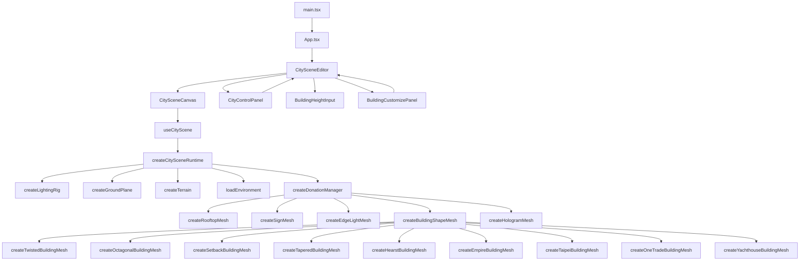
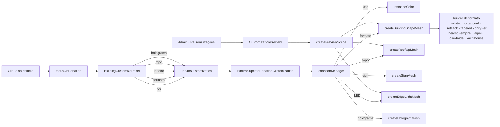

# Cidoa — Documentação

Cidoa é uma cena 3D de cidade procedural feita com `React 19`, `Three.js`, `TypeScript` e `Vite`. Gera prédios baseados em doações, com texturas PBR, iluminação configurável e sistema de sombras — tudo controlável via painel em tempo real.

> [!abstract] Para quem é essa documentação?
> O objetivo é ajudar um dev júnior a entender por onde a aplicação começa, onde cada responsabilidade fica, em qual arquivo mexer e como os dados saem do React e chegam na cena 3D.

> [!important] Estilo de escrita
> Toda escrita aqui = modo homem das cavernas. Corta artigo, enchimento, hedge. Fragmento OK. Termo técnico exato. Code block, wikilink, Mermaid ficam intactos.

## Como a Documentação Está Organizada

As páginas ficam em pastas que **espelham as pastas do código** — assim você acha o doc pelo mesmo caminho do arquivo.

| Pasta da doc       | Espelha          | O que documenta                                            |
| ------------------ | ---------------- | ---------------------------------------------------------- |
| `components/`      | `src/components` | Interface React: painel de controle e canvas               |
| `scene/engine/`    | `src/scene`      | Maquinaria que monta e roda a cena (runtime, hooks, managers, builders) |
| `scene/foundation/`| `src/scene`      | Base que o engine consome: config, tipos e utils           |
| `admin/`           | `src/components` · `src/pages/admin` | Área admin (fora da cena): UI HTML/shadcn, roteamento, login e dashboard |
| `passe/`           | transversal      | Gamificação: liberação de personalização por doação + indicação |

> [!tip] Adicionando uma página nova
> 1. Crie o `.md` dentro da pasta cujo **tema** combina (componente novo → `components/`; peça nova da cena → `scene/engine/`; tipo/config novo → `scene/foundation/`).
> 2. Linke com wikilink pelo **nome do arquivo**, ex.: `[[scene-runtime]]` — funciona de qualquer pasta, não use o caminho.
> 3. Registre a página aqui no `index.md` (árvore de arquivos + tabela "Onde Mexer?").

## Visão Geral Rápida

O projeto é dividido em 3 grandes partes:

| Pasta            | Responsabilidade                                                       |
| ---------------- | ---------------------------------------------------------------------- |
| `src/components` | Interface React — editor, painel lateral e canvas                      |
| `src/scene`      | Lógica 3D — tipos, configs, utils, builders, managers, hooks e runtime |
| `doc`    | Documentação da estrutura                                              |

## Estrutura de Arquivos

```text
scripts/
  encode-ktx2.mjs              ← converte texturas PBR pra KTX2 (`npm run textures:ktx2`)
  check-pass.mjs               ← ordenação do passe sem servidor/navegador
  check-building-shapes.mjs    ← checa os 11 formatos + o preview do admin sem navegador (`node scripts/check-building-shapes.mjs`)
  check-horizon.mjs            ← horizonte, montanhas e culling no runtime sem servidor/navegador/GPU
public/
  basis/                       ← transcoder basis do KTX2Loader (js + wasm)
src/
  App.tsx
  main.tsx
  index.css
  api/
    http.ts
    auth/
      auth.routes.ts              ← login e cadastro passwordless
      auth.types.ts               ← contratos do perfil + desafio por código
    referral/
      referral.routes.ts          ← preview, resumo e confirmação de indicação
      referral.types.ts           ← contratos do sistema de indicação
      referral.logic.ts           ← normalização e decisão do modal
    user/
      user.routes.ts              ← edição autenticada do próprio perfil
      user.types.ts               ← usuário público, incluindo imagem de perfil base64
    donationApi.ts
    customizationApi.ts             ← catálogo de personalizações + conquistas do usuário
    regions.ts
  pages/admin/
    Pass.tsx                    ← página dedicada /dale/passe
  components/
    pass/
      PassTrack.tsx             ← trilha horizontal reutilizável, um cartão por recompensa
    customization/
      CustomizationImage.tsx    ← miniatura compartilhada com catálogo
    admin/
      UnlockDialog.tsx          ← editor de requisitos compartilhado
    ui/
      badge.tsx                     ← Badge shadcn; requisito de liberação no admin
      switch.tsx                    ← Switch shadcn usado nas ativações do admin
      select.tsx                    ← Select shadcn; filtro de personalização no admin
    AuthMenu.tsx                  ← menu do usuário na cena: modo noite, perfil, indicação, sair
    AuthDialog.tsx                ← login por e-mail; cadastro com nome + username único
    AuthProvider.tsx              ← sessão local espelhada do cookie httpOnly
    ProfileDialog.tsx             ← edição de nome, username e imagem de perfil
    referral/
      ReferralDialog.tsx          ← confirmação e avisos da indicação
      ReferralPerson.tsx          ← nome e imagem do indicador
    CitySceneEditor.tsx
    html/
      CityControlPanel.tsx
      BuildingHeightInput.tsx
      DonationLoadOverlay.tsx
      DonationFilterBar.tsx
      BuildingCustomizePanel.tsx
      BuildingControls.tsx
      TextureControls.tsx
      ReflectionControls.tsx         ← aba reflexo: probe do envMap dos prédios
      GroundControls.tsx
      TerrainControls.tsx
      SceneLightControls.tsx
      EnvironmentControls.tsx
      PointLightControls.tsx
  lib/
    image.ts                       ← valida e reduz imagens proporcionalmente para até 400 px
    pass.ts                        ← contrato visual e ordenação das recompensas
    adminUnlock.ts                 ← alvos de edição por opção/feature
    unlock.ts                      ← fonte única: requisito do passe → texto (badge, frase, o que falta)
      PanelIntro.tsx
      KeyboardShortcutsHelp.tsx
      controls/
        PanelSection.tsx
        ColorField.tsx
        RangeField.tsx
        NumberField.tsx
        CheckboxField.tsx
        PointLightCard.tsx
    hooks/
      useKeyboardShortcuts.ts
      useDonations.ts
      useCustomizationCatalog.ts   ← carrega catálogo de personalizações 1×
    three/
      CitySceneCanvas.tsx
      CustomizationPreview.tsx     ← miniatura + preview 3D de formato/topo/LED (admin)
  scene/
    types.ts
    config/
      citySceneConfig.ts
      buildingConfig.ts
      textureConfig.ts
      groundConfig.ts
      terrainConfig.ts
      lightConfig.ts
      environmentConfig.ts
      reflectionConfig.ts
      blockLayoutConfig.ts
      uiVisibilityConfig.ts
    builders/
      createLightingRig.ts
      createGroundPlane.ts
      createTerrain.ts
      createRooftopMesh.ts
      createParapetMesh.ts         ← platibandas automáticas, 3 modelos instanciados
      createSignMesh.ts
      createEdgeLightMesh.ts
      createBuildingShapeMesh.ts   ← registro formato → builder (cena + admin)
      createPreviewScene.ts        ← cena isolada de 1 personalização (preview do admin)
      createTwistedBuildingMesh.ts
      createOctagonalBuildingMesh.ts
      createSetbackBuildingMesh.ts
      createTaperedBuildingMesh.ts
      createHearstBuildingMesh.ts
      createEmpireBuildingMesh.ts
      createTaipeiBuildingMesh.ts
      createOneTradeBuildingMesh.ts
      createYachthouseBuildingMesh.ts ← torres gêmeas sobre embasamento comum
      createHologramMesh.ts
      loadEnvironment.ts
    managers/
      createDonationManager.ts
      createChunkManager.ts   ← referência arquitetural
    textures/
      facadeTextureManifest.ts  ← descobre pastas de textura (glob, sem THREE). PNG/JPG > KTX2
      facadeTextureLoader.ts    ← carrega set PBR (KTX2Loader, lazy + async + cache)
    hooks/
      useCityScene.ts
    runtime/
      createCitySceneRuntime.ts
    utils/
      math.ts
      materials.ts
      lighting.ts
      random.ts
      instanceCulling.ts
      devAssertions.ts
doc/
  index.md                       ← você está aqui (mapa da documentação)
  api/                           ← espelha src/api (camada de dados / doações)
    donation-api.md
    referral.md                  ← links, código, confirmação e compartilhamento
    customization-api.md         ← catálogo, conquistas do usuário, formatação do requisito
  components/                    ← espelha src/components (interface React)
    html-components.md
    three-components.md
  scene/                         ← espelha src/scene (lógica 3D)
    engine/                      ← maquinaria que monta e roda a cena
      scene-runtime.md
      scene-hooks.md
      scene-managers.md
      scene-builders.md
      scene-textures.md          ← texturas: manifesto, loader lazy/async/cache, pipeline KTX2, por-edifício
    foundation/                  ← base de dados consumida pelo engine
      scene-config.md
      scene-types.md
      scene-utils.md
  passe/                         ← gamificação (transversal: api + lib + admin + cena)
    passe-front.md               ← índice do módulo: contrato, estado, mapa
    passe-formatacao.md          ← src/lib/unlock.ts — requisito vira texto (fonte única)
    passe-admin-ui.md            ← tela onde admin define quanto custa cada personalização
    passe-cena.md                ← cadeado no painel do usuário (fase seguinte)
  admin/                         ← área admin do front (fora da cena 3D)
    componentes-html.md          ← base de UI: shadcn, tema, roteamento, componentes
    area-admin.md                ← login, dashboard, auth e API admin
    edificios-teste.md           ← gerar/excluir edifícios fictícios em massa
    personalizacoes.md           ← CRUD do catálogo de personalizações
    ibge.md                      ← vincular catálogo geográfico do IBGE
```

## Fluxo da Aplicação

### 1. Entrada

- `src/main.tsx` → renderiza React no `#root`
- `src/App.tsx` → `BrowserRouter` com rotas lazy: `/` = `CitySceneEditor` (cena), `/dale/login` + `/dale` = área admin (ver [[componentes-html]] e [[area-admin]])
- Acesso público na cena → `AuthDialog`: e-mail → código; conta existente entra, conta nova informa `name` + `username` somente após confirmar o e-mail. Campo opcional de indicação fica sempre visível; `?ref=` preenche código e preview. Ver [[area-admin#Login público na cena (passwordless)]] e [[referral]].

### 2. Container Principal

`src/components/CitySceneEditor.tsx` é o componente mais importante do lado React.

Ele guarda todos os estados:

- `buildingSettings`, `textureSettings`, `groundSettings`
- `lightSettings`
- `environmentSettings`, `reflectionSettings`, `horizonSettings`, `blockLayoutSettings`, `terrainSettings`
- `sceneStats`, `hoverInfo`
- `showControlPanel` — toggle do painel de configuração (escondido por padrão)
- `selectedBuildingId` — edifício selecionado para personalização
- `buildingCustomizations` — `Map<donationId, BuildingCustomization>` com cor, formato (default/twisted/octagonal/setback/tapered/chrysler/hearst/empire/taipei/one-trade/yachthouse), acessório de topo (holofotes, heliponto, jardim suspenso ou helicóptero com casco único, vidros integrados e rotores proporcionais), letreiro, LED de arestas e holograma cyberpunk

E entrega para:

- [[three-components|CitySceneCanvas]] — monta a cena 3D
- [[html-components|CityControlPanel]] — mostra os controles (abre pelo ícone de engrenagem, que some quando o painel está aberto; fecha pelo "X" na barra de abas)
- [[html-components#BuildingCustomizePanel.tsx|BuildingCustomizePanel]] — personalização do edifício selecionado com cor, formato, letreiro, topo, LED e holograma (upload de imagem ou GIF), sem controles de textura
- [[html-components#BuildingHeightInput.tsx|BuildingHeightInput]] — input de doação e layout

Também gerencia:

- Doações do backend via `useDonations` (snapshot cacheado, não mais `INITIAL_TEST_DONATIONS`) → `canvasRef.setDonations(donations)` quando `loadState.status === "ready"`. Ver [[donation-api]]
- Doações manuais via `canvasRef.addDonation(value)` e `canvasRef.addDonations(values)`
- Foco em edifício via `canvasRef.focusOnDonation(id)` e `canvasRef.clearFocus()`
- Personalização via `canvasRef.updateDonationCustomization(id, customization)`

### 3. Canvas 3D

[[three-components|CitySceneCanvas.tsx]] cria um `div` com `ref` e chama o hook [[scene-hooks|useCityScene]], que monta o renderer Three.js dentro do div.

### 4. Painel Lateral

[[html-components|CityControlPanel.tsx]] organiza os componentes do painel em abas. Não conhece Three.js — só atualiza estado React.

### 5. Hook da Cena

[[scene-hooks|useCityScene.ts]] conecta React com Three.js. Cria o runtime uma vez, depois sincroniza mudanças de estado chamando métodos do runtime.

### 6. Runtime da Cena

[[scene-runtime|createCitySceneRuntime.ts]] é o cérebro do Three.js. Orquestra scene, camera, renderer, controls, builders e managers.

Alcance do chão tem slider próprio na aba **horizonte**: `groundDistance` (20–2200, padrão `far * 1.1`), lado do mesh = `* 2`. Distância na mesma aba limita edifícios. Slider `renderDistance` (60–2000) mexe em `camera.far` e raio do céu, sem tocar no cull nem no chão. Linha do horizonte é RETA enquanto `groundDistance > far`: borda do plano fica além do `far`, quem corta é o far plane, a distância constante. Baixar `groundDistance` abaixo do `far` mostra a borda do quadrado — chão acaba antes do céu, de propósito. Formato do mesh (quadrado, disco, canto arredondado) não aparece. Chão local acompanha câmera; sem camada cinza adicional atrás do terreno. Montanhas mantêm malha e cores; probe conserva alcance próprio. Ver [[scene-runtime#Alcance visual e distância dos edifícios]].

## Diagrama de Fluxo


```mermaid
flowchart TD
    A[main.tsx] --> B[App.tsx]
    B --> C[CitySceneEditor]
    C --> D[CitySceneCanvas]
    C --> E[CityControlPanel]
    C --> F[BuildingHeightInput]
    C --> P[BuildingCustomizePanel]
    D --> G[useCityScene]
    G --> H[createCitySceneRuntime]
    H --> I[createLightingRig]
    H --> J[createGroundPlane]
    H --> TR[createTerrain]
    H --> L[loadEnvironment]
    H --> M[createDonationManager]
    M --> N[createRooftopMesh]
    M --> O[createSignMesh]
    M --> Q[createEdgeLightMesh]
    M --> BS[createBuildingShapeMesh]
    BS --> T[createTwistedBuildingMesh]
    BS --> U[createOctagonalBuildingMesh]
    BS --> V[createSetbackBuildingMesh]
    BS --> W[createTaperedBuildingMesh]
    BS --> X[createHearstBuildingMesh]
    BS --> Y[createEmpireBuildingMesh]
    BS --> Z[createTaipeiBuildingMesh]
    BS --> OT[createOneTradeBuildingMesh]
    BS --> YC[createYachthouseBuildingMesh]
    M --> HG[createHologramMesh]
    E --> C
    P --> C
```

## Fluxo de Personalização de Edifícios


```mermaid
flowchart LR
    Click[Clique no edifício] --> Focus[focusOnDonation]
    Focus --> Panel[BuildingCustomizePanel]
    Panel --> |cor| UC[updateCustomization]
    Panel --> |formato| UC
    Panel --> |letreiro| UC
    Panel --> |topo| UC
    Panel --> |holograma| UC
    UC --> Runtime[runtime.updateDonationCustomization]
    Runtime --> DM[donationManager]
    DM --> |cor| IC[instanceColor]
    DM --> |formato| BS[createBuildingShapeMesh]
    BS --> SH["builder do formato<br/>twisted · octagonal · setback · tapered · chrysler<br/>hearst · empire · taipei · one-trade · yachthouse"]
    DM --> |topo| RM[createRooftopMesh]
    DM --> |sign| SM[createSignMesh]
    DM --> |LED| EL[createEdgeLightMesh]
    DM --> |holograma| HM[createHologramMesh]
    Admin[Admin · Personalizações] --> CP[CustomizationPreview]
    CP --> PS[createPreviewScene]
    PS --> BS
    PS --> RM
    PS --> EL
```

## Onde Mexer?

| Objetivo                                         | Arquivo                                           |
| ------------------------------------------------ | ------------------------------------------------- |
| Alterar valor padrão dos prédios                 | [[scene-config]]                                  |
| Alterar a UI do painel de configuração           | [[html-components#CityControlPanel.tsx]]          |
| Granulado de render sob carga (padrão `0`)       | aba **tela** em [[html-components#CityControlPanel.tsx]] · `setGrain` em [[scene-runtime#Granulado (setGrain)]] |
| Modo noite: toggle no menu do usuário            | [[area-admin#Modo noite (menu do usuário)]]       |
| Modo noite: céu escuro e estrelas                | [[scene-builders#loadEnvironment.ts]]             |
| Modo noite: luz, IBL e névoa                     | [[scene-runtime#Modo noite]] · `NIGHT_PRESET` em [[scene-config#environmentConfig.ts]] |
| Modo noite: janelas acesas na fachada            | [[scene-managers#Janelas acesas de noite]]        |
| Modo noite: brilho das janelas (slider)          | seção **Ambiente** → [[html-components#EnvironmentControls.tsx]] |
| Postes de luz nas ruas (quantidade, altura, luz) | [[scene-managers#Postes de Luz (rebuildStreetLamps)]] |
| Adicionar/alterar atalho de teclado              | [[html-components#Atalhos de teclado]]            |
| Mostrar/esconder componentes HTML da tela        | aba **Tela** → [[scene-config#uiVisibilityConfig.ts]] |
| Alterar a UI de personalização de edifício       | [[html-components#BuildingCustomizePanel.tsx]]    |
| Entender de onde vêm as opções de personalização | [[customization-api]]                             |
| Cadastrar/ativar cores e opções (admin)          | [[personalizacoes]]                               |
| Entender a gamificação inteira                   | [[passe-front]]                                   |
| Definir quanto doar/indicar pra liberar (admin)  | [[passe-admin-ui#Dialog de liberação]]            |
| Ver a curva inteira de conquistas (admin)        | [[passe-admin-ui#Visão Passe]]                    |
| Reutilizar a trilha visual para usuários         | [[html-components#PassTrack.tsx]]                |
| Mudar o texto do requisito ("R$ 50 + 3 indicações") | [[passe-formatacao]]                           |
| Colocar cadeado na cena / painel do usuário      | [[passe-cena]]                                    |
| Trocar textura da fachada (UI) / entender loading | [[scene-textures]] · aba **texturas** → [[html-components#TextureControls.tsx]] |
| Cadastrar textura nova (dropar pasta + `npm run textures:ktx2` + admin) | [[scene-textures]] · [[personalizacoes]] |
| Textura por edifício (usuário escolhe a dele)    | [[scene-textures#Por edifício]] · [[html-components#BuildingCustomizePanel.tsx]] |
| Textura sorteada por edifício (cidade variada)   | [[scene-textures#Sorteio por edifício]] · [[scene-managers#Grupos de fachada]] |
| Mexer no pipeline KTX2 (codec, tamanho, qualidade) | [[scene-textures#Pipeline KTX2]] · `scripts/encode-ktx2.mjs` |
| Alterar o canvas ou a ligação com o hook         | [[three-components]]                              |
| Alterar fórmulas de luz, clamp ou material       | [[scene-utils]]                                   |
| Mexer no cull de distância do chão (quadra, calçada, poste, asfalto) | [[scene-utils#`instanceCulling.ts`]] · [[scene-managers#Cull do chão da cidade]] |
| Mexer no cull de distância das montanhas         | [[scene-builders#createTerrain.ts]]               |
| Alterar criação do chão, grid, luzes ou ambiente | [[scene-builders]]                                |
| Alterar o relevo procedural (terreno verde)      | [[scene-builders#createTerrain.ts]]               |
| Alterar valores padrão do relevo                 | [[scene-config#terrainConfig.ts]]                 |
| Alterar a UI dos controles de relevo (aba **terreno**) | [[html-components#TerrainControls.tsx]]     |
| Alterar acessórios de topo                       | [[scene-builders#createRooftopMesh.ts]]           |
| Alterar platibandas automáticas                  | [[scene-builders#createParapetMesh.ts]]           |
| Alterar letreiros de fachada (signs)             | [[scene-builders#createSignMesh.ts]]              |
| Alterar LED de arestas                           | [[scene-builders#createEdgeLightMesh.ts]]         |
| Ajustar luz do LED nos vizinhos (intensidade, alcance, nº de luzes) | [[scene-managers#Fora do reflexo, dentro da luz]] |
| Alterar holograma cyberpunk                      | [[scene-builders#createHologramMesh.ts]]          |
| Adicionar formato de edifício novo               | [[scene-builders#createBuildingShapeMesh.ts]] + [[scene-types#BuildingShape]] |
| Ver formato/topo/LED em 3D no admin              | [[personalizacoes#Preview 3D: Formato, Topo e LED]] · [[three-components#CustomizationPreview.tsx]] |
| Dar preview 3D a outra categoria do catálogo     | `PREVIEW_KIND` em `src/lib/pass.ts` + [[scene-builders#createPreviewScene.ts]] |
| Alterar torre torcida (twisted)                  | [[scene-builders#createTwistedBuildingMesh.ts]]   |
| Alterar torre octogonal (octagonal)              | [[scene-builders#createOctagonalBuildingMesh.ts]] |
| Alterar torre setback (setback)                  | [[scene-builders#createSetbackBuildingMesh.ts]]   |
| Alterar torre afunilada (tapered)                | [[scene-builders#createTaperedBuildingMesh.ts]]   |
| Alterar torre Hearst (hearst)                    | [[scene-builders#createHearstBuildingMesh.ts]]    |
| Alterar torre Empire State (empire)              | [[scene-builders#createEmpireBuildingMesh.ts]]    |
| Alterar torre Taipei 101 (taipei)                | [[scene-builders#createTaipeiBuildingMesh.ts]]    |
| Alterar torres Yachthouse (yachthouse)           | [[scene-builders#createYachthouseBuildingMesh.ts]] |
| Alterar torre One Trade (one-trade)              | [[scene-builders#createOneTradeBuildingMesh.ts]]  |

| Alterar torre Chrysler (chrysler) | [[scene-builders#createChryslerBuildingMesh.ts]] |
| Carregar/buscar doações do backend | [[donation-api]] |
| Filtrar doações por região/UF/cidade/ONG | [[donation-api]] |
| Overlay de carregamento / barra de filtros | [[html-components]] |
| Alterar geração dos prédios de doação | [[scene-managers]] |
| Alterar loteamento / lotes vazios / asfalto | [[scene-managers#Loteamento e Lotes Vazios]] |
| Ajustar destaque da quadra central (escala/altura das torres, prédio do centro) | [[scene-managers#Destaque da Quadra Central]] |
| Alterar calçada / faixa central / cruzamentos | [[scene-managers#Rede de Estradas (Asfalto)]] |
| Alterar postes de luz das ruas | [[scene-managers#Postes de Luz (rebuildStreetLamps)]] |
| Trocar a cor das quadras (UI) | aba **geral** → seção Quadras → [[html-components#CityControlPanel.tsx]] |
| Trocar cor/altura da calçada (UI) | aba **geral** → seção Calçada → [[html-components#CityControlPanel.tsx]] |
| Alterar o ciclo completo da cena | [[scene-runtime]] |
| Ajustar reflexo dos prédios (probe do envMap) | [[scene-runtime#Probe de reflexo (envMap dos prédios)]] |
| Controlar reflexo pela UI (posição, qualidade, cadência) | aba **reflexo** → [[html-components#ReflectionControls.tsx]] |
| Mudar a direção do reflexo (reflexo só nas laterais) | aba **reflexo** → seção Direção do reflexo → [[scene-runtime#Probe de reflexo (envMap dos prédios)]] |
| Entender o contrato dos dados | [[scene-types]] |
| Entender como React sincroniza com Three.js | [[scene-hooks]] |
| Mexer na UI/tema/componentes do admin | [[componentes-html]] |
| Mexer no login, dashboard ou auth do admin | [[area-admin]] |
| Botão de login + modal passwordless na cena | [[area-admin#Login público na cena (passwordless)]] |
| Gerar/excluir edifícios fictícios em massa (admin) | [[edificios-teste]] |
| Vincular catálogo do IBGE (regiões/estados/municípios) | [[ibge]] |
| Adicionar rota ou página no admin | [[componentes-html#Roteamento]] |

## Ordem de Leitura Recomendada

1. `src/App.tsx`
2. `src/components/CitySceneEditor.tsx`
3. [[html-components]]
4. [[three-components]]
5. [[scene-hooks]]
6. [[scene-runtime]]
7. [[scene-managers]]
8. [[scene-builders]]
9. [[scene-config]]
10. [[scene-utils]]

Gamificação (transversal, ler à parte): [[passe-front]] → [[passe-formatacao]] → [[passe-admin-ui]] → [[passe-cena]]

## Ideia Central da Arquitetura

```
React  → estado e interface
Three.js → renderização 3D
config   → valores padrão
types    → contratos
utils    → funções puras
builders → peças isoladas da cena
managers → partes complexas com estado interno
runtime  → orquestra tudo
hooks    → ponte React ↔ runtime
```

> [!tip] Padrões do projeto
>
> - **Factory functions** em vez de classes (`create*()`)
> - **Dispose explícito** — todo recurso Three.js tem cleanup
> - **InstancedMesh** para performance nos prédios
> - **Seeded random** para geração determinística por posição

## Benefícios dos primeiros inscritos

- [[primeiros-inscritos]] — página própria `/dale/primeiros-inscritos`; combo, quantidade, ativação e contagem histórica.
- `src/pages/admin/EarlySignups.tsx` — gestão; `src/api/admin/admin.routes.ts` + `admin.types.ts` — contrato.
- `scripts/check-customization-access.mjs` — verifica presente permanente, requisitos e sessão ausente.
